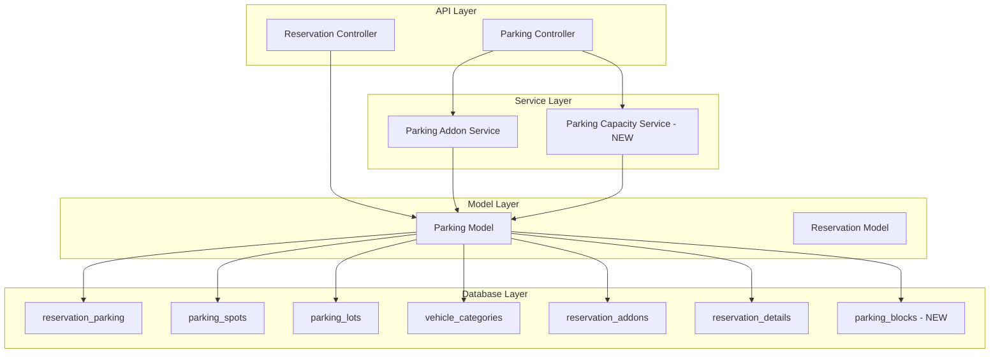

# Design Document: Parking Module Revamp

## Overview

This design document outlines the architectural changes needed to transform the parking module from a spot-specific assignment system to a capacity-based availability system. The revamp will align the parking module with the reservation module's approach to managing availability by counting available capacity rather than tracking specific spot assignments.

### Current System Architecture

The current parking system operates as follows:
- **Spot Assignment**: Each parking reservation assigns a specific `parking_spot_id` to each date
- **Database Model**: `reservation_parking` table links `parking_spot_id` → `reservation_details_id` → `reservation_addon_id`
- **Capacity Validation**: Vehicle categories have `capacity_units_required` that must be ≤ parking spot `capacity_units`
- **Billing Integration**: Parking assignments create `reservation_addons` records for billing
- **Blocking**: Current `blockParkingSpot` creates mock reservations with status='block'

### Target System Architecture

The new system will:
- **Capacity Counting**: Track number of available spots per vehicle category per date
- **Flexible Assignment**: Allow different physical spots on consecutive dates
- **Capacity Blocking**: Block capacity counts rather than specific spots
- **Maintain Billing**: Continue integration with reservation_addons
- **Backward Compatible**: Preserve existing data and API contracts where possible

## Architecture

### High-Level Architecture Diagram



### Key Architectural Changes

1. **New Parking Capacity Service**: Handles capacity-based availability calculations
2. **New Parking Blocks Table**: Stores capacity blocking records separate from reservations
3. **Modified Parking Model**: Updated functions to work with capacity counts
4. **Updated reservation_parking**: Change from spot-specific to capacity-based records

## Components and Interfaces

### 1. Parking Capacity Service (New)

**Purpose**: Centralize capacity-based availability logic

**Key Methods**:

```javascript
class ParkingCapacityService {
    constructor(requestId) {
        this.requestId = requestId;
    }

    /**
     * Calculate available parking capacity for a date range
     * @param {number} hotelId
     * @param {string} startDate
     * @param {string} endDate
     * @param {number} vehicleCategoryId
     * @returns {Promise<Object>} Capacity availability by date
     */
    async getAvailableCapacity(hotelId, startDate, endDate, vehicleCategoryId)

    /**
     * Reserve parking capacity without assigning specific spots
     * @param {Object} reservationData
     * @returns {Promise<Object>} Reservation result
     */
    async reserveCapacity(reservationData)

    /**
     * Block parking capacity for a date range
     * @param {Object} blockData
     * @returns {Promise<Object>} Block result
     */
    async blockCapacity(blockData)

    /**
     * Release blocked capacity
     * @param {string} blockId
     * @returns {Promise<boolean>} Success status
     */
    async releaseBlockedCapacity(blockId)

    /**
     * Get capacity summary for a hotel
     * @param {number} hotelId
     * @param {string} startDate
     * @param {string} endDate
     * @returns {Promise<Object>} Capacity summary
     */
    async getCapacitySummary(hotelId, startDate, endDate)
}
```

### 2. Modified Parking Model Functions

**Updated Functions**:

```javascript
// MODIFIED: Change from spot assignment to capacity reservation
async saveParkingAssignments(requestId, assignments, userId, client = null)
// New behavior: Creates reservation_parking records without specific parking_spot_id
// Uses NULL for parking_spot_id or a sentinel value to indicate capacity-based

// MODIFIED: Calculate available capacity instead of available spots
async checkParkingVacancies(requestId, hotel_id, startDate, endDate, vehicleCategoryId)
// New behavior: Returns count of available capacity units

// NEW: Block capacity for a date range
async blockParkingCapacity(requestId, blockData)
// Creates records in parking_blocks table

// NEW: Get blocked capacity for a date range
async getBlockedCapacity(requestId, hotel_id, startDate, endDate)
// Returns blocking records from parking_blocks table

// NEW: Remove capacity block
async removeCapacityBlock(requestId, blockId)
// Deletes from parking_blocks table

// MODIFIED: Get parking reservations with capacity info
async getParkingReservations(requestId, hotel_id, startDate, endDate)
// Returns capacity-based reservations grouped by date and vehicle category
```

### 3. Database Schema Changes

#### New Table: parking_blocks

```sql
CREATE TABLE parking_blocks (
    id UUID DEFAULT gen_random_uuid() PRIMARY KEY,
    hotel_id INTEGER NOT NULL REFERENCES hotels(id) ON DELETE CASCADE,
    vehicle_category_id INTEGER NOT NULL REFERENCES vehicle_categories(id) ON DELETE CASCADE,
    start_date DATE NOT NULL,
    end_date DATE NOT NULL,
    blocked_capacity INTEGER NOT NULL,
    reason TEXT,
    comment TEXT,
    created_at TIMESTAMPTZ NOT NULL DEFAULT NOW(),
    updated_at TIMESTAMPTZ NOT NULL DEFAULT NOW(),
    created_by INTEGER REFERENCES users(id),
    updated_by INTEGER REFERENCES users(id)
) PARTITION BY LIST (hotel_id);

CREATE INDEX idx_parking_blocks_hotel_id ON parking_blocks(hotel_id);
CREATE INDEX idx_parking_blocks_dates ON parking_blocks(start_date, end_date);
CREATE INDEX idx_parking_blocks_vehicle_category ON parking_blocks(vehicle_category_id);
```

#### Approach: Use Virtual/Placeholder Spots for Capacity-Based Reservations

**Strategy**:
Instead of modifying the `reservation_parking` table schema, we'll create virtual "capacity pool" parking spots that represent capacity rather than physical spots. This maintains the existing schema while enabling capacity-based management.

**Implementation**:
- Create special parking spots with spot_number like 'CAPACITY-POOL-1', 'CAPACITY-POOL-2', etc.
- These virtual spots have high capacity_units to accommodate multiple vehicles
- Capacity-based reservations assign to these virtual spots instead of physical spots
- Physical spots remain available for spot-specific assignments if needed
- The system tracks whether a spot is virtual or physical via naming convention or spot_type

**Alternative Approach** (if virtual spots are not preferred):
- Use the existing `parking_blocks` table structure but with negative blocked_capacity values to represent reservations
- This keeps all capacity tracking in one place without schema changes
- Query logic aggregates blocks (negative = reservation, positive = actual block)

### 4. API Endpoints

#### New Endpoints

```javascript
// Get available capacity for date range
GET /api/parking/capacity/available
Query params: hotelId, startDate, endDate, vehicleCategoryId
Response: { availableCapacity: { "2024-01-01": 5, "2024-01-02": 3 }, ... }

// Block parking capacity
POST /api/parking/capacity/block
Body: { hotel_id, vehicle_category_id, start_date, end_date, blocked_capacity, reason, comment }
Response: { blockId, success, message }

// Get blocked capacity
GET /api/parking/capacity/blocks
Query params: hotelId, startDate, endDate
Response: [ { blockId, vehicle_category_id, start_date, end_date, blocked_capacity, reason } ]

// Remove capacity block
DELETE /api/parking/capacity/blocks/:blockId
Response: { success, message }

// Get capacity summary
GET /api/parking/capacity/summary
Query params: hotelId, startDate, endDate
Response: { totalCapacity, reservedCapacity, blockedCapacity, availableCapacity, byVehicleCategory: {...} }
```

#### Modified Endpoints

```javascript
// Modified: saveParkingAssignments now works with capacity
POST /api/parking/assignments
Body: { assignments: [{ hotel_id, reservation_id, vehicle_category_id, roomId, check_in, check_out, numberOfSpots, unit_price, addon }] }
// No longer requires spotId in assignments

// Modified: checkParkingVacancies returns capacity counts
GET /api/parking/vacancies/:hotelId/:startDate/:endDate/:vehicleCategoryId
Response: { availableCapacity: 5, totalCapacity: 10, reservedCapacity: 3, blockedCapacity: 2 }
```

## Data Models

### Parking Capacity Reservation Model

```javascript
{
    hotel_id: number,
    reservation_id: uuid,
    reservation_details_id: uuid,
    reservation_addon_id: uuid,
    vehicle_category_id: number,
    date: date,
    parking_spot_id: number,  // Points to virtual capacity pool spot for capacity-based reservations
    status: 'confirmed' | 'blocked' | 'cancelled',
    created_by: number,
    updated_by: number
}
```

**Note**: For capacity-based reservations, `parking_spot_id` will reference a virtual "capacity pool" spot rather than a physical spot. Virtual spots are identified by `spot_type = 'capacity_pool'` or spot_number pattern like 'CAPACITY-POOL-{vehicle_category_id}'.

### Parking Block Model

```javascript
{
    id: uuid,
    hotel_id: number,
    vehicle_category_id: number,
    start_date: date,
    end_date: date,
    blocked_capacity: number,
    reason: string,
    comment: string,
    created_by: number,
    updated_by: number,
    created_at: timestamp,
    updated_at: timestamp
}
```

### Capacity Availability Model

```javascript
{
    hotel_id: number,
    vehicle_category_id: number,
    date: date,
    total_capacity: number,
    reserved_capacity: number,
    blocked_capacity: number,
    available_capacity: number,
    capacity_by_lot: [
        {
            parking_lot_id: number,
            parking_lot_name: string,
            total_spots: number,
            available_spots: number
        }
    ]
}
```

## Error Handling

### Error Scenarios and Responses

1. **Insufficient Capacity**
   - Scenario: Attempting to reserve more capacity than available
   - Response: `400 Bad Request` with message "Insufficient parking capacity available for the requested dates"
   - Action: Return available capacity and suggest alternative dates

2. **Invalid Vehicle Category**
   - Scenario: Vehicle category ID doesn't exist
   - Response: `404 Not Found` with message "Vehicle category not found"
   - Action: Return list of valid vehicle categories

3. **Invalid Date Range**
   - Scenario: End date before start date or invalid date format
   - Response: `400 Bad Request` with message "Invalid date range"
   - Action: Return expected date format

4. **Block Exceeds Total Capacity**
   - Scenario: Blocking more capacity than physically exists
   - Response: `200 OK` with warning flag
   - Action: Create block but include warning in response

5. **Concurrent Reservation Conflict**
   - Scenario: Two reservations attempt to book last available capacity
   - Response: `409 Conflict` with message "Capacity no longer available"
   - Action: Use database-level locking to prevent race conditions

### Error Handling Strategy

```javascript
// Capacity validation with detailed error messages
async function validateCapacityAvailability(hotelId, startDate, endDate, vehicleCategoryId, requestedCapacity) {
    const availability = await getAvailableCapacity(hotelId, startDate, endDate, vehicleCategoryId);
    
    const insufficientDates = [];
    for (const [date, available] of Object.entries(availability)) {
        if (available < requestedCapacity) {
            insufficientDates.push({ date, available, requested: requestedCapacity });
        }
    }
    
    if (insufficientDates.length > 0) {
        throw new InsufficientCapacityError({
            message: 'Insufficient parking capacity',
            insufficientDates,
            suggestion: 'Consider reducing the number of spots or choosing alternative dates'
        });
    }
}

// Database transaction with rollback
async function reserveCapacityWithTransaction(reservationData) {
    const client = await pool.connect();
    try {
        await client.query('BEGIN');
        
        // Lock rows to prevent concurrent modifications
        await client.query('SELECT * FROM parking_spots WHERE hotel_id = $1 FOR UPDATE', [hotelId]);
        
        // Validate capacity
        await validateCapacityAvailability(...);
        
        // Create reservation
        const result = await createCapacityReservation(client, reservationData);
        
        await client.query('COMMIT');
        return result;
    } catch (error) {
        await client.query('ROLLBACK');
        throw error;
    } finally {
        client.release();
    }
}
```

## Testing Strategy

### Unit Tests

1. **Capacity Calculation Tests**
   - Test available capacity calculation with various scenarios
   - Test capacity with blocks and reservations
   - Test capacity across multiple parking lots
   - Test capacity with different vehicle categories

2. **Reservation Logic Tests**
   - Test capacity reservation without spot assignment
   - Test reservation with insufficient capacity
   - Test reservation spanning multiple dates
   - Test reservation cancellation and capacity release

3. **Blocking Logic Tests**
   - Test capacity blocking for date ranges
   - Test overlapping blocks
   - Test block removal and capacity restoration
   - Test block validation

### Integration Tests

1. **End-to-End Reservation Flow**
   - Create reservation → Check capacity → Confirm reservation → Verify capacity reduction
   - Cancel reservation → Verify capacity restoration
   - Modify reservation dates → Verify capacity adjustments

2. **Blocking and Reservation Interaction**
   - Block capacity → Attempt reservation → Verify rejection if insufficient
   - Remove block → Verify capacity becomes available
   - Block during active reservation → Verify warning

3. **Concurrent Access Tests**
   - Multiple simultaneous reservations for same capacity
   - Verify database locking prevents overbooking
   - Test race conditions

### Migration Tests

1. **Data Migration Validation**
   - Verify existing spot-based reservations are preserved
   - Verify capacity_units_reserved is correctly populated
   - Verify no data loss during migration

2. **Backward Compatibility Tests**
   - Verify existing API endpoints still work
   - Verify existing reservations can be modified
   - Verify reports and queries still function

### Performance Tests

1. **Capacity Query Performance**
   - Test capacity calculation for large date ranges
   - Test capacity queries with many parking lots
   - Verify query performance with indexes

2. **Concurrent Reservation Performance**
   - Test system under high concurrent reservation load
   - Verify transaction throughput
   - Test database connection pool efficiency

## Migration Strategy

### Phase 1: Database Schema Updates

1. Create `parking_blocks` table
2. Modify `reservation_parking` table to make `parking_spot_id` nullable
3. Add `capacity_units_reserved` column
4. Populate `capacity_units_reserved` for existing records
5. Create necessary indexes

### Phase 2: Service Layer Implementation

1. Implement `ParkingCapacityService`
2. Update `ParkingModel` functions
3. Maintain backward compatibility with existing functions
4. Add feature flags to toggle between old and new behavior

### Phase 3: API Layer Updates

1. Add new capacity-based endpoints
2. Update existing endpoints to support both modes
3. Add API versioning if needed
4. Update API documentation

### Phase 4: Frontend Updates

1. Update parking management UI to show capacity instead of spots
2. Add capacity blocking interface
3. Update reservation flow to work with capacity
4. Maintain ability to view legacy spot-based reservations

### Phase 5: Testing and Rollout

1. Run comprehensive test suite
2. Deploy to staging environment
3. Perform user acceptance testing
4. Gradual rollout with feature flags
5. Monitor for issues
6. Full production deployment

### Rollback Plan

- Feature flags allow instant rollback to old behavior
- Database changes are additive (no data deletion)
- Old API endpoints remain functional
- Can revert code deployment if needed

## Performance Considerations

### Database Optimization

1. **Indexes**
   - Index on `reservation_parking(hotel_id, date, vehicle_category_id)`
   - Index on `parking_blocks(hotel_id, start_date, end_date)`
   - Composite index for capacity queries

2. **Query Optimization**
   - Use CTEs for complex capacity calculations
   - Implement database-level capacity calculation functions
   - Cache frequently accessed capacity data

3. **Partitioning**
   - Maintain existing partitioning by hotel_id
   - Consider date-based partitioning for historical data

### Caching Strategy

1. **Capacity Cache**
   - Cache available capacity for frequently queried date ranges
   - Invalidate cache on reservation or block changes
   - Use Redis for distributed caching

2. **Vehicle Category Cache**
   - Cache vehicle category data (rarely changes)
   - Refresh on category updates

### Scalability

1. **Horizontal Scaling**
   - Stateless service design allows multiple instances
   - Database connection pooling
   - Load balancing across API servers

2. **Database Scaling**
   - Read replicas for capacity queries
   - Write to primary for reservations
   - Partition by hotel_id for data isolation

## Security Considerations

1. **Authorization**
   - Verify user has permission to manage parking for hotel
   - Validate hotel_id matches user's authorized hotels
   - Audit trail for all capacity changes

2. **Data Validation**
   - Validate all date inputs
   - Validate capacity values are positive integers
   - Prevent SQL injection with parameterized queries

3. **Rate Limiting**
   - Limit capacity query frequency per user
   - Prevent abuse of blocking functionality
   - Monitor for suspicious patterns

## Monitoring and Observability

1. **Metrics**
   - Track capacity utilization rates
   - Monitor reservation success/failure rates
   - Track API response times
   - Alert on capacity overbooking

2. **Logging**
   - Log all capacity reservations and blocks
   - Log capacity calculation errors
   - Log concurrent access conflicts
   - Structured logging for easy querying

3. **Dashboards**
   - Real-time capacity availability dashboard
   - Reservation trends and patterns
   - System health metrics
   - Error rate monitoring
