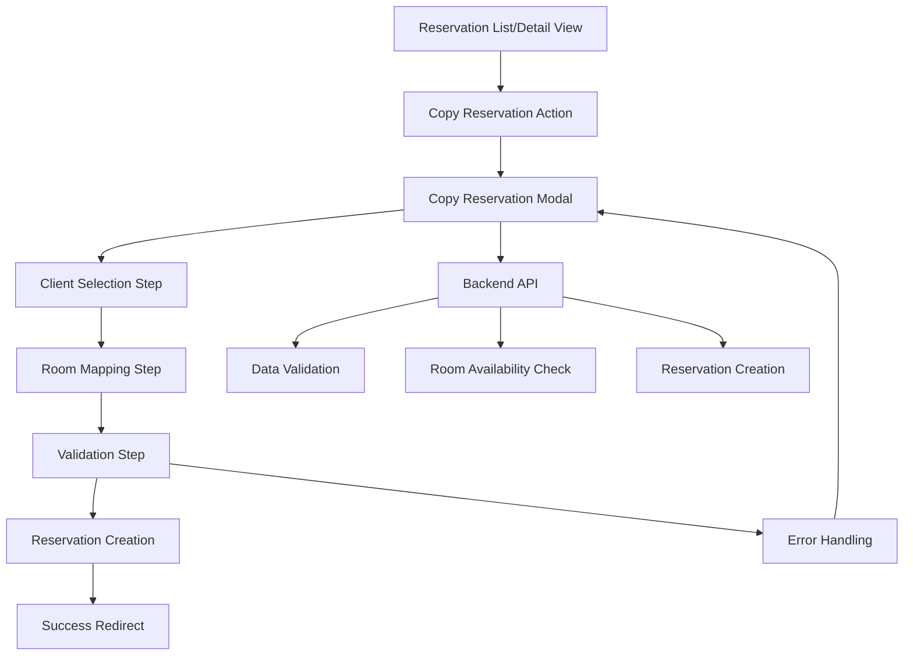

# Design Document: Reservation Copy Feature

## Overview

This design document outlines the implementation of a comprehensive reservation copy feature that allows hotel staff to duplicate existing reservations for different clients while preserving all reservation details including room assignments, dates, plans, addons, and pricing information. The feature will streamline the booking process by eliminating the need to manually re-enter reservation details for similar bookings.

The feature will be implemented as a modal-based workflow that guides users through the copy process, including client selection, room mapping, and validation steps. The implementation will ensure data integrity and maintain the existing reservation system's security and validation rules.

### Key Features

- **Reservation Selection**: Copy option available in reservation actions menu
- **Client Selection**: Modal dialog for selecting new client/booker
- **Room Mapping**: Visual interface for mapping original rooms to available rooms
- **Data Preservation**: Complete copying of reservation details except client and payment information
- **Validation**: Comprehensive validation of room availability and data integrity
- **User Feedback**: Clear success/error messages and navigation flow

## Architecture

The reservation copy feature will be implemented as a frontend-driven workflow with backend API support for data validation and persistence. The architecture follows the existing application patterns and integrates seamlessly with the current reservation management system.



### Component Architecture

1. **Frontend Components**
   - Copy Reservation Button (in reservation actions)
   - Copy Reservation Modal (multi-step workflow)
   - Client Selection Component
   - Room Mapping Component
   - Validation Summary Component2 **Backend API Endpoints**
   - `GET /api/reservations/:id/copy-data` - Retrieve reservation data for copying
   - `POST /api/reservations/copy` - Create copied reservation
   - `GET /api/rooms/available` - Get available rooms for date range
3. **Data Flow**
   - Original reservation data retrieval
   - Client selection and validation
   - Room availability checking
   - Room mapping validation
   - New reservation creation
   - Success/error response handling

## Components and Interfaces

### Frontend Components

#### 1. Copy Reservation Button
- **Location**: Reservation actions menu in reservation list and detail views
- **Trigger**: User clicks Copy Reservation" option
- **Action**: Opens copy reservation modal with original reservation data

#### 2. Copy Reservation Modal
- **Structure**: Multi-step modal with progress indicator
- **Steps**:
  1. Client Selection
  2. Room Mapping
  3. Validation Summary
 4Confirmation

#### 3. Client Selection Component
- **Features**: Client search/autocomplete, client details display
- **Validation**: Ensures selected client is valid and active
- **Data**: Client ID, name, contact information

#### 4. Room Mapping Component
- **Features**: Visual room mapping interface, availability indicators
- **Validation**: Ensures all rooms are mapped and available
- **Data**: Original room assignments, available rooms, mapping relationships

#### 5. Validation Summary Component
- **Features**: Summary of copied data, final validation check
- **Display**: Reservation details, client information, room assignments
- **Actions**: Confirm copy, edit mapping, cancel operation

### Backend API Design

#### 1. Get Copy Data Endpoint
```javascript
GET /api/reservations/:id/copy-data
Response: {
  reservation: [object Object]   id: number,
    checkIn: string,
    checkOut: string,
    rooms: Array<[object Object]      id: number,
      roomType: string,
      roomNumber: string,
      plan: object,
      addons: Array<object>,
      pricing: object
    }>,
    totalAmount: number,
    status: string
  },
  availableRooms: Array<[object Object]   id: number,
    roomType: string,
    roomNumber: string,
    available: boolean
  }>
}
```

#### 2. Create Copied Reservation Endpoint
```javascript
POST /api/reservations/copy
Request: {
  originalReservationId: number,
  newClientId: number,
  roomMappings: Array<[object Object]    originalRoomId: number,
    newRoomId: number
  }>
}
Response: {
  success: boolean,
  newReservationId: number,
  message: string
}
```

#### 3. Room Availability Endpoint
```javascript
GET /api/rooms/available?checkIn=YYYY-MM-DD&checkOut=YYYY-MM-DD
Response:[object Object]
  rooms: Array<[object Object]   id: number,
    roomType: string,
    roomNumber: string,
    available: boolean,
    conflictingReservations: Array<object>
  }>
}
```

## Data Models

### Copy Reservation Request Model
```javascript
{
  originalReservationId: number,    // ID of reservation to copy
  newClientId: number,              // ID of new client
  roomMappings: [                   // Array of room mappings
  [object Object]      originalRoomId: number,       // Original room ID
      newRoomId: number             // New room ID
    }
  ],
  preservePricing: boolean,         // Whether to copy pricing exactly
  copyAddons: boolean               // Whether to copy addons
}
```

### Copy Reservation Response Model
```javascript
{
  success: boolean,                 // Operation success status
  newReservationId: number,         // ID of newly created reservation
  message: string,                  // Success/error message
  validationErrors: Array<{         // Validation errors if any
    field: string,
    message: string
  }>
}
```

### Room Mapping Model
```javascript[object Object]  originalRoom: [object Object]   id: number,
    roomType: string,
    roomNumber: string,
    plan: object,
    addons: Array<object>,
    pricing: object
  },
  availableRooms: Array<[object Object]   id: number,
    roomType: string,
    roomNumber: string,
    available: boolean,
    conflicts: Array<object>
  }>,
  selectedRoomId: number
}
```

## Implementation Strategy

### Phase 1: Backend API Development
1. **Database Schema Updates**
   - No schema changes required (uses existing reservation and room tables)
   - Ensure proper indexing for room availability queries
2int Implementation**
   - Implement copy data retrieval endpoint
   - Implement room availability checking
   - Implement reservation creation with copied data

3. **Business Logic**
   - Reservation data extraction and validation
   - Room availability validation
   - Pricing calculation preservation
   - Addon copying logic

### Phase 2: Frontend Component Development
1. **Copy Button Integration**
   - Add copy option to reservation actions menu
   - Implement modal trigger functionality

2. **Modal Workflow Implementation**
   - Create multi-step modal component
   - Implement client selection interface
   - Create room mapping visualization
   - Build validation summary component

3. **User Experience Enhancements**
   - Progress indicators
   - Real-time validation feedback
   - Error handling and recovery
   - Success confirmation and navigation

### Phase 3ration and Testing
1. **End-to-End Testing**
   - Complete workflow testing
   - Edge case handling
   - Performance testing with large datasets

2. **User Acceptance Testing**
   - Staff workflow validation
   - Usability testing
   - Error scenario testing

## Error Handling

### Validation Errors
1. **Client Validation**
   - Invalid client ID
   - Inactive client status
   - Client not found

2. **Room Availability Errors**
   - Selected rooms not available for date range
   - Room type mismatches
   - Conflicting reservations

3. **Data Integrity Errors**
   - Original reservation not found
   - Incomplete room mappings
   - Invalid pricing data

### Error Response Handling
```javascript
[object Object]  success: false,
  error: [object Object] type: VALIDATION_ERROR' | 'AVAILABILITY_ERROR' | 'SYSTEM_ERROR',
    message: string,
    details: Array<{
      field: string,
      message: string
    }>
  }
}
```

### User Feedback
- **Success**: Clear success message with redirect to new reservation
- **Validation Errors**: Inline error messages with field highlighting
- **System Errors**: User-friendly error messages with retry options
- **Partial Failures**: Detailed explanation of what succeeded/failed

## Security Considerations

### Data Access Control
1thorization Checks**
   - Verify user has permission to copy reservations
   - Validate access to original reservation
   - Ensure client selection permissions

2. **Data Validation**
   - Sanitize all input data
   - Validate room availability server-side
   - Prevent unauthorized data access

### Audit Trail
1. **Copy Operation Logging**
   - Log all copy operations with user and timestamp
   - Track original and new reservation IDs
   - Record room mapping decisions

2. **Change Tracking**
   - Maintain audit trail of copied reservations
   - Track modifications to copied reservations
   - Preserve relationship to original reservation

## Performance Considerations

### Database Optimization
1. **Query Optimization**
   - Efficient room availability queries
   - Proper indexing on date ranges
   - Optimized reservation data retrieval

2. **Caching Strategy**
   - Cache room availability data
   - Cache client information
   - Implement request deduplication

### Frontend Performance1 **Lazy Loading**
   - Load room availability data on demand
   - Progressive enhancement of UI components
   - Optimized modal rendering

2. **User Experience**
   - Responsive design for all screen sizes
   - Keyboard navigation support
   - Accessibility compliance

## Testing Strategy

### Unit Testing
1. **Backend API Testing**
   - Copy data retrieval endpoint
   - Reservation creation logic
   - Room availability validation

2. **Frontend Component Testing**
   - Modal workflow components
   - Client selection validation
   - Room mapping interface

### Integration Testing
1. **End-to-End Workflow**
   - Complete copy reservation process
   - Error handling scenarios
   - Edge case validation

2. **Data Integrity Testing**
   - Copied reservation accuracy
   - Room mapping validation
   - Pricing preservation verification

### User Acceptance Testing
1. **Staff Workflow Testing**
   - Real-world usage scenarios
   - Performance under load
   - Usability validation

## Deployment Considerations

### Database Migration
- No schema changes required
- Ensure proper indexing for performance
- Validate existing data integrity

### Configuration Updates
- Update API route configurations
- Configure proper error logging
- Set up audit trail logging

### Monitoring and Alerting
- Monitor copy operation success rates
- Track performance metrics
- Alert on system errors

## Success Metrics

### Functional Metrics
- Copy operation success rate
- User adoption of copy feature
- Time saved per copy operation

### Performance Metrics
- API response times
- Modal load times
- Database query performance

### User Experience Metrics
- User satisfaction scores
- Error rate reduction
- Workflow completion rates 