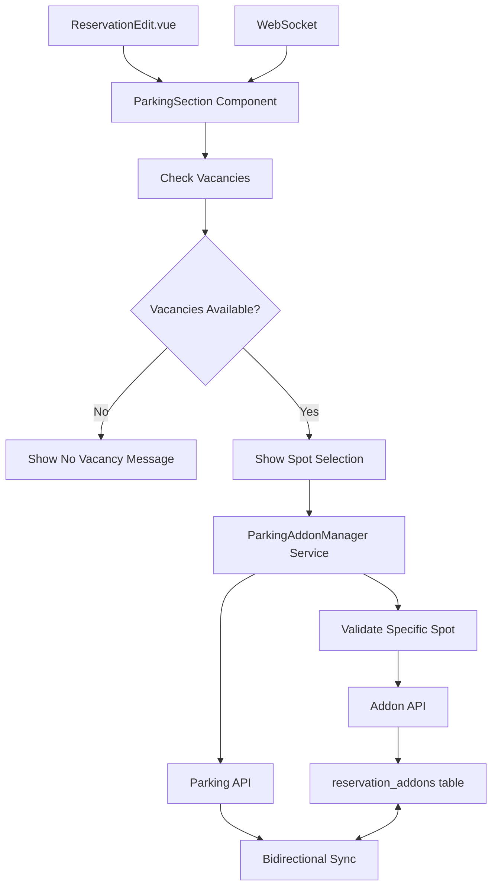
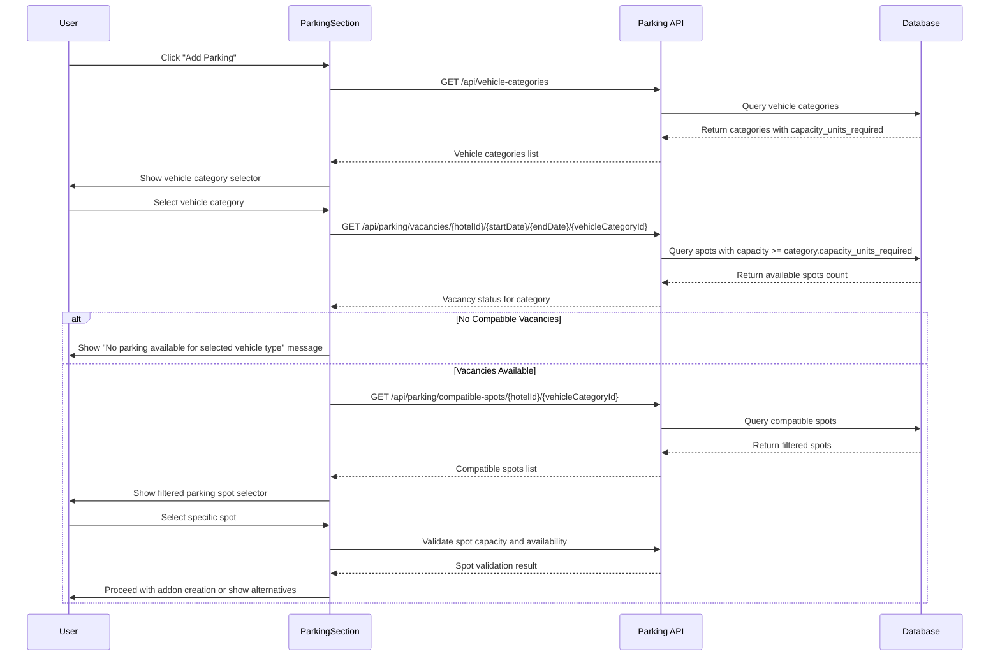

# Design Document

## Overview

This design integrates the existing parking management system with the reservation editing interface by creating a seamless connection between parking addons (global addon ID 3) and parking spot assignments. The integration will extend the current ReservationEdit.vue interface to include parking management capabilities while maintaining the existing addon system architecture.

The solution leverages the existing `reservation_addons` table for billing and the `reservation_parking` table for physical spot assignments, creating a bidirectional relationship that ensures data consistency and traceability.

## Architecture

### System Components Integration

The integration connects three main system components:

1. **Addon System**: Existing `addons_global`, `addons_hotel`, and `reservation_addons` tables
2. **Parking System**: Existing `parking_lots`, `parking_spots`, and `reservation_parking` tables  
3. **Reservation System**: Existing reservation management interface and components

### Data Flow



### Vehicle Category and Vacancy Checking Workflow

The system implements a three-tier validation approach:

1. **Vehicle Category Selection**: User must first select vehicle category to determine capacity requirements
2. **Category-Specific Vacancy Check**: Check if spots with sufficient capacity are available for the reservation period
3. **Specific Spot Validation**: When user selects a specific spot, validate its capacity and availability for all dates



### Capacity Unit Logic

The system uses capacity units to determine parking compatibility:

- **Vehicle Categories**: Each has `capacity_units_required` (e.g., regular car = 1, large vehicle = 2)
- **Parking Spots**: Each has `capacity_units` (e.g., regular spot = 1, large spot = 2)
- **Compatibility Rule**: `spot.capacity_units >= vehicle_category.capacity_units_required`

**Examples**:
- Regular car (1 unit) can use regular spot (1 unit) or large spot (2 units)
- Large vehicle (2 units) can only use large spot (2 units)
- Large vehicle (2 units) cannot use regular spot (1 unit)

### Key Design Principles

- **Data Consistency**: Maintain referential integrity between addon and parking records
- **Real-time Updates**: Use WebSocket for live parking availability updates
- **Component Reusability**: Create reusable parking components for different editing contexts
- **Backward Compatibility**: Preserve existing addon and parking functionality

## Components and Interfaces

### Frontend Components

#### 1. ParkingSection.vue
**Purpose**: Main parking management section in ReservationEdit.vue
**Location**: `frontend/src/pages/MainPage/components/ParkingSection.vue`

**Props**:
- `reservationDetails`: Array of reservation detail objects
- `hotelId`: Current hotel ID

**Key Features**:
- Display existing parking assignments
- Add new parking addons with spot selection
- Edit existing parking assignments
- Remove parking assignments
- Real-time availability display

#### 2. ParkingSpotSelector.vue
**Purpose**: Reusable component for selecting parking spots with vehicle category consideration
**Location**: `frontend/src/pages/MainPage/components/ParkingSpotSelector.vue`

**Props**:
- `hotelId`: Hotel ID for filtering spots
- `dateRange`: Array of dates for availability checking
- `selectedSpotId`: Currently selected spot ID
- `vehicleCategoryId`: Required vehicle category ID for capacity calculation
- `capacityUnitsRequired`: Calculated from vehicle category

**Events**:
- `spot-selected`: Emitted when a spot is selected
- `availability-checked`: Emitted with availability data
- `vehicle-category-changed`: Emitted when vehicle category selection changes

#### 3. ParkingAddonDialog.vue
**Purpose**: Dialog for adding/editing parking addons with vehicle category and spot assignment
**Location**: `frontend/src/pages/MainPage/components/ParkingAddonDialog.vue`

**Props**:
- `visible`: Dialog visibility
- `editMode`: Boolean for edit vs add mode
- `existingAddon`: Existing addon data for editing
- `reservationDetails`: Reservation details for date range
- `hotelId`: Hotel ID

**Key Features**:
- Vehicle category selection dropdown
- Dynamic capacity unit calculation based on selected category
- Filtered parking spot display based on capacity requirements
- Real-time availability checking with capacity consideration

### Backend Services

#### 1. ParkingAddonService
**Purpose**: Manages the relationship between parking addons and spot assignments
**Location**: `api/services/parkingAddonService.js`

**Key Methods**:
- `checkParkingVacancies(hotelId, dateRange, vehicleCategoryId)` - Check available spots for specific vehicle category
- `calculateCapacityUnits(vehicleCategoryId)` - Get capacity units required for vehicle category
- `getCompatibleSpots(hotelId, capacityUnitsRequired)` - Get spots that can accommodate vehicle category
- `addParkingAddonWithSpot(reservationDetailId, addonData, spotId, dates, vehicleCategoryId)`
- `updateParkingAddonSpot(addonId, newSpotId, dates, vehicleCategoryId)`
- `removeParkingAddonWithSpot(addonId)`
- `validateSpotCapacity(spotId, capacityUnitsRequired)` - Ensure spot can accommodate vehicle
- `getAvailableSpotsForDates(hotelId, startDate, endDate, capacityUnits)`

#### 2. Enhanced Parking API Endpoints
**Location**: `api/routes/parking.js`

**New Endpoints**:
- `GET /api/parking/availability/:hotelId?startDate=&endDate=&vehicleCategoryId=` - Get parking availability filtered by vehicle category capacity
- `GET /api/parking/vacancies/:hotelId/:startDate/:endDate/:vehicleCategoryId` - Check vacancies for specific vehicle category
- `GET /api/parking/compatible-spots/:hotelId/:vehicleCategoryId` - Get spots compatible with vehicle category
- `POST /api/parking/addon-assignment` - Create addon with spot assignment (includes capacity validation)
- `PUT /api/parking/addon-assignment/:id` - Update addon spot assignment
- `DELETE /api/parking/addon-assignment/:id` - Remove addon and spot assignment

### Frontend Services

#### 1. Enhanced useParkingStore
**Location**: `frontend/src/composables/useParkingStore.js`

**New Methods**:
- `fetchVehicleCategories()` - Get all vehicle categories with capacity requirements
- `checkParkingVacancies(hotelId, startDate, endDate, vehicleCategoryId)` - Check available spots for vehicle category
- `getCompatibleSpots(hotelId, vehicleCategoryId)` - Get spots that can accommodate vehicle category
- `checkSpotAvailability(spotId, dates, excludeReservationId)`
- `addParkingAddonWithSpot(addonData, spotData, vehicleCategoryId)` - Includes capacity validation
- `updateParkingAddonSpot(addonId, newSpotData, vehicleCategoryId)`
- `removeParkingAddonWithSpot(addonId)`
- `getAvailableSpotsByDateRange(hotelId, dates, capacityUnits)`

#### 2. ParkingAddonManager
**Purpose**: Manages parking addon operations with spot assignments
**Location**: `frontend/src/composables/useParkingAddonManager.js`

**Key Features**:
- Coordinate addon and parking spot operations
- Handle data validation and consistency
- Manage WebSocket updates for real-time sync

## Data Models

### Enhanced Reservation Addon Model

The existing `reservation_addons` table will be used with additional metadata:

```sql
-- Existing table structure (no changes needed)
reservation_addons (
    id,
    hotel_id,
    reservation_detail_id,
    addons_global_id,
    addons_hotel_id,
    addon_name,
    addon_type,
    quantity,
    price,
    tax_type_id,
    tax_rate,
    created_by,
    updated_by,
    created_at,
    updated_at
)
```

### Enhanced Reservation Parking Model

The existing `reservation_parking` table will be extended with addon and vehicle category references:

```sql
-- Add new columns to existing table
ALTER TABLE reservation_parking 
ADD COLUMN reservation_addon_id UUID REFERENCES reservation_addons(id),
ADD COLUMN vehicle_category_id INTEGER REFERENCES vehicle_categories(id);
```

### Parking Addon Integration Model

**Purpose**: Define the relationship structure between addons and parking spots

```javascript
// Frontend model structure
const ParkingAddonAssignment = {
    addonId: String,           // reservation_addons.id
    spotId: Number,            // parking_spots.id
    reservationDetailId: String, // reservation_details.id
    vehicleCategoryId: Number, // vehicle_categories.id
    vehicleCategoryName: String, // vehicle_categories.name
    capacityUnitsRequired: Number, // vehicle_categories.capacity_units_required
    dates: Array,              // Array of date strings
    spotNumber: String,        // parking_spots.spot_number
    spotCapacityUnits: Number, // parking_spots.capacity_units
    parkingLotName: String,    // parking_lots.name
    price: Number,             // addon price
    quantity: Number           // addon quantity
}

// Vehicle Category Model
const VehicleCategory = {
    id: Number,
    name: String,              // e.g., "普通車", "大型車"
    capacity_units_required: Number // e.g., 1 for regular car, 2 for large vehicle
}
```

## Error Handling

### Validation Rules

1. **Parking Addon Detection**: Identify parking addons by `addons_global_id = 3`
2. **Vacancy Checking**: Always check parking lot vacancies before allowing addon creation
3. **Spot Availability**: Validate specific spot availability for entire reservation period
4. **Vehicle Category Compatibility**: Ensure selected spot can accommodate vehicle category
5. **Referential Integrity**: Ensure addon exists before creating parking assignment
6. **Concurrent Access**: Handle multiple users editing same parking spots

### Error Scenarios

#### 1. No Parking Vacancies
**Trigger**: No parking spots available for requested dates
**Response**: Prevent addon creation and show clear message about lack of availability
**Implementation**: Pre-validation using `checkParkingVacancies()` before showing spot selection

#### 2. Spot Unavailability
**Trigger**: Selected spot is not available for requested dates
**Response**: Show alternative available spots with clear messaging
**Implementation**: Real-time availability checking with WebSocket updates

#### 2. Addon-Parking Mismatch
**Trigger**: Parking assignment exists without corresponding addon
**Response**: Automatic cleanup or user notification for manual resolution
**Implementation**: Background validation service

#### 3. Concurrent Modifications
**Trigger**: Multiple users modify same parking spot simultaneously
**Response**: Last-write-wins with conflict notification
**Implementation**: WebSocket broadcasting with optimistic locking

### Error Messages

```javascript
const ERROR_MESSAGES = {
    NO_VACANCIES: "指定期間中に利用可能な駐車場がありません。期間を変更するか、後日再度お試しください。",
    SPOT_UNAVAILABLE: "選択された駐車場は指定期間中利用できません。他の駐車場をお選びください。",
    VEHICLE_INCOMPATIBLE: "選択された駐車場は車両カテゴリに対応していません。適切な駐車場をお選びください。",
    ADDON_REQUIRED: "駐車場の割り当てには駐車場アドオンが必要です。",
    CONCURRENT_MODIFICATION: "他のユーザーが同じ駐車場を編集中です。最新の情報を確認してください。",
    VALIDATION_FAILED: "駐車場の割り当てに失敗しました。入力内容を確認してください。"
}
```

## Testing Strategy

### Unit Tests

#### Frontend Components
- **ParkingSection.vue**: Component rendering, event handling, prop validation
- **ParkingSpotSelector.vue**: Spot selection logic, availability display
- **ParkingAddonDialog.vue**: Form validation, dialog state management

#### Backend Services
- **ParkingAddonService**: CRUD operations, validation logic
- **Enhanced Parking API**: Endpoint functionality, error handling
- **Data Models**: Database operations, referential integrity

### Integration Tests

#### Addon-Parking Synchronization
- Test addon creation with spot assignment
- Test addon modification with spot changes
- Test addon deletion with spot cleanup
- Test data consistency across operations

#### Real-time Updates
- Test WebSocket broadcasting for parking changes
- Test concurrent user scenarios
- Test availability updates across multiple clients

#### Cross-Component Integration
- Test parking functionality across all reservation editing dialogs
- Test bulk operations with parking assignments
- Test reservation copying with parking data

### End-to-End Tests

#### Complete Parking Workflow
1. Add parking addon to reservation
2. Assign parking spot
3. Modify spot assignment
4. Remove parking assignment
5. Verify data consistency

#### Multi-User Scenarios
1. Concurrent parking spot assignments
2. Real-time availability updates
3. Conflict resolution

#### Error Recovery
1. Network failure during parking assignment
2. Database constraint violations
3. WebSocket connection issues

### Test Data Setup

```javascript
// Test parking addon (global addon ID 3)
const TEST_PARKING_ADDON = {
    id: 3,
    name: "駐車場",
    addon_type: "parking",
    price: 1000,
    tax_type_id: 1,
    tax_rate: 0.10
}

// Test parking spots
const TEST_PARKING_SPOTS = [
    { id: 1, spot_number: "A-01", capacity_units: 1, parking_lot_name: "メイン駐車場" },
    { id: 2, spot_number: "A-02", capacity_units: 1, parking_lot_name: "メイン駐車場" },
    { id: 3, spot_number: "B-01", capacity_units: 2, parking_lot_name: "大型車駐車場" }
]
```

### Performance Testing

#### Load Testing Scenarios
- Multiple simultaneous parking assignments
- High-frequency availability checks
- WebSocket message broadcasting under load

#### Performance Metrics
- API response times for parking operations
- WebSocket message delivery latency
- Database query performance for availability checks

This design provides a comprehensive integration between the parking and reservation systems while maintaining the existing architecture and ensuring data consistency, real-time updates, and a seamless user experience across all reservation editing contexts.