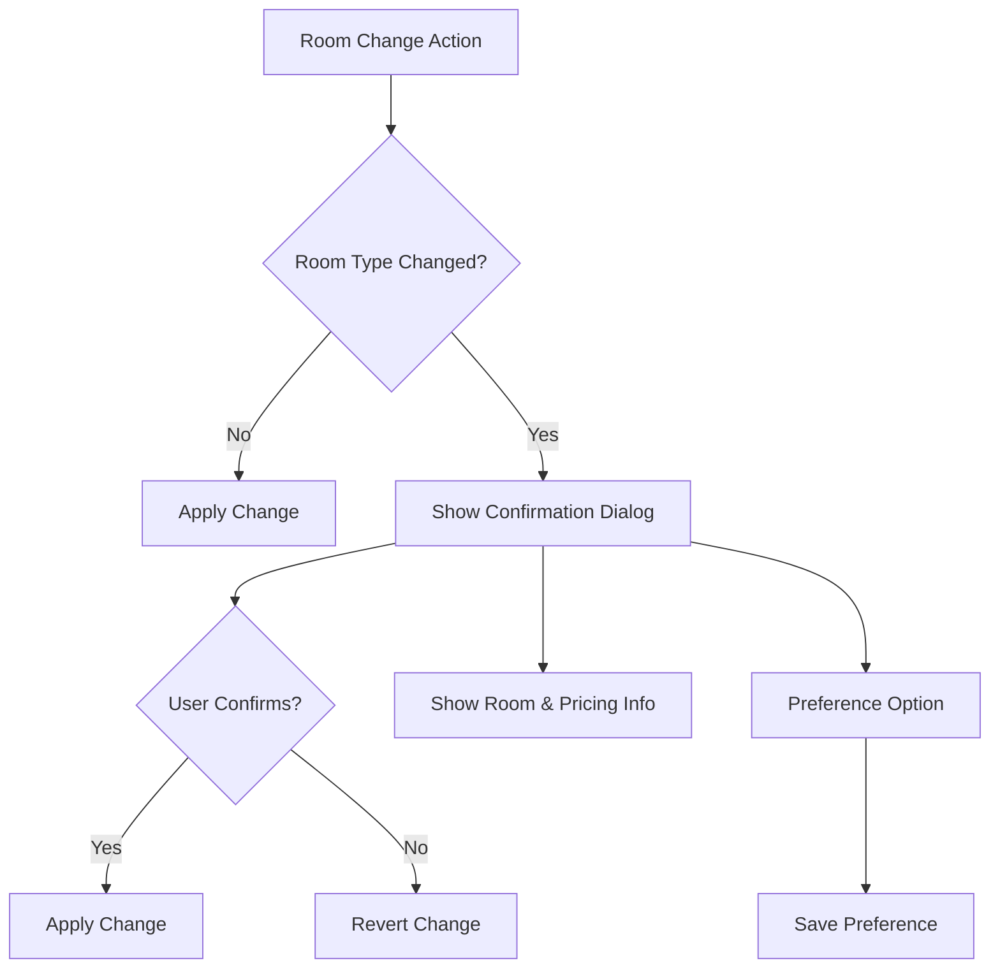

# Design Document

## Overview

The Room Change Confirmation feature introduces a confirmation dialog in フリー移動 (Free Move) mode when a room change results in a room type change. This prevents accidental modifications and ensures hotel staff are fully informed about the impact of their actions, including any pricing changes.

## Architecture

### Component Structure
```
src/components/RoomChange/
├── RoomChangeHandler.vue
├── RoomChangeConfirmationDialog.vue
├── RoomInfoDisplay.vue
├── PricingImpactIndicator.vue
└── PreferenceCheckbox.vue
```

### Navigation Integration
- Confirmation dialog is triggered from the room assignment UI in Free Move mode.
- Only appears when a room type change is detected.
- User preferences for suppressing minor confirmations are respected.

### Diagram


## Components and Interfaces

### RoomChangeHandler.vue
- Detects room type changes in Free Move mode.
- Triggers confirmation dialog as needed.

### RoomChangeConfirmationDialog.vue
- Modal dialog displaying original/new room info, pricing impact, confirm/cancel buttons, and preference checkbox.
- Prevents change until confirmed.
- Supports keyboard shortcuts and accessibility.

### RoomInfoDisplay.vue
- Shows original and new room numbers/types.
- Highlights differences.

### PricingImpactIndicator.vue
- Displays pricing difference if room type change affects pricing.
- Shows warnings as needed.

### PreferenceCheckbox.vue
- Allows users to suppress dialog for minor changes.
- Saves and retrieves user preference.

## Data Models

### Room Change Confirmation Payload
```json
{
  "originalRoomId": 101,
  "newRoomId": 202,
  "originalRoomType": "Single",
  "newRoomType": "Double",
  "pricingImpact": true,
  "userPreference": false
}
```

### Confirmation Response
```json
{
  "confirmed": true,
  "reverted": false,
  "message": "Room change applied."
}
```

## Error Handling

- If the dialog is not confirmed, revert to the original room assignment.
- Show user-friendly error messages for API or preference save failures.
- Fallback to always showing the dialog if preference cannot be saved.

## Testing Strategy

### Unit Tests
- Room type change detection logic
- Dialog display and confirmation flow
- Preference save/retrieve logic

### Integration Tests
- End-to-end workflow for room change with/without type change
- Pricing impact calculation and display
- Accessibility and keyboard navigation

## Implementation Notes

### Internationalization
- All dialog content and labels should support Japanese and future language expansion.
- Consistent terminology with existing UI.

### Performance Considerations
- Dialog should appear instantly; avoid unnecessary API calls.
- Preference storage should be lightweight (localStorage or backend as needed).

### Content Management
- Room and pricing info sourced from existing room management data.
- Preference state persisted per user.

---

This document follows the conventions of the About & FAQ System and VPS Configuration Documentation specs for clarity and maintainability. 