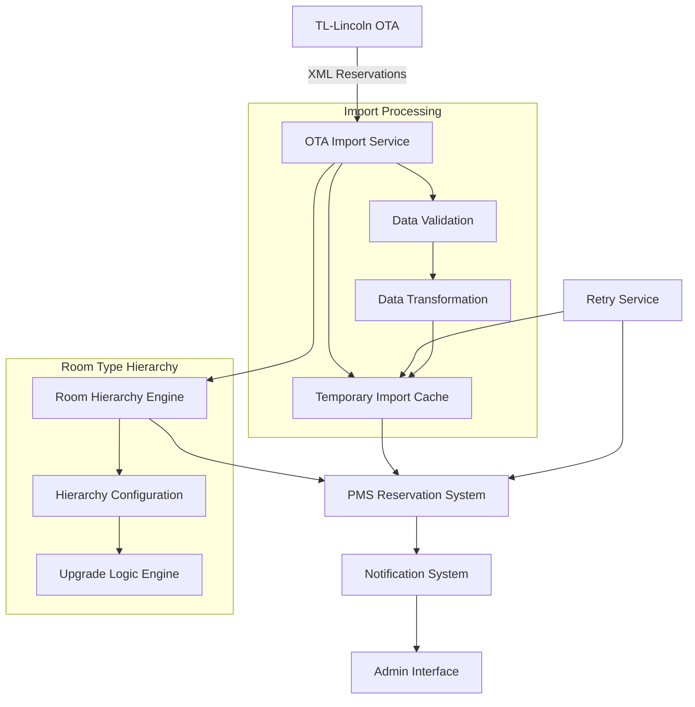
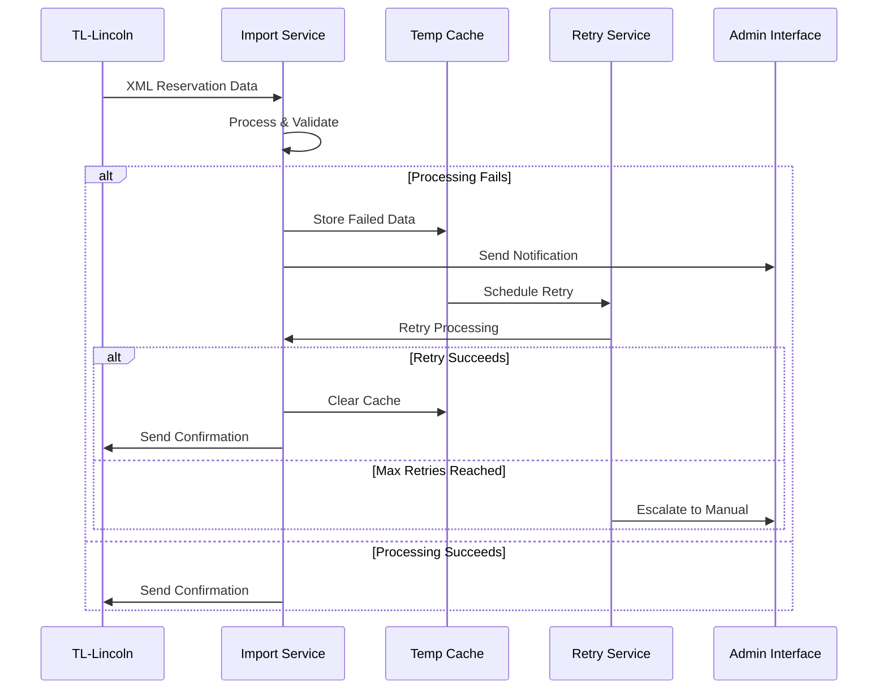

# Design Document

## Overview

This design implements a room type hierarchy system and enhances the existing TL-Lincoln OTA integration with robust import handling. The system builds upon the current XML-based TL-Lincoln integration (`rht-hotel/api/ota/`) to add systematic room upgrade capabilities and resilient reservation import processing with temporary caching and retry mechanisms.

## Architecture

### High-Level Architecture



### Integration with Existing System

The design leverages the existing TL-Lincoln integration infrastructure:
- **XML Templates**: Extends existing `xml_templates` table
- **TL Room Master**: Uses existing `sc_tl_rooms` table for room type mappings
- **XML Processing**: Builds on existing `xmlController.js` and `xmlModel.js`
- **Database Structure**: Extends current PostgreSQL schema with new tables

## Components and Interfaces

### 1. Room Type Hierarchy Engine

**Purpose**: Manages room type upgrade relationships and provides upgrade recommendations.

**Key Components**:
- `RoomHierarchyService`: Core service for hierarchy management
- `UpgradeEngine`: Logic for finding and prioritizing upgrades
- `HierarchyValidator`: Prevents circular dependencies

**Interfaces**:
```javascript
// Room Hierarchy Service Interface
class RoomHierarchyService {
  async createHierarchy(hotelId, roomTypeId, upgradeToRoomTypeId, priority)
  async getUpgradeOptions(hotelId, roomTypeId)
  async validateHierarchy(hotelId, hierarchyConfig)
  async deleteHierarchy(hotelId, hierarchyId)
}

// Upgrade Engine Interface
class UpgradeEngine {
  async findBestUpgrade(hotelId, requestedRoomTypeId, checkIn, checkOut)
  async getAllUpgradePaths(hotelId, roomTypeId)
  async prioritizeUpgrades(upgradeOptions, criteria)
}
```

### 2. Enhanced OTA Import Service

**Purpose**: Extends existing TL-Lincoln integration with robust import handling and temporary caching.

**Key Components**:
- `OTAImportService`: Enhanced version of existing OTA processing
- `TemporaryImportCache`: Manages failed import data
- `ImportRetryService`: Handles automatic retry logic
- `ImportNotificationService`: User notifications for failed imports

**Interfaces**:
```javascript
// Enhanced OTA Import Service Interface
class OTAImportService {
  async processReservations(xmlData, hotelId)
  async cacheFailedImport(reservationData, failureReason)
  async retryFailedImports(hotelId)
  async clearSuccessfulCache(reservationId, outputId)
}

// Temporary Import Cache Interface
class TemporaryImportCache {
  async storeFailedReservation(reservationData, error)
  async getFailedReservations(hotelId)
  async markAsRetrying(cacheId)
  async clearCache(cacheId)
}
```

### 3. Import Monitoring and Notification System

**Purpose**: Provides visibility into import status and notifies users of issues.

**Key Components**:
- `ImportMonitorService`: Tracks import statistics and health
- `NotificationService`: Sends alerts to users
- `ImportDashboard`: Admin interface for monitoring

**Interfaces**:
```javascript
// Import Monitor Service Interface
class ImportMonitorService {
  async logImportAttempt(hotelId, reservationId, status, error)
  async getImportStatistics(hotelId, dateRange)
  async detectImportIssues(hotelId)
  async generateHealthReport(hotelId)
}
```

## Data Models

### Room Type Hierarchy Tables

```sql
-- Room type hierarchy configuration
CREATE TABLE room_type_hierarchy (
    id SERIAL PRIMARY KEY,
    hotel_id INT NOT NULL REFERENCES hotels(id),
    from_room_type_id INT NOT NULL,
    to_room_type_id INT NOT NULL,
    priority INT NOT NULL DEFAULT 1,
    is_active BOOLEAN DEFAULT true,
    created_at TIMESTAMP DEFAULT CURRENT_TIMESTAMP,
    updated_at TIMESTAMP DEFAULT CURRENT_TIMESTAMP,
    FOREIGN KEY (from_room_type_id, hotel_id) REFERENCES room_types(id, hotel_id),
    FOREIGN KEY (to_room_type_id, hotel_id) REFERENCES room_types(id, hotel_id),
    UNIQUE(hotel_id, from_room_type_id, to_room_type_id)
);

-- Hierarchy validation rules
CREATE TABLE room_hierarchy_rules (
    id SERIAL PRIMARY KEY,
    hotel_id INT NOT NULL REFERENCES hotels(id),
    rule_type VARCHAR(50) NOT NULL, -- 'max_upgrade_levels', 'price_difference_limit'
    rule_value JSONB NOT NULL,
    is_active BOOLEAN DEFAULT true,
    created_at TIMESTAMP DEFAULT CURRENT_TIMESTAMP
);
```

### Enhanced OTA Import Tables

**PostgreSQL Tables (Persistent Critical Data)**:

```sql
-- Persistent import cache for failed reservations (PostgreSQL)
CREATE TABLE ota_import_cache (
    id SERIAL PRIMARY KEY,
    hotel_id INT NOT NULL REFERENCES hotels(id),
    ota_reservation_id VARCHAR(255) NOT NULL,
    reservation_data JSONB NOT NULL,
    original_xml TEXT NOT NULL,
    failure_reason TEXT NOT NULL,
    failure_type VARCHAR(100) NOT NULL, -- 'room_mapping', 'validation', 'system_error'
    retry_count INT DEFAULT 0,
    max_retries INT DEFAULT 3,
    next_retry_at TIMESTAMP,
    status VARCHAR(50) DEFAULT 'pending', -- 'pending', 'retrying', 'failed', 'resolved'
    created_at TIMESTAMP DEFAULT CURRENT_TIMESTAMP,
    updated_at TIMESTAMP DEFAULT CURRENT_TIMESTAMP,
    resolved_at TIMESTAMP,
    UNIQUE(hotel_id, ota_reservation_id)
);

-- Import attempt logging
CREATE TABLE ota_import_log (
    id SERIAL PRIMARY KEY,
    hotel_id INT NOT NULL REFERENCES hotels(id),
    ota_reservation_id VARCHAR(255),
    import_batch_id UUID,
    attempt_type VARCHAR(50) NOT NULL, -- 'initial', 'retry', 'manual'
    status VARCHAR(50) NOT NULL, -- 'success', 'failed', 'partial'
    error_message TEXT,
    error_type VARCHAR(100),
    processing_time_ms INT,
    reservation_count INT DEFAULT 1,
    created_at TIMESTAMP DEFAULT CURRENT_TIMESTAMP
);

-- Room type mapping overrides for OTA imports
CREATE TABLE ota_room_type_mappings (
    id SERIAL PRIMARY KEY,
    hotel_id INT NOT NULL REFERENCES hotels(id),
    ota_room_type_code VARCHAR(255) NOT NULL,
    pms_room_type_id INT NOT NULL,
    is_active BOOLEAN DEFAULT true,
    created_by INT REFERENCES users(id),
    created_at TIMESTAMP DEFAULT CURRENT_TIMESTAMP,
    updated_at TIMESTAMP DEFAULT CURRENT_TIMESTAMP,
    FOREIGN KEY (pms_room_type_id, hotel_id) REFERENCES room_types(id, hotel_id),
    UNIQUE(hotel_id, ota_room_type_code)
);

-- Import statistics and monitoring
CREATE TABLE ota_import_statistics (
    id SERIAL PRIMARY KEY,
    hotel_id INT NOT NULL REFERENCES hotels(id),
    date DATE NOT NULL,
    total_attempts INT DEFAULT 0,
    successful_imports INT DEFAULT 0,
    failed_imports INT DEFAULT 0,
    retry_attempts INT DEFAULT 0,
    avg_processing_time_ms INT DEFAULT 0,
    error_types JSONB DEFAULT '{}',
    created_at TIMESTAMP DEFAULT CURRENT_TIMESTAMP,
    updated_at TIMESTAMP DEFAULT CURRENT_TIMESTAMP,
    UNIQUE(hotel_id, date)
);
```

**PostgreSQL-Based Operational Data**:

```sql
-- Retry queue management (PostgreSQL-based)
CREATE TABLE ota_retry_queue (
    id SERIAL PRIMARY KEY,
    hotel_id INT NOT NULL REFERENCES hotels(id),
    cache_id INT NOT NULL REFERENCES ota_import_cache(id),
    scheduled_at TIMESTAMP NOT NULL,
    priority INT DEFAULT 1,
    status VARCHAR(50) DEFAULT 'queued', -- 'queued', 'processing', 'completed'
    processing_started_at TIMESTAMP,
    created_at TIMESTAMP DEFAULT CURRENT_TIMESTAMP,
    INDEX(hotel_id, scheduled_at, status)
);

-- Real-time notifications (PostgreSQL-based)
CREATE TABLE ota_notifications (
    id SERIAL PRIMARY KEY,
    hotel_id INT NOT NULL REFERENCES hotels(id),
    notification_type VARCHAR(100) NOT NULL, -- 'import_failed', 'retry_exhausted', 'manual_intervention'
    message TEXT NOT NULL,
    severity VARCHAR(20) DEFAULT 'info', -- 'info', 'warning', 'error', 'critical'
    is_read BOOLEAN DEFAULT false,
    target_user_id INT REFERENCES users(id),
    related_cache_id INT REFERENCES ota_import_cache(id),
    created_at TIMESTAMP DEFAULT CURRENT_TIMESTAMP,
    read_at TIMESTAMP,
    INDEX(hotel_id, is_read, created_at)
);

-- Processing state tracking (PostgreSQL-based)
CREATE TABLE ota_import_batches (
    id UUID PRIMARY KEY DEFAULT gen_random_uuid(),
    hotel_id INT NOT NULL REFERENCES hotels(id),
    batch_type VARCHAR(50) NOT NULL, -- 'scheduled', 'manual', 'retry'
    total_reservations INT DEFAULT 0,
    processed_reservations INT DEFAULT 0,
    failed_reservations INT DEFAULT 0,
    status VARCHAR(50) DEFAULT 'processing', -- 'processing', 'completed', 'failed'
    started_at TIMESTAMP DEFAULT CURRENT_TIMESTAMP,
    completed_at TIMESTAMP,
    error_summary TEXT,
    INDEX(hotel_id, status, started_at)
);
```

### Integration with Existing TL-Lincoln Tables

The design extends existing tables:
- **sc_tl_rooms**: Add hierarchy-related fields
- **xml_responses**: Enhanced with import status tracking
- **reservations**: Add OTA import tracking fields

```sql
-- Extend existing sc_tl_rooms table
ALTER TABLE sc_tl_rooms ADD COLUMN hierarchy_level INT DEFAULT 0;
ALTER TABLE sc_tl_rooms ADD COLUMN upgrade_priority INT DEFAULT 1;

-- Extend reservations table for OTA tracking
ALTER TABLE reservations ADD COLUMN ota_source VARCHAR(100);
ALTER TABLE reservations ADD COLUMN ota_reservation_id VARCHAR(255);
ALTER TABLE reservations ADD COLUMN ota_import_cache_id INT REFERENCES ota_import_cache(id);
```

## Error Handling

### Error Classification System

**Room Mapping Errors**:
- Unknown OTA room type codes
- Unavailable room types
- Capacity mismatches

**Validation Errors**:
- Invalid date ranges
- Missing required fields
- Data format issues

**System Errors**:
- Database connection issues
- TL-Lincoln API timeouts
- Processing exceptions

### Error Recovery Strategies

1. **Automatic Retry**: Exponential backoff for transient errors
2. **Room Type Substitution**: Use hierarchy for unavailable rooms
3. **Manual Intervention**: Queue for admin review when auto-retry fails
4. **Graceful Degradation**: Continue processing other reservations

### Error Notification Flow



## Testing Strategy

### Unit Testing
- Room hierarchy validation logic
- Upgrade path calculation algorithms
- OTA data transformation functions
- Error handling and retry mechanisms

### Integration Testing
- TL-Lincoln XML processing end-to-end
- Database transaction integrity
- Notification system integration
- Cache management operations

### Performance Testing
- Large batch import processing
- Concurrent reservation handling
- Hierarchy traversal performance
- Database query optimization

### User Acceptance Testing
- Admin interface usability
- Error notification clarity
- Manual intervention workflows
- Reporting and monitoring features

## Security Considerations

### Data Protection
- Encrypt sensitive reservation data in cache
- Secure XML transmission with TL-Lincoln
- Audit trail for all hierarchy changes
- Role-based access to admin functions

### Input Validation
- Sanitize all XML input data
- Validate hierarchy configurations
- Prevent SQL injection in dynamic queries
- Rate limiting for retry attempts

### Access Control
- Restrict hierarchy configuration to admins
- Limit cache access to authorized users
- Secure API endpoints with authentication
- Log all administrative actions

## Performance Optimization

### Database Optimization
- Index room type hierarchy relationships
- Partition large import log tables
- Optimize upgrade path queries
- Cache frequently accessed hierarchies

### Processing Efficiency
- Batch process multiple reservations
- Async processing for non-critical operations
- Connection pooling for TL-Lincoln API
- Memory-efficient XML parsing

### Monitoring and Alerting
- Real-time import success rates
- Performance metric dashboards
- Automated health checks
- Proactive error detection