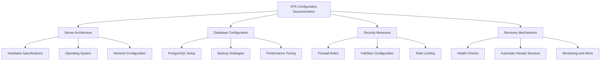

# Design Document: VPS Configuration Documentation

## Overview

This design document outlines the structure and content for comprehensive documentation of the Sakura VPS configuration used in the hotel management system, with a specific focus on PostgreSQL database automatic recovery mechanisms. The documentation will be organized into logical sections covering server architecture, database configuration, security measures, and implementation guides for automatic recovery mechanisms.

The documentation will specifically address the Sakura VPS environment (https://vps.sakura.ad.jp/feature/), taking into account its unique features and management interfaces.

### Current VPS Configuration

- **Operating System**: Ubuntu 24.04 amd64
- **Location**: 石狩第1ゾーン (Ishikari Zone 1)
- **Storage**: SSD 200GB
- **CPU**: 4 virtual cores
- **Memory**: 4GB

### Current vs. Ideal Specifications

#### Current Usage Profile
- Single hotel in the database
- Less than 5 concurrent users
- Moderate database size and transaction volume

#### Projected Growth (1 Year)
- Expansion to approximately 25 hotels
- 10-40 concurrent users
- Increased database size and transaction complexity

#### Specification Analysis

1. **Memory (4GB)**
   - **Current Assessment**: Adequate for current operations with a single hotel and few concurrent users.
   - **Future Considerations**: Likely insufficient for 25 hotels and up to 40 concurrent users. PostgreSQL performance is heavily dependent on available RAM for caching.
   - **Recommendation**: Plan for an upgrade to 8-16GB RAM as the system scales to handle increased connection pools and query caching.

2. **CPU (4 virtual cores)**
   - **Current Assessment**: Sufficient for current workload with minimal concurrent operations.
   - **Future Considerations**: May become a bottleneck with increased concurrent users and more complex reporting queries across multiple hotels.
   - **Recommendation**: Monitor CPU utilization as the system grows; consider upgrading to 6-8 cores if query response times degrade.

3. **Storage (200GB SSD)**
   - **Current Assessment**: Very generous for current needs, providing ample room for database growth.
   - **Future Considerations**: Likely still sufficient for 25 hotels unless storing extensive media files or long-term logs.
   - **Recommendation**: Implement proper log rotation and database maintenance to manage disk usage; current capacity should be adequate for projected growth.

4. **Network Bandwidth**
   - **Current Assessment**: Not specified, but Sakura VPS typically provides adequate bandwidth for database applications.
   - **Future Considerations**: With increased users, especially if accessing remotely, bandwidth requirements will increase.
   - **Recommendation**: Monitor network utilization and latency as user count grows; consider implementing connection pooling to optimize network resource usage.

5. **Database Optimization**
   - **Current Assessment**: Standard PostgreSQL configuration likely in use.
   - **Future Considerations**: Default configurations are rarely optimal for growing workloads.
   - **Recommendation**: Implement custom PostgreSQL tuning parameters based on workload characteristics, focusing on connection pooling, work memory, and shared buffers as the system scales.

## Architecture

The documentation will follow a modular architecture with the following components:

1. **Core Documentation Files**: Markdown files organized in a hierarchical structure
2. **Diagrams**: Visual representations of server architecture and data flows
3. **Configuration Examples**: Sample configuration files for reference
4. **Implementation Scripts**: Scripts for setting up automatic recovery mechanisms
5. **Sakura VPS-Specific Guides**: Documentation specific to Sakura VPS management interface and features

The documentation will be stored in the project's `docs/operations/vps-configuration/` directory and will be version-controlled alongside the codebase. It will include specific sections for Sakura VPS management, including their control panel usage, network settings, and backup features.



## Components and Interfaces

### Documentation Components

1. **Server Architecture Documentation**
   - Hardware specifications (Sakura VPS plan details)
   - Operating system details (from Sakura's OS lineup including CentOS, Ubuntu, KUSANAGI)
   - Network configuration (including Sakura's local network features)
   - Installed software and versions

2. **Database Configuration Documentation**
   - PostgreSQL installation and version
   - Configuration parameters
   - Backup strategies and schedules
   - Performance tuning recommendations for Sakura VPS SSD plans

3. **Security Measures Documentation**
   - Sakura VPS packet filter configuration
   - Fail2ban configuration
   - Rate limiting and connection throttling
   - SSL/TLS implementation

4. **Recovery Mechanisms Documentation**
   - Health check implementation
   - Systemd service configurations
   - Monitoring and alerting setup
   - Testing procedures

5. **Sakura VPS Control Panel Documentation**
   - Server management operations
   - OS reinstallation procedures
   - Console access methods
   - Startup script configuration

### Implementation Components

1. **PostgreSQL Automatic Recovery Service**
   - Systemd service definition
   - Health check script
   - Recovery script
   - Logging configuration

2. **DoS Protection Implementation**
   - Fail2ban configuration for PostgreSQL
   - Connection rate limiting rules
   - IP blacklisting mechanism
   - Monitoring and alerting setup

## Data Models

### Documentation Structure

```
docs/
└── operations/
    └── vps-configuration/
        ├── index.md                     # Overview and TOC
        ├── server-architecture.md       # Server architecture details
        ├── database-configuration.md    # PostgreSQL configuration
        ├── security-measures.md         # Security implementations
        ├── recovery-mechanisms.md       # Automatic recovery details
        ├── diagrams/                    # Visual representations
        │   ├── server-architecture.png
        │   ├── database-flows.png
        │   └── security-layers.png
        └── examples/                    # Configuration examples
            ├── postgresql.conf
            ├── pg_hba.conf
            ├── fail2ban-postgresql.conf
            └── systemd-services/
                ├── postgresql-recovery.service
                └── postgresql-health-check.timer
```

### Implementation Structure

```
server-config/
├── postgresql/
│   ├── postgresql.conf                  # Main PostgreSQL configuration
│   ├── pg_hba.conf                      # Client authentication configuration
│   ├── recovery-scripts/
│   │   ├── pg-health-check.sh           # Health check script
│   │   └── pg-recovery.sh               # Recovery script
│   └── systemd/
│       ├── postgresql-recovery.service  # Recovery service definition
│       └── postgresql-health-check.timer # Health check timer
├── security/
│   ├── fail2ban/
│   │   └── filter.d/
│   │       └── postgresql.conf          # Fail2ban filter for PostgreSQL
│   └── iptables/
│       ├── rules.v4                     # IPv4 firewall rules
│       └── rules.v6                     # IPv6 firewall rules
└── monitoring/
    └── alerts/
        └── postgresql-alerts.conf       # Alert configuration
```

## Error Handling

The documentation will include comprehensive error handling guidance:

1. **Common Error Scenarios**:
   - Database connection failures
   - Authentication issues
   - Resource exhaustion
   - DoS attack detection

2. **Troubleshooting Guides**:
   - Step-by-step diagnostic procedures
   - Log file locations and interpretation
   - Common error messages and their meanings
   - Resolution strategies

3. **Recovery Procedures**:
   - Manual recovery steps when automatic recovery fails
   - Data integrity verification after recovery
   - Service restoration priorities

## Testing Strategy

The documentation will include testing strategies for the automatic recovery mechanisms:

1. **Unit Testing**:
   - Health check script testing
   - Recovery script testing
   - Service configuration validation

2. **Integration Testing**:
   - End-to-end recovery scenario testing
   - Simulated failure recovery testing
   - Performance under load testing

3. **Security Testing**:
   - Simulated DoS attack testing
   - Fail2ban response testing
   - Rate limiting effectiveness testing

4. **Documentation Testing**:
   - Accuracy verification
   - Completeness check
   - Procedural validation

## Implementation Details

### PostgreSQL Automatic Recovery Service

The automatic recovery service will consist of:

1. **Health Check Component**:
   - Systemd timer that runs at regular intervals (e.g., every minute)
   - Bash script that checks PostgreSQL availability
   - Logging mechanism for health status

2. **Recovery Component**:
   - Systemd service triggered when health check fails
   - Recovery script that attempts to restart PostgreSQL
   - Escalation mechanism for repeated failures

3. **Monitoring Component**:
   - Log analysis for failure patterns
   - Metrics collection for database performance
   - Alert generation for critical failures

### Sample Systemd Service Configuration

```ini
[Unit]
Description=PostgreSQL Database Recovery Service
After=network.target

[Service]
Type=oneshot
ExecStart=/usr/local/bin/pg-recovery.sh
User=postgres
Group=postgres
StandardOutput=journal
StandardError=journal

[Install]
WantedBy=multi-user.target
```

### Sample Health Check Timer Configuration

```ini
[Unit]
Description=PostgreSQL Health Check Timer

[Timer]
OnBootSec=1min
OnUnitActiveSec=1min
Unit=postgresql-health-check.service

[Install]
WantedBy=timers.target
```

### Sample Health Check Script

```bash
#!/bin/bash

# PostgreSQL health check script
# This script checks if PostgreSQL is running and responding to queries

LOG_FILE="/var/log/postgresql/health-check.log"
MAX_FAILURES=3
FAILURE_COUNT_FILE="/var/run/postgresql/failure_count"

# Initialize failure count if file doesn't exist
if [ ! -f "$FAILURE_COUNT_FILE" ]; then
    echo "0" > "$FAILURE_COUNT_FILE"
fi

# Function to log messages
log_message() {
    echo "$(date '+%Y-%m-%d %H:%M:%S') - $1" >> "$LOG_FILE"
}

# Check if PostgreSQL is running
if ! systemctl is-active --quiet postgresql; then
    log_message "ERROR: PostgreSQL service is not running"
    
    # Increment failure count
    FAILURES=$(cat "$FAILURE_COUNT_FILE")
    FAILURES=$((FAILURES + 1))
    echo "$FAILURES" > "$FAILURE_COUNT_FILE"
    
    if [ "$FAILURES" -ge "$MAX_FAILURES" ]; then
        log_message "CRITICAL: Maximum failures reached, attempting recovery"
        systemctl start postgresql-recovery.service
        echo "0" > "$FAILURE_COUNT_FILE"
    else
        log_message "WARNING: Failure count: $FAILURES/$MAX_FAILURES"
    fi
    
    exit 1
fi

# Check if PostgreSQL is accepting connections
if ! sudo -u postgres psql -c "SELECT 1" >/dev/null 2>&1; then
    log_message "ERROR: PostgreSQL is not accepting connections"
    
    # Increment failure count
    FAILURES=$(cat "$FAILURE_COUNT_FILE")
    FAILURES=$((FAILURES + 1))
    echo "$FAILURES" > "$FAILURE_COUNT_FILE"
    
    if [ "$FAILURES" -ge "$MAX_FAILURES" ]; then
        log_message "CRITICAL: Maximum failures reached, attempting recovery"
        systemctl start postgresql-recovery.service
        echo "0" > "$FAILURE_COUNT_FILE"
    else
        log_message "WARNING: Failure count: $FAILURES/$MAX_FAILURES"
    fi
    
    exit 1
fi

# If we got here, PostgreSQL is healthy
log_message "INFO: PostgreSQL is healthy"
echo "0" > "$FAILURE_COUNT_FILE"
exit 0
```

## Design Decisions and Rationale

1. **Markdown-based Documentation**:
   - Rationale: Markdown is version-control friendly, easy to read and write, and can be rendered in various formats.
   - Alternative: Wiki system, which was rejected due to the need for tight integration with the codebase.

2. **Systemd for Service Management**:
   - Rationale: Systemd is the standard service manager on modern Linux distributions, providing robust dependency management and service supervision.
   - Alternative: Custom init scripts, which were rejected due to increased maintenance complexity.

3. **Fail2ban for DoS Protection**:
   - Rationale: Fail2ban provides a flexible framework for monitoring logs and blocking malicious IP addresses.
   - Alternative: Hardware firewall, which was rejected due to cost considerations.

4. **Bash Scripts for Health Checks**:
   - Rationale: Bash scripts are universally available on Linux systems and easy to maintain.
   - Alternative: Python scripts, which were rejected to minimize dependencies.

5. **Hierarchical Documentation Structure**:
   - Rationale: A hierarchical structure makes it easier to navigate and find specific information.
   - Alternative: Flat structure, which was rejected due to poor organization for complex topics.