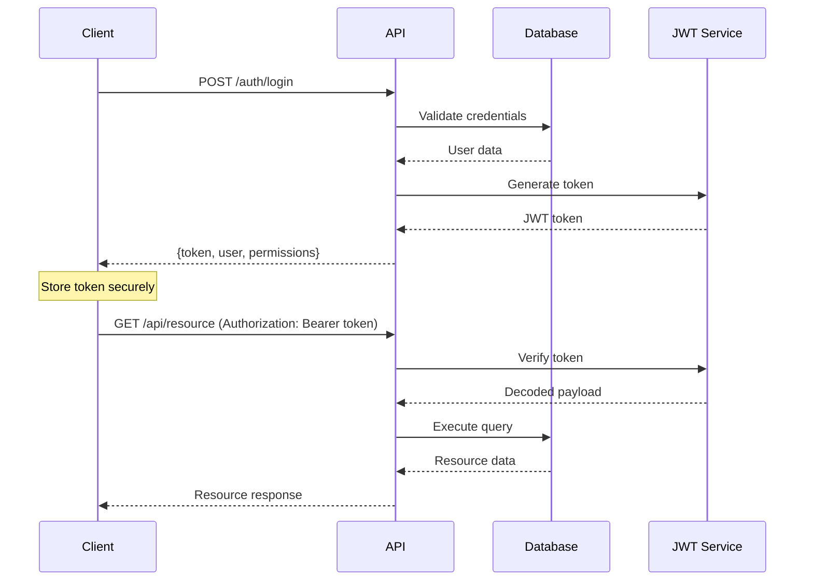
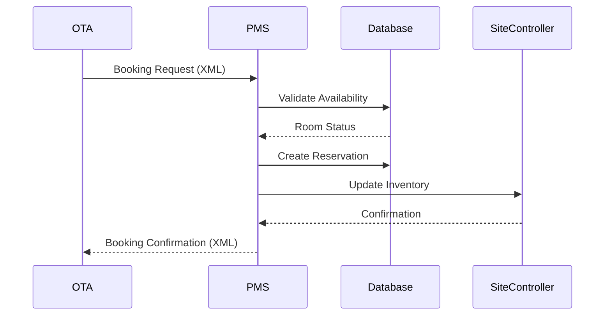

# API Design and Integration Patterns

## Overview

This document describes the comprehensive API design, authentication patterns, and integration strategies for the Hotel PMS system. The API follows RESTful principles with JWT-based authentication and supports multiple integration patterns including OTA channels, booking engines, and external services.

## API Architecture

### RESTful API Design

The API follows REST architectural principles with a clear resource-based URL structure:

```
/api/v1/
├── /auth/              # Authentication endpoints
├── /users/             # User management
├── /hotels/            # Hotel information
├── /rooms/             # Room inventory
├── /reservations/      # Reservation management
├── /clients/           # Customer management
├── /billing/           # Payment and invoicing
├── /reports/           # Analytics and reporting
├── /crm/               # Customer relationship management
├── /waitlist/          # Waitlist management
├── /plans/             # Rate plans and packages
├── /addons/            # Additional services
└── /booking-engine/    # External booking engine integration
```

### HTTP Methods and Status Codes

#### Standard HTTP Methods
```http
GET     /api/resource       # Retrieve resources
POST    /api/resource       # Create new resource
PUT     /api/resource/:id   # Update entire resource
PATCH   /api/resource/:id   # Partial resource update
DELETE  /api/resource/:id   # Delete resource
```

#### HTTP Status Codes
```http
200 OK                  # Successful GET, PUT, PATCH
201 Created             # Successful POST
204 No Content          # Successful DELETE
400 Bad Request         # Invalid request data
401 Unauthorized        # Authentication required
403 Forbidden           # Insufficient permissions
404 Not Found           # Resource not found
409 Conflict            # Resource conflict
422 Unprocessable Entity # Validation errors
500 Internal Server Error # Server error
```

## Authentication and Authorization

### JWT-Based Authentication

#### Token Structure
```javascript
{
  "id": 123,
  "email": "user@example.com",
  "name": "John Doe",
  "role_id": 2,
  "status_id": 1,
  "permissions": {
    "manage_db": false,
    "manage_users": true,
    "manage_clients": true,
    "view_reports": true,
    "crud_ok": true
  },
  "iat": 1640995200,
  "exp": 1641081600
}
```

#### Authentication Flow


### Authorization Middleware

#### Permission Levels
```javascript
// Basic authentication - user must be active
const authMiddleware = (req, res, next) => {
  // Verify JWT token
  // Check user status (active/inactive)
  // Set req.user
};

// CRUD access - additional permission check for non-GET requests
const authMiddlewareCRUDAccess = (req, res, next) => {
  // Basic auth + crud_ok permission for POST/PUT/DELETE
};

// Admin access - requires management permissions
const authMiddlewareAdmin = (req, res, next) => {
  // Basic auth + manage_users OR manage_db permission
};

// Specific permission checks
const authMiddleware_manageUsers = (req, res, next) => {
  // Basic auth + manage_users permission
};
```

#### Role-Based Access Control (RBAC)
```javascript
// User roles with hierarchical permissions
const roles = {
  admin: {
    manage_db: true,
    manage_users: true,
    manage_clients: true,
    view_reports: true,
    crud_ok: true
  },
  manager: {
    manage_db: false,
    manage_users: true,
    manage_clients: true,
    view_reports: true,
    crud_ok: true
  },
  editor: {
    manage_db: false,
    manage_users: false,
    manage_clients: true,
    view_reports: true,
    crud_ok: true
  },
  user: {
    manage_db: false,
    manage_users: false,
    manage_clients: false,
    view_reports: true,
    crud_ok: true
  },
  viewer: {
    manage_db: false,
    manage_users: false,
    manage_clients: false,
    view_reports: true,
    crud_ok: false
  }
};
```

### Session Management

#### Session Configuration
```javascript
app.use(session({
  store: new pgSession({
    pool: sessionPool,
    tableName: 'user_sessions',
    createTableIfMissing: true
  }),
  secret: process.env.SESSION_SECRET,
  resave: false,
  saveUninitialized: false,
  cookie: {
    secure: isSecureEnvironment,
    httpOnly: true,
    maxAge: 30 * 60 * 1000, // 30 minutes
    sameSite: isSecureEnvironment ? 'None' : 'Lax'
  }
}));
```

## Core API Endpoints

### Authentication Endpoints

#### Login
```http
POST /api/auth/login
Content-Type: application/json

{
  "email": "user@example.com",
  "password": "password123"
}
```

**Response:**
```json
{
  "token": "eyJhbGciOiJIUzI1NiIsInR5cCI6IkpXVCJ9...",
  "user": {
    "id": 123,
    "email": "user@example.com",
    "name": "John Doe",
    "role": "manager"
  },
  "permissions": {
    "manage_users": true,
    "manage_clients": true,
    "view_reports": true,
    "crud_ok": true
  }
}
```

#### Google OAuth
```http
GET /api/auth/google
# Redirects to Google OAuth consent screen

GET /api/auth/google/callback?code=...
# Handles OAuth callback and returns JWT token
```

### Reservation Management

#### Create Reservation
```http
POST /api/reservation/hold
Authorization: Bearer <token>
Content-Type: application/json

{
  "hotel_id": 1,
  "client_id": "uuid-client-id",
  "check_in": "2024-03-15",
  "check_out": "2024-03-17",
  "number_of_people": 2,
  "rooms": [
    {
      "room_type_id": 1,
      "plan_id": 2,
      "guests": 2
    }
  ]
}
```

**Response:**
```json
{
  "reservation_id": "uuid-reservation-id",
  "status": "hold",
  "confirmation_number": "RES-2024-001",
  "total_amount": 25000,
  "details": [
    {
      "date": "2024-03-15",
      "room_id": 101,
      "plan_name": "Standard Plan",
      "price": 12500
    }
  ]
}
```

#### Get Available Rooms
```http
GET /api/reservation/available-rooms?hotel_id=1&check_in=2024-03-15&check_out=2024-03-17
Authorization: Bearer <token>
```

**Response:**
```json
{
  "hotel_id": 1,
  "check_in": "2024-03-15",
  "check_out": "2024-03-17",
  "available_rooms": [
    {
      "room_id": 101,
      "room_number": "101",
      "room_type": "Standard",
      "capacity": 2,
      "smoking": false,
      "available_dates": ["2024-03-15", "2024-03-16"]
    }
  ]
}
```

### Client Management

#### Create Client
```http
POST /api/clients
Authorization: Bearer <token>
Content-Type: application/json

{
  "name": "田中太郎",
  "name_kana": "タナカタロウ",
  "name_kanji": "田中太郎",
  "email": "tanaka@example.com",
  "phone": "090-1234-5678",
  "legal_or_natural_person": "natural",
  "gender": "male"
}
```

#### Search Clients
```http
GET /api/clients/search?q=田中&limit=10
Authorization: Bearer <token>
```

### Billing and Payments

#### Create Payment
```http
POST /api/reservation/payment/add
Authorization: Bearer <token>
Content-Type: application/json

{
  "reservation_id": "uuid-reservation-id",
  "client_id": "uuid-client-id",
  "payment_type_id": 1,
  "amount": 12500,
  "date": "2024-03-15",
  "comment": "Check-in payment"
}
```

### Reporting and Analytics

#### Dashboard Metrics
```http
GET /api/metrics/dashboard?hotel_id=1&date=2024-03-15
Authorization: Bearer <token>
```

**Response:**
```json
{
  "hotel_id": 1,
  "date": "2024-03-15",
  "metrics": {
    "reservations_today": {
      "count": 5,
      "total_value": 125000
    },
    "check_ins_expected": 8,
    "check_outs_expected": 6,
    "cancellations_today": {
      "count": 1,
      "lost_value": 15000
    },
    "occupancy_rate": 85.5,
    "revenue_per_available_room": 8500
  }
}
```

## External Integration Patterns

### Booking Engine Integration

#### API Key Authentication
```javascript
const authMiddlewareBookingEngine = async (req, res, next) => {
  const authHeader = req.headers.authorization;
  const apiKey = authHeader?.split(' ')[1];
  
  if (apiKey !== process.env.BOOKING_ENGINE_API_KEY) {
    return res.status(401).json({ error: 'Invalid API key' });
  }
  
  req.user = {
    id: 2,
    name: 'Booking Engine System',
    permissions: { crud_ok: true }
  };
  
  next();
};
```

#### Cache Update Endpoints
```http
POST /api/booking-engine/cache/update-hotels
Authorization: Bearer <api-key>

POST /api/booking-engine/cache/update-room-types
Authorization: Bearer <api-key>

GET /api/booking-engine/cache/status
Authorization: Bearer <api-key>
```

### OTA Integration

#### Site Controller XML Templates
```javascript
// XML template management for OTA communications
const xmlTemplates = {
  NetStockAdjustmentService: `
    <?xml version="1.0" encoding="UTF-8"?>
    <soapenv:Envelope>
      <soapenv:Body>
        <pms:execute>
          <arg0>
            <commonRequest>
              <systemId>{{systemId}}</systemId>
              <pmsUserId>{{pmsUserId}}</pmsUserId>
              <pmsPassword>{{pmsPassword}}</pmsPassword>
            </commonRequest>
            <adjustmentTarget>
              <adjustmentProcedureCode>{{adjustmentProcedureCode}}</adjustmentProcedureCode>
              <netRmTypeGroupCode>{{netRmTypeGroupCode}}</netRmTypeGroupCode>
              <adjustmentDate>{{adjustmentDate}}</adjustmentDate>
              <remainingCount>{{remainingCount}}</remainingCount>
              <salesStatus>{{salesStatus}}</salesStatus>
              <requestId>{{requestId}}</requestId>
            </adjustmentTarget>
          </arg0>
        </pms:execute>
      </soapenv:Body>
    </soapenv:Envelope>
  `
};
```

#### OTA Message Flow


### Waitlist Integration

#### Token-Based Authentication
```javascript
const authMiddlewareWaitlistToken = async (req, res, next) => {
  const token = req.headers.authorization?.split(' ')[1];
  
  const entry = await WaitlistEntry.findByToken(req.requestId, token);
  if (!entry) {
    return res.status(401).json({ error: 'Invalid waitlist token' });
  }
  
  req.user = { id: 1, name: 'System User', permissions: { crud_ok: true } };
  req.waitlistEntry = entry;
  
  next();
};
```

#### Waitlist Endpoints
```http
POST /api/waitlist/entries
Authorization: Bearer <jwt-token>

GET /api/waitlist/confirm/:token
# Public endpoint with token authentication

POST /api/waitlist/cancel/:token
Authorization: Bearer <waitlist-token>
```

## Error Handling and Validation

### Standardized Error Responses

#### Error Response Format
```json
{
  "error": {
    "message": "Validation failed",
    "type": "VALIDATION_ERROR",
    "details": [
      {
        "field": "email",
        "message": "Invalid email format"
      }
    ]
  }
}
```

#### Error Types
```javascript
const errorTypes = {
  // Authentication errors
  NO_AUTH_HEADER: 'Authorization header required',
  INVALID_AUTH_FORMAT: 'Invalid authorization format',
  NO_TOKEN: 'Token missing',
  TOKEN_EXPIRED: 'Token has expired',
  TOKEN_INVALID: 'Invalid token',
  USER_INACTIVE: 'User account is inactive',
  
  // Authorization errors
  INSUFFICIENT_PERMISSIONS: 'Insufficient permissions',
  FORBIDDEN: 'Access forbidden',
  
  // Validation errors
  VALIDATION_ERROR: 'Request validation failed',
  MISSING_REQUIRED_FIELD: 'Required field missing',
  INVALID_FORMAT: 'Invalid data format',
  
  // Business logic errors
  RESOURCE_NOT_FOUND: 'Resource not found',
  RESOURCE_CONFLICT: 'Resource conflict',
  BUSINESS_RULE_VIOLATION: 'Business rule violation'
};
```

### Input Validation Middleware

#### Validation Examples
```javascript
const { body, param, query, validationResult } = require('express-validator');

// Email validation
const emailValidation = [
  body('email')
    .isEmail()
    .normalizeEmail()
    .withMessage('Valid email required')
];

// Password validation
const passwordValidation = [
  body('password')
    .isLength({ min: 8 })
    .matches(/^(?=.*[a-z])(?=.*[A-Z])(?=.*\d)/)
    .withMessage('Password must be at least 8 characters with uppercase, lowercase, and number')
];

// Date validation
const dateValidation = [
  body('check_in')
    .isISO8601()
    .toDate()
    .withMessage('Valid check-in date required'),
  body('check_out')
    .isISO8601()
    .toDate()
    .custom((value, { req }) => {
      if (value <= req.body.check_in) {
        throw new Error('Check-out must be after check-in');
      }
      return true;
    })
];
```

## Real-time Communication

### WebSocket Integration

#### Socket.IO Setup
```javascript
const io = socketio(httpServer, {
  cors: {
    origin: [process.env.FRONTEND_URL, process.env.PROD_FRONTEND_URL],
    methods: ["GET", "POST", "PUT", "DELETE", "OPTIONS"],
    credentials: true
  }
});

// Environment-based room management
io.on('connection', (socket) => {
  const origin = socket.handshake.headers.origin;
  const environment = origin?.includes('test.wehub') ? 'dev' : 'prod';
  socket.join(environment);
  
  socket.on('disconnect', () => {
    console.log('Client disconnected:', socket.id);
  });
});
```

#### Real-time Updates
```javascript
// Database change notifications
const listenForTableChanges = async () => {
  const client = await pool.connect();
  
  client.on('notification', async (msg) => {
    if (msg.channel === 'reservation_log_inserted') {
      const logId = parseInt(msg.payload, 10);
      
      // Process reservation change
      const data = await getReservationData(logId);
      
      // Update external systems
      await updateSiteController(data);
      await updateGoogleSheets(data);
      
      // Notify connected clients
      io.emit('tableUpdate', {
        type: 'reservation',
        data: data
      });
    }
  });
  
  await client.query('LISTEN reservation_log_inserted');
};
```

## Performance Optimization

### Caching Strategies

#### Redis Caching
```javascript
const redis = require('redis');
const client = redis.createClient();

// Cache frequently accessed data
const cacheMiddleware = (ttl = 300) => {
  return async (req, res, next) => {
    const key = `cache:${req.originalUrl}`;
    
    try {
      const cached = await client.get(key);
      if (cached) {
        return res.json(JSON.parse(cached));
      }
      
      // Store original res.json
      const originalJson = res.json;
      res.json = function(data) {
        // Cache the response
        client.setex(key, ttl, JSON.stringify(data));
        return originalJson.call(this, data);
      };
      
      next();
    } catch (error) {
      next(); // Continue without cache on error
    }
  };
};
```

#### Database Query Optimization
```javascript
// Connection pooling
const pool = new Pool({
  user: process.env.PG_USER,
  host: process.env.PG_HOST,
  database: process.env.PG_DATABASE,
  password: process.env.PG_PASSWORD,
  port: process.env.PG_PORT,
  max: 50, // Maximum connections
  idleTimeoutMillis: 30000,
  connectionTimeoutMillis: 2000
});

// Prepared statements for frequently used queries
const preparedQueries = {
  getAvailableRooms: `
    SELECT r.id, r.room_number, rt.name as room_type
    FROM rooms r
    JOIN room_types rt ON r.room_type_id = rt.id
    WHERE r.hotel_id = $1 
      AND r.for_sale = true
      AND r.id NOT IN (
        SELECT DISTINCT rd.room_id
        FROM reservation_details rd
        WHERE rd.date >= $2 AND rd.date < $3
          AND rd.cancelled IS NULL
      )
  `
};
```

### Rate Limiting

#### API Rate Limiting
```javascript
const rateLimit = require('express-rate-limit');

// General API rate limiting
const apiLimiter = rateLimit({
  windowMs: 15 * 60 * 1000, // 15 minutes
  max: 1000, // Limit each IP to 1000 requests per windowMs
  message: {
    error: 'Too many requests from this IP, please try again later.'
  },
  standardHeaders: true,
  legacyHeaders: false
});

// Strict rate limiting for authentication endpoints
const authLimiter = rateLimit({
  windowMs: 15 * 60 * 1000, // 15 minutes
  max: 5, // Limit each IP to 5 login attempts per windowMs
  message: {
    error: 'Too many login attempts, please try again later.'
  },
  skipSuccessfulRequests: true
});

app.use('/api/', apiLimiter);
app.use('/api/auth/login', authLimiter);
```

## Security Considerations

### Input Sanitization

#### SQL Injection Prevention
```javascript
// Always use parameterized queries
const getUserById = async (id) => {
  const query = 'SELECT * FROM users WHERE id = $1';
  const result = await pool.query(query, [id]);
  return result.rows[0];
};

// Avoid string concatenation
// BAD: `SELECT * FROM users WHERE id = ${id}`
// GOOD: Use parameterized queries as shown above
```

#### XSS Prevention
```javascript
const helmet = require('helmet');
const xss = require('xss');

// Security headers
app.use(helmet({
  contentSecurityPolicy: {
    directives: {
      defaultSrc: ["'self'"],
      styleSrc: ["'self'", "'unsafe-inline'"],
      scriptSrc: ["'self'"],
      imgSrc: ["'self'", "data:", "https:"]
    }
  }
}));

// Input sanitization
const sanitizeInput = (req, res, next) => {
  for (const key in req.body) {
    if (typeof req.body[key] === 'string') {
      req.body[key] = xss(req.body[key]);
    }
  }
  next();
};
```

### HTTPS and CORS

#### CORS Configuration
```javascript
app.use(cors((req, callback) => {
  const allowedOrigins = [
    process.env.FRONTEND_URL,
    process.env.PROD_FRONTEND_URL
  ];
  
  const origin = req.header('Origin');
  const corsOptions = {
    origin: allowedOrigins.includes(origin) ? origin : false,
    methods: ['GET', 'POST', 'PUT', 'DELETE', 'OPTIONS'],
    allowedHeaders: ['Content-Type', 'Authorization', 'X-Request-Environment'],
    credentials: true,
    optionsSuccessStatus: 200
  };
  
  callback(null, corsOptions);
}));
```

### Audit Logging

#### Security Event Logging
```javascript
const winston = require('winston');

const securityLogger = winston.createLogger({
  level: 'info',
  format: winston.format.combine(
    winston.format.timestamp(),
    winston.format.json()
  ),
  transports: [
    new winston.transports.File({ filename: 'security.log' })
  ]
});

// Log authentication attempts
const logAuthAttempt = (req, success, error = null) => {
  securityLogger.info('Authentication attempt', {
    ip: req.ip,
    userAgent: req.headers['user-agent'],
    email: req.body.email,
    success: success,
    error: error,
    timestamp: new Date().toISOString()
  });
};
```

## API Documentation and Testing

### OpenAPI/Swagger Documentation

#### API Documentation Structure
```yaml
openapi: 3.0.0
info:
  title: Hotel PMS API
  version: 1.0.0
  description: Comprehensive API for Hotel Property Management System

servers:
  - url: https://test.wehub.work/api
    description: Development server
  - url: https://wehub.work/api
    description: Production server

components:
  securitySchemes:
    bearerAuth:
      type: http
      scheme: bearer
      bearerFormat: JWT

  schemas:
    User:
      type: object
      properties:
        id:
          type: integer
        email:
          type: string
          format: email
        name:
          type: string
        role:
          type: string
          enum: [admin, manager, editor, user, viewer]

    Reservation:
      type: object
      properties:
        id:
          type: string
          format: uuid
        hotel_id:
          type: integer
        client_id:
          type: string
          format: uuid
        check_in:
          type: string
          format: date
        check_out:
          type: string
          format: date
        status:
          type: string
          enum: [hold, provisory, confirmed, checked_in, checked_out, cancelled]

paths:
  /auth/login:
    post:
      summary: User login
      requestBody:
        required: true
        content:
          application/json:
            schema:
              type: object
              properties:
                email:
                  type: string
                  format: email
                password:
                  type: string
      responses:
        '200':
          description: Login successful
          content:
            application/json:
              schema:
                type: object
                properties:
                  token:
                    type: string
                  user:
                    $ref: '#/components/schemas/User'
```

### API Testing

#### Unit Testing with Jest
```javascript
const request = require('supertest');
const app = require('../index');

describe('Authentication API', () => {
  test('POST /api/auth/login - successful login', async () => {
    const response = await request(app)
      .post('/api/auth/login')
      .send({
        email: 'test@example.com',
        password: 'password123'
      });
    
    expect(response.status).toBe(200);
    expect(response.body).toHaveProperty('token');
    expect(response.body).toHaveProperty('user');
  });
  
  test('POST /api/auth/login - invalid credentials', async () => {
    const response = await request(app)
      .post('/api/auth/login')
      .send({
        email: 'test@example.com',
        password: 'wrongpassword'
      });
    
    expect(response.status).toBe(401);
    expect(response.body).toHaveProperty('error');
  });
});

describe('Reservation API', () => {
  let authToken;
  
  beforeAll(async () => {
    const loginResponse = await request(app)
      .post('/api/auth/login')
      .send({
        email: 'test@example.com',
        password: 'password123'
      });
    
    authToken = loginResponse.body.token;
  });
  
  test('GET /api/reservation/available-rooms', async () => {
    const response = await request(app)
      .get('/api/reservation/available-rooms')
      .set('Authorization', `Bearer ${authToken}`)
      .query({
        hotel_id: 1,
        check_in: '2024-03-15',
        check_out: '2024-03-17'
      });
    
    expect(response.status).toBe(200);
    expect(response.body).toHaveProperty('available_rooms');
  });
});
```

#### Integration Testing
```javascript
const { Pool } = require('pg');

describe('Database Integration', () => {
  let pool;
  
  beforeAll(async () => {
    pool = new Pool({
      connectionString: process.env.TEST_DATABASE_URL
    });
  });
  
  afterAll(async () => {
    await pool.end();
  });
  
  test('Create and retrieve reservation', async () => {
    // Create test reservation
    const createResponse = await request(app)
      .post('/api/reservation/hold')
      .set('Authorization', `Bearer ${authToken}`)
      .send({
        hotel_id: 1,
        client_id: 'test-client-uuid',
        check_in: '2024-03-15',
        check_out: '2024-03-17',
        number_of_people: 2
      });
    
    expect(createResponse.status).toBe(201);
    
    const reservationId = createResponse.body.reservation_id;
    
    // Retrieve reservation
    const getResponse = await request(app)
      .get(`/api/reservation/info?id=${reservationId}`)
      .set('Authorization', `Bearer ${authToken}`);
    
    expect(getResponse.status).toBe(200);
    expect(getResponse.body.id).toBe(reservationId);
  });
});
```

## Monitoring and Observability

### API Metrics

#### Performance Monitoring
```javascript
const prometheus = require('prom-client');

// Create metrics
const httpRequestDuration = new prometheus.Histogram({
  name: 'http_request_duration_seconds',
  help: 'Duration of HTTP requests in seconds',
  labelNames: ['method', 'route', 'status_code']
});

const httpRequestTotal = new prometheus.Counter({
  name: 'http_requests_total',
  help: 'Total number of HTTP requests',
  labelNames: ['method', 'route', 'status_code']
});

// Middleware to collect metrics
const metricsMiddleware = (req, res, next) => {
  const start = Date.now();
  
  res.on('finish', () => {
    const duration = (Date.now() - start) / 1000;
    const route = req.route?.path || req.path;
    
    httpRequestDuration
      .labels(req.method, route, res.statusCode)
      .observe(duration);
    
    httpRequestTotal
      .labels(req.method, route, res.statusCode)
      .inc();
  });
  
  next();
};

app.use(metricsMiddleware);

// Metrics endpoint
app.get('/metrics', async (req, res) => {
  res.set('Content-Type', prometheus.register.contentType);
  res.end(await prometheus.register.metrics());
});
```

### Health Checks

#### Health Check Endpoint
```javascript
app.get('/health', async (req, res) => {
  const health = {
    status: 'healthy',
    timestamp: new Date().toISOString(),
    services: {}
  };
  
  try {
    // Database health check
    const dbResult = await pool.query('SELECT 1');
    health.services.database = {
      status: 'healthy',
      response_time: Date.now() - start
    };
  } catch (error) {
    health.status = 'unhealthy';
    health.services.database = {
      status: 'unhealthy',
      error: error.message
    };
  }
  
  // Redis health check
  try {
    await redisClient.ping();
    health.services.redis = { status: 'healthy' };
  } catch (error) {
    health.services.redis = {
      status: 'unhealthy',
      error: error.message
    };
  }
  
  const statusCode = health.status === 'healthy' ? 200 : 503;
  res.status(statusCode).json(health);
});
```

## Deployment and Environment Management

### Environment Configuration

#### Multi-Environment Support
```javascript
const getEnvConfig = (req) => {
  const origin = req?.headers?.origin;
  
  if (origin?.includes('wehub.work') && !origin.includes('test.wehub.work')) {
    return {
      pgDatabase: process.env.PROD_PG_DATABASE,
      frontendUrl: process.env.PROD_FRONTEND_URL,
      environment: 'production'
    };
  }
  
  return {
    pgDatabase: process.env.PG_DATABASE,
    frontendUrl: process.env.FRONTEND_URL,
    environment: 'development'
  };
};

// Request context middleware
app.use((req, res, next) => {
  req.envConfig = getEnvConfig(req);
  req.requestId = crypto.randomUUID();
  next();
});
```

### API Versioning

#### Version Management Strategy
```javascript
// Version-specific routes
app.use('/api/v1', v1Routes);
app.use('/api/v2', v2Routes);

// Default to latest version
app.use('/api', v2Routes);

// Version deprecation headers
const versionMiddleware = (version) => {
  return (req, res, next) => {
    res.set('API-Version', version);
    
    if (version === 'v1') {
      res.set('Deprecation', 'true');
      res.set('Sunset', '2024-12-31');
    }
    
    next();
  };
};
```

This comprehensive API design documentation provides a complete overview of the Hotel PMS API architecture, authentication patterns, integration strategies, and best practices for development, testing, and deployment.