# Component Diagrams

## Overview

This document provides detailed component diagrams showing the major system components and their interactions within the Hotel PMS system.

## Frontend Component Architecture

### Main Application Structure

### Dashboard Component Hierarchy

### Reservation Management Components

## Backend Component Architecture

### API Server Structure

### Service Layer Architecture

```mermaid
graph TB
    subgraph "Business Logic Services"
        subgraph "Core Services"
            RESSERVICE[Reservation Service]
            GUESTSERVICE[Guest Service]
            ROOMSERVICE[Room Service]
            USERSERVICE[User Service]
        end
        
        subgraph "Supporting Services"
            BILLSERVICE[Billing Service]
            EMAILSERVICE[Email Service]
            REPORTSERVICE[Report Service]
            VALIDSERVICE[Validation Service]
        end
        
        subgraph "Integration Services"
            OTASERVICE[OTA Service]
            PAYMENTSERVICE[Payment Service]
            SMSSERVICE[SMS Service]
        end
        
        subgraph "Utility Services"
            LOGSERVICE[Logging Service]
            CACHESERVICE[Cache Service]
            FILESERVICE[File Service]
            CONFIGSERVICE[Config Service]
        end
    end
    
    RESSERVICE --> BILLSERVICE
    RESSERVICE --> EMAILSERVICE
    RESSERVICE --> VALIDSERVICE
    RESSERVICE --> OTASERVICE
    
    GUESTSERVICE --> EMAILSERVICE
    GUESTSERVICE --> VALIDSERVICE
    
    ROOMSERVICE --> VALIDSERVICE
    ROOMSERVICE --> CACHESERVICE
    
    BILLSERVICE --> PAYMENTSERVICE
    BILLSERVICE --> EMAILSERVICE
    
    REPORTSERVICE --> CACHESERVICE
    REPORTSERVICE --> LOGSERVICE
```

## Database Component Architecture

### Database Schema Overview

### Data Access Layer Components

## Integration Component Architecture

### External System Integration

### Message Flow Architecture

## Component Interaction Patterns

### Request-Response Flow

### Event-Driven Communication

## Component Dependencies

### Frontend Dependencies

### Backend Dependencies

