# Data Flow Architecture

## Overview

This document describes the data flow patterns and interactions between the frontend, backend, and database layers of the Hotel PMS system. It covers both synchronous request-response patterns and asynchronous event-driven flows.

## Three-Tier Data Flow

### Standard Request-Response Flow

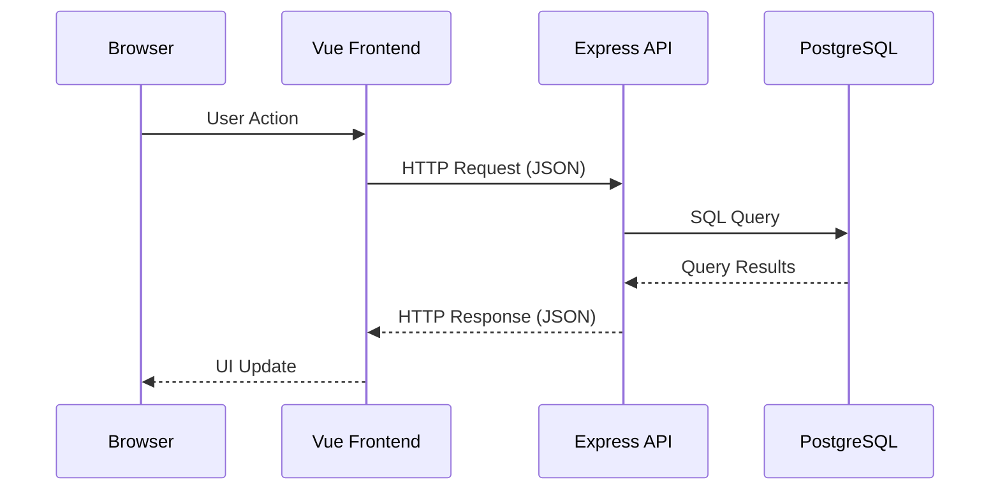
```mermaid
sequenceDiagram
    participant Browser
    participant Vue Frontend
    participant Express API
    participant PostgreSQL
    
    Browser->>Vue Frontend: User Action
    Vue Frontend->>Express API: HTTP Request (JSON)
    Express API->>PostgreSQL: SQL Query
    PostgreSQL-->>Express API: Query Results
    Express API-->>Vue Frontend: HTTP Response (JSON)
    Vue Frontend-->>Browser: UI Update
```

### Authentication Flow

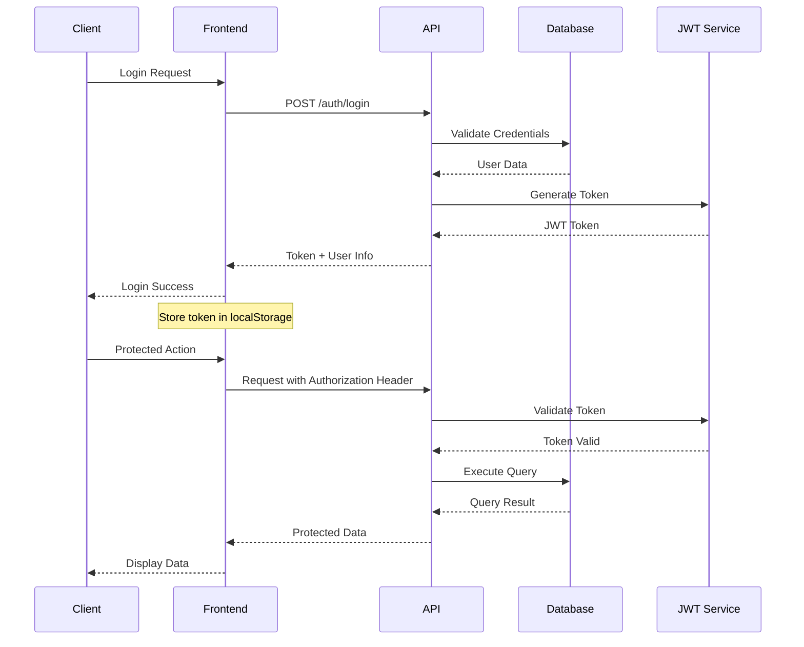
```mermaid
sequenceDiagram
    participant Client
    participant Frontend
    participant API
    participant Database
    participant JWT Service
    
    Client->>Frontend: Login Request
    Frontend->>API: POST /auth/login
    API->>Database: Validate Credentials
    Database-->>API: User Data
    API->>JWT Service: Generate Token
    JWT Service-->>API: JWT Token
    API-->>Frontend: Token + User Info
    Frontend-->>Client: Login Success
    
    Note over Frontend: Store token in localStorage
    
    Client->>Frontend: Protected Action
    Frontend->>API: Request with Authorization Header
    API->>JWT Service: Validate Token
    JWT Service-->>API: Token Valid
    API->>Database: Execute Query
    Database-->>API: Query Result
    API-->>Frontend: Protected Data
    Frontend-->>Client: Display Data
```

## Core Business Flows

### Reservation Creation Flow

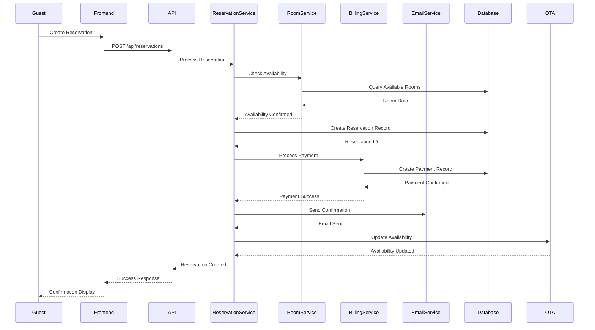
```mermaid
sequenceDiagram
    participant Guest
    participant Frontend
    participant API
    participant ReservationService
    participant RoomService
    participant BillingService
    participant EmailService
    participant Database
    participant OTA
    
    Guest->>Frontend: Create Reservation
    Frontend->>API: POST /api/reservations
    API->>ReservationService: Process Reservation
    
    ReservationService->>RoomService: Check Availability
    RoomService->>Database: Query Available Rooms
    Database-->>RoomService: Room Data
    RoomService-->>ReservationService: Availability Confirmed
    
    ReservationService->>Database: Create Reservation Record
    Database-->>ReservationService: Reservation ID
    
    ReservationService->>BillingService: Process Payment
    BillingService->>Database: Create Payment Record
    Database-->>BillingService: Payment Confirmed
    BillingService-->>ReservationService: Payment Success
    
    ReservationService->>EmailService: Send Confirmation
    EmailService-->>ReservationService: Email Sent
    
    ReservationService->>OTA: Update Availability
    OTA-->>ReservationService: Availability Updated
    
    ReservationService-->>API: Reservation Created
    API-->>Frontend: Success Response
    Frontend-->>Guest: Confirmation Display
```

### Dashboard Data Aggregation Flow

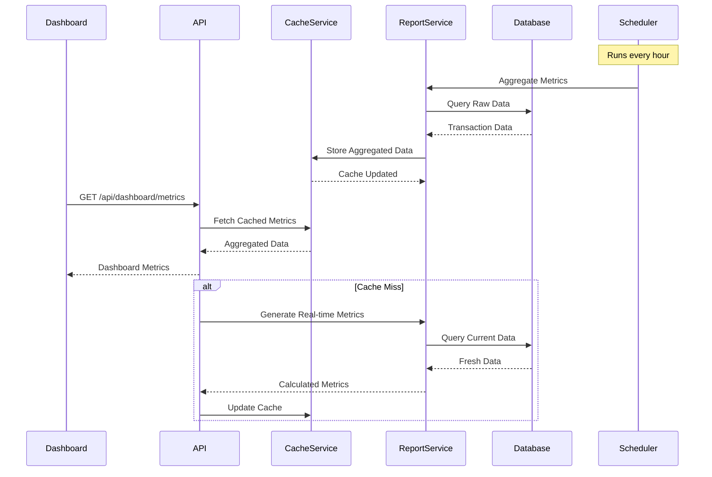
```mermaid
sequenceDiagram
    participant Dashboard
    participant API
    participant CacheService
    participant ReportService
    participant Database
    participant Scheduler
    
    Note over Scheduler: Runs every hour
    Scheduler->>ReportService: Aggregate Metrics
    ReportService->>Database: Query Raw Data
    Database-->>ReportService: Transaction Data
    ReportService->>CacheService: Store Aggregated Data
    CacheService-->>ReportService: Cache Updated
    
    Dashboard->>API: GET /api/dashboard/metrics
    API->>CacheService: Fetch Cached Metrics
    CacheService-->>API: Aggregated Data
    API-->>Dashboard: Dashboard Metrics
    
    alt Cache Miss
        API->>ReportService: Generate Real-time Metrics
        ReportService->>Database: Query Current Data
        Database-->>ReportService: Fresh Data
        ReportService-->>API: Calculated Metrics
        API->>CacheService: Update Cache
    end
```

## Data Layer Interactions

### Database Query Patterns

#### Simple CRUD Operations

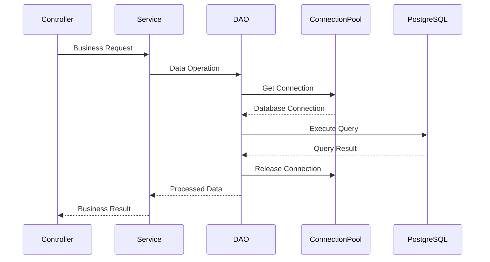
```mermaid
sequenceDiagram
    participant Controller
    participant Service
    participant DAO
    participant ConnectionPool
    participant PostgreSQL
    
    Controller->>Service: Business Request
    Service->>DAO: Data Operation
    DAO->>ConnectionPool: Get Connection
    ConnectionPool-->>DAO: Database Connection
    DAO->>PostgreSQL: Execute Query
    PostgreSQL-->>DAO: Query Result
    DAO->>ConnectionPool: Release Connection
    DAO-->>Service: Processed Data
    Service-->>Controller: Business Result
```

#### Complex Reporting Queries

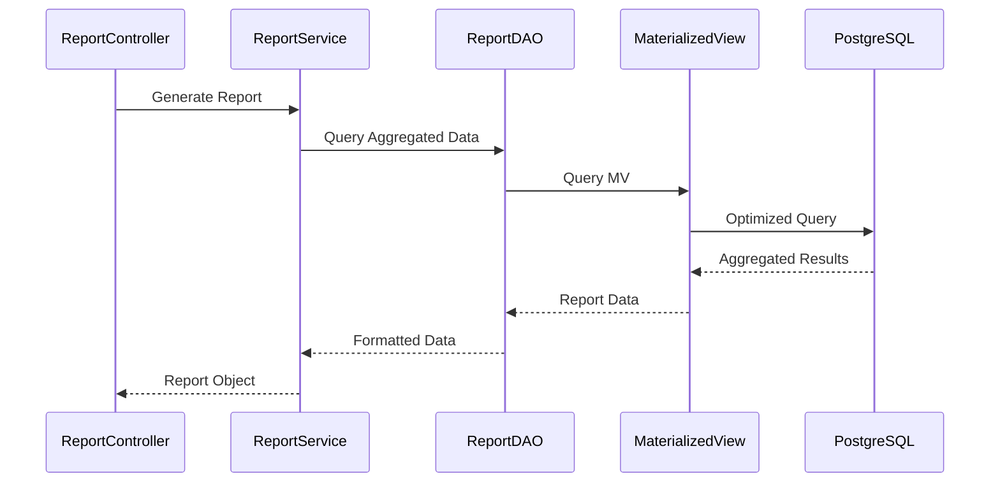
```mermaid
sequenceDiagram
    participant ReportController
    participant ReportService
    participant ReportDAO
    participant MaterializedView
    participant PostgreSQL
    
    ReportController->>ReportService: Generate Report
    ReportService->>ReportDAO: Query Aggregated Data
    ReportDAO->>MaterializedView: Query MV
    MaterializedView->>PostgreSQL: Optimized Query
    PostgreSQL-->>MaterializedView: Aggregated Results
    MaterializedView-->>ReportDAO: Report Data
    ReportDAO-->>ReportService: Formatted Data
    ReportService-->>ReportController: Report Object
```

#### Transaction Management

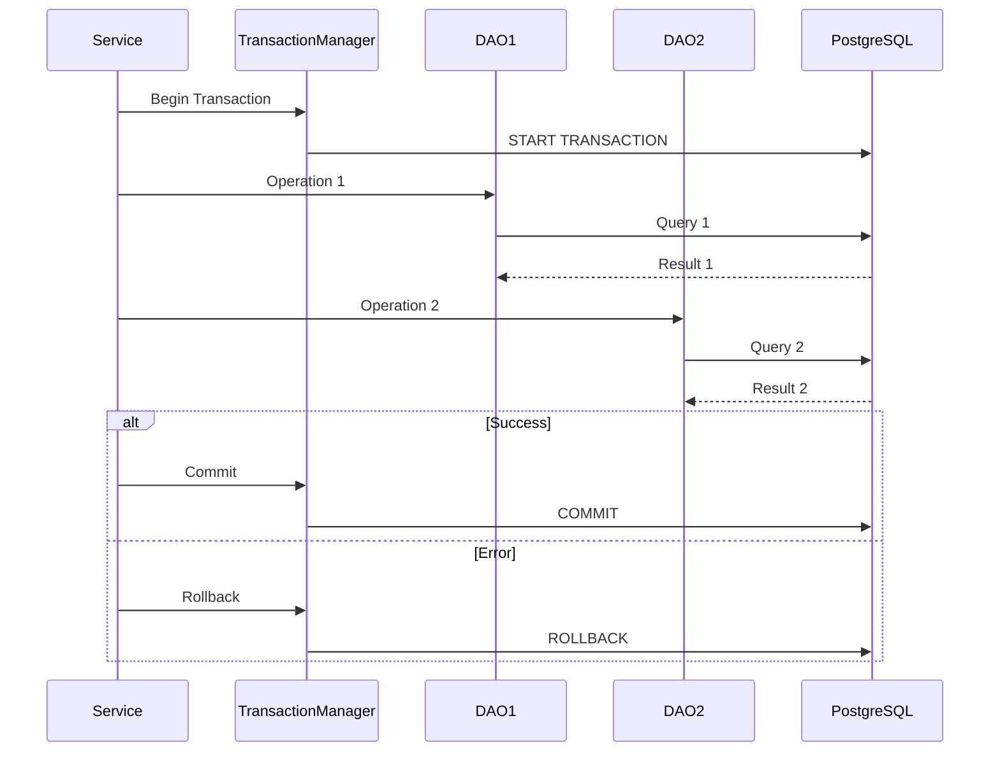
```mermaid
sequenceDiagram
    participant Service
    participant TransactionManager
    participant DAO1
    participant DAO2
    participant PostgreSQL
    
    Service->>TransactionManager: Begin Transaction
    TransactionManager->>PostgreSQL: START TRANSACTION
    
    Service->>DAO1: Operation 1
    DAO1->>PostgreSQL: Query 1
    PostgreSQL-->>DAO1: Result 1
    
    Service->>DAO2: Operation 2
    DAO2->>PostgreSQL: Query 2
    PostgreSQL-->>DAO2: Result 2
    
    alt Success
        Service->>TransactionManager: Commit
        TransactionManager->>PostgreSQL: COMMIT
    else Error
        Service->>TransactionManager: Rollback
        TransactionManager->>PostgreSQL: ROLLBACK
    end
```

## Real-time Data Flows

### WebSocket Communication

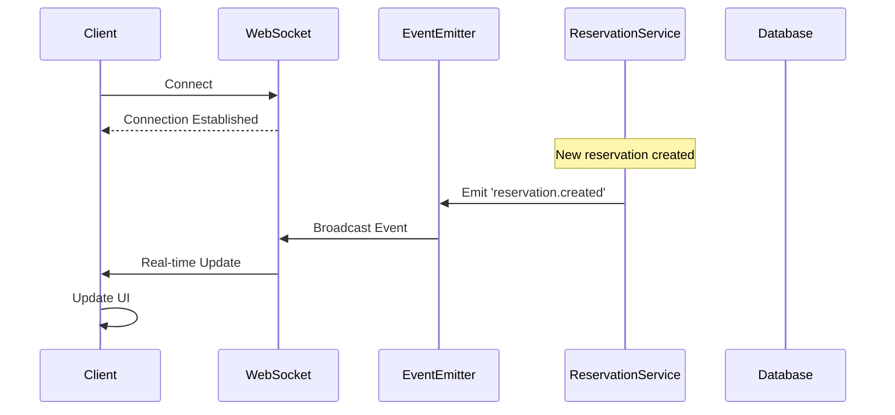
```mermaid
sequenceDiagram
    participant Client
    participant WebSocket
    participant EventEmitter
    participant ReservationService
    participant Database
    
    Client->>WebSocket: Connect
    WebSocket-->>Client: Connection Established
    
    Note over ReservationService: New reservation created
    ReservationService->>EventEmitter: Emit 'reservation.created'
    EventEmitter->>WebSocket: Broadcast Event
    WebSocket->>Client: Real-time Update
    Client->>Client: Update UI
```

### Cache Invalidation Flow

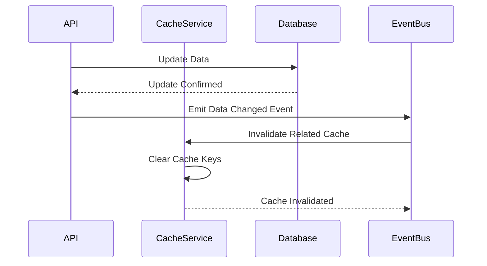
```mermaid
sequenceDiagram
    participant API
    participant CacheService
    participant Database
    participant EventBus
    
    API->>Database: Update Data
    Database-->>API: Update Confirmed
    API->>EventBus: Emit Data Changed Event
    EventBus->>CacheService: Invalidate Related Cache
    CacheService->>CacheService: Clear Cache Keys
    CacheService-->>EventBus: Cache Invalidated
```

## External System Data Flows

### OTA Integration Flow

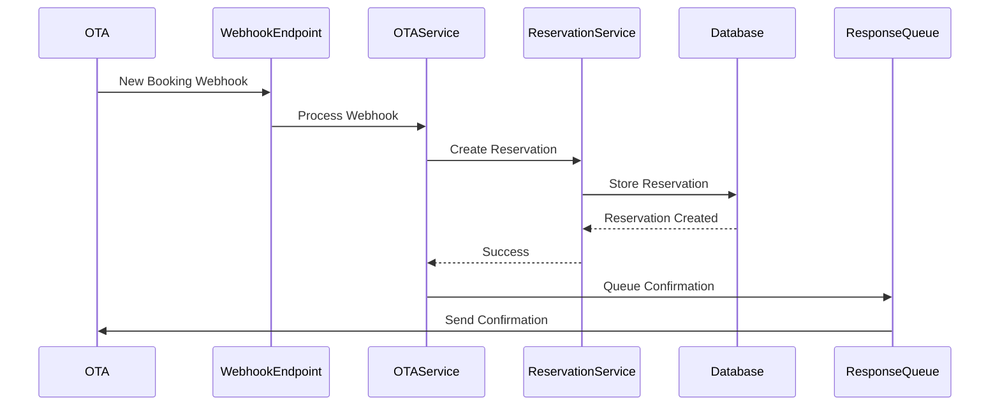
```mermaid
sequenceDiagram
    participant OTA
    participant WebhookEndpoint
    participant OTAService
    participant ReservationService
    participant Database
    participant ResponseQueue
    
    OTA->>WebhookEndpoint: New Booking Webhook
    WebhookEndpoint->>OTAService: Process Webhook
    OTAService->>ReservationService: Create Reservation
    ReservationService->>Database: Store Reservation
    Database-->>ReservationService: Reservation Created
    ReservationService-->>OTAService: Success
    OTAService->>ResponseQueue: Queue Confirmation
    ResponseQueue->>OTA: Send Confirmation
```

### Payment Processing Flow

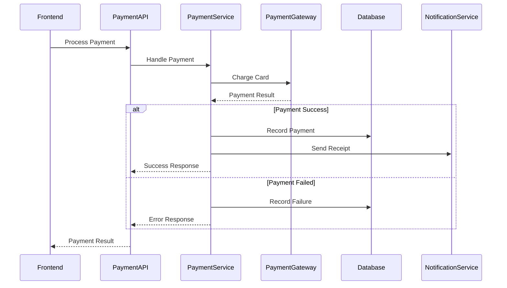
```mermaid
sequenceDiagram
    participant Frontend
    participant PaymentAPI
    participant PaymentService
    participant PaymentGateway
    participant Database
    participant NotificationService
    
    Frontend->>PaymentAPI: Process Payment
    PaymentAPI->>PaymentService: Handle Payment
    PaymentService->>PaymentGateway: Charge Card
    PaymentGateway-->>PaymentService: Payment Result
    
    alt Payment Success
        PaymentService->>Database: Record Payment
        PaymentService->>NotificationService: Send Receipt
        PaymentService-->>PaymentAPI: Success Response
    else Payment Failed
        PaymentService->>Database: Record Failure
        PaymentService-->>PaymentAPI: Error Response
    end
    
    PaymentAPI-->>Frontend: Payment Result
```

## Data Synchronization Patterns

### Multi-Hotel Data Isolation

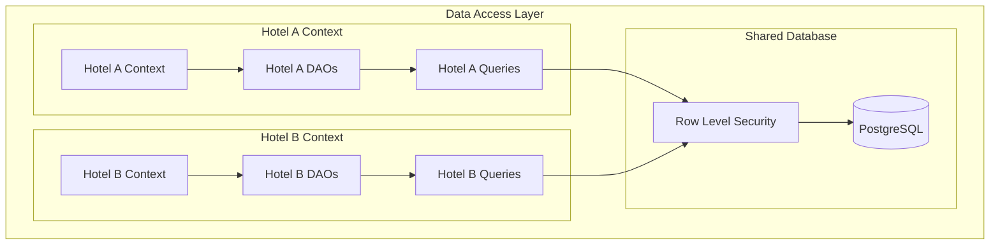
```mermaid
graph TB
    subgraph "Data Access Layer"
        subgraph "Hotel A Context"
            CTXA[Hotel A Context]
            DAOA[Hotel A DAOs]
            QUERYA[Hotel A Queries]
        end
        
        subgraph "Hotel B Context"
            CTXB[Hotel B Context]
            DAOB[Hotel B DAOs]
            QUERYB[Hotel B Queries]
        end
        
        subgraph "Shared Database"
            DB[(PostgreSQL)]
            RLS[Row Level Security]
        end
    end
    
    CTXA --> DAOA
    CTXB --> DAOB
    DAOA --> QUERYA
    DAOB --> QUERYB
    QUERYA --> RLS
    QUERYB --> RLS
    RLS --> DB
```

### Data Consistency Patterns

#### Eventual Consistency

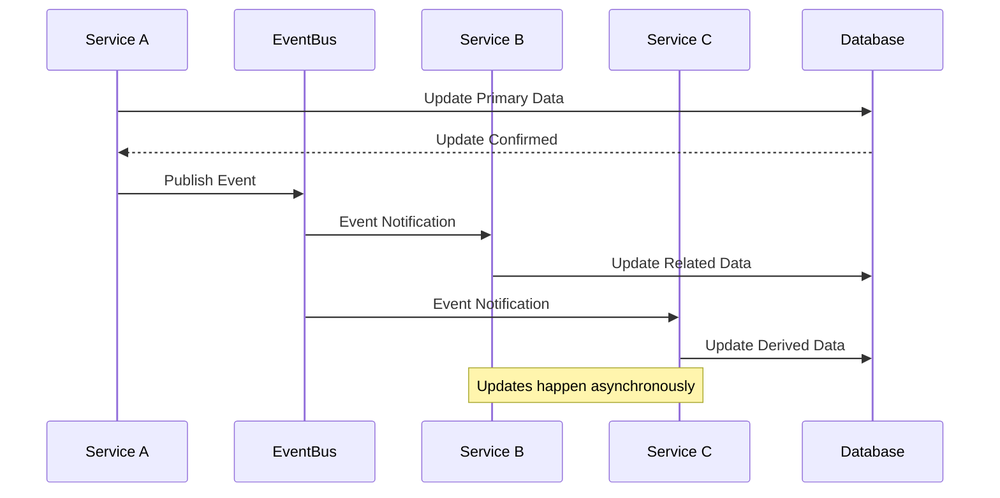
```mermaid
sequenceDiagram
    participant Service A
    participant EventBus
    participant Service B
    participant Service C
    participant Database
    
    Service A->>Database: Update Primary Data
    Database-->>Service A: Update Confirmed
    Service A->>EventBus: Publish Event
    
    EventBus->>Service B: Event Notification
    Service B->>Database: Update Related Data
    
    EventBus->>Service C: Event Notification
    Service C->>Database: Update Derived Data
    
    Note over Service B, Service C: Updates happen asynchronously
```

#### Strong Consistency

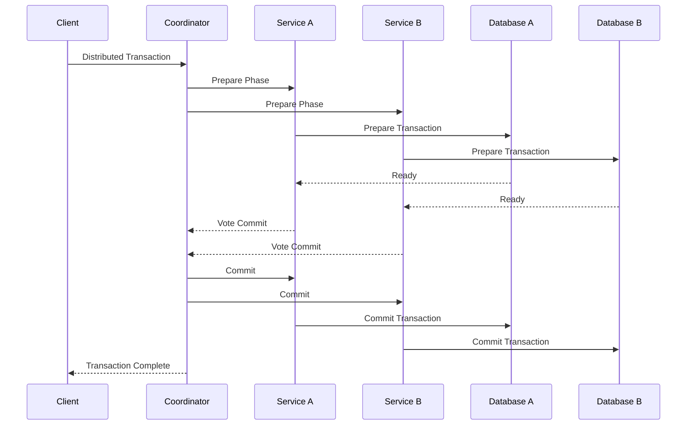
```mermaid
sequenceDiagram
    participant Client
    participant Coordinator
    participant Service A
    participant Service B
    participant Database A
    participant Database B
    
    Client->>Coordinator: Distributed Transaction
    Coordinator->>Service A: Prepare Phase
    Coordinator->>Service B: Prepare Phase
    
    Service A->>Database A: Prepare Transaction
    Service B->>Database B: Prepare Transaction
    
    Database A-->>Service A: Ready
    Database B-->>Service B: Ready
    
    Service A-->>Coordinator: Vote Commit
    Service B-->>Coordinator: Vote Commit
    
    Coordinator->>Service A: Commit
    Coordinator->>Service B: Commit
    
    Service A->>Database A: Commit Transaction
    Service B->>Database B: Commit Transaction
    
    Coordinator-->>Client: Transaction Complete
```

## Performance Optimization Flows

### Query Optimization Pipeline

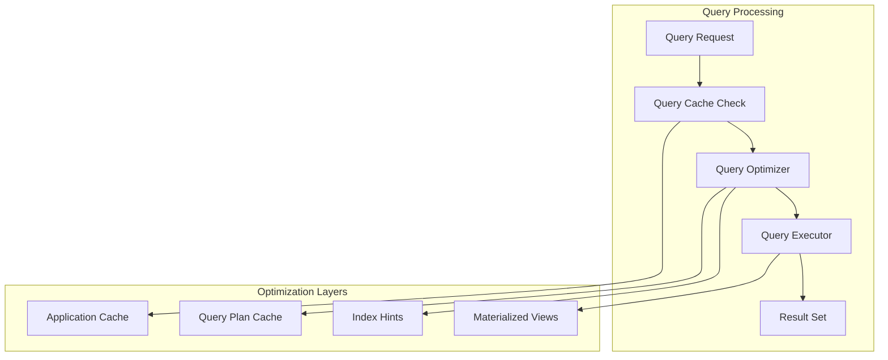
```mermaid
graph TB
    subgraph "Query Processing"
        REQUEST[Query Request]
        CACHE[Query Cache Check]
        OPTIMIZER[Query Optimizer]
        EXECUTOR[Query Executor]
        RESULT[Result Set]
    end
    
    subgraph "Optimization Layers"
        APPCACHE[Application Cache]
        QUERYCACHE[Query Plan Cache]
        INDEXHINT[Index Hints]
        MATERIALIZE[Materialized Views]
    end
    
    REQUEST --> CACHE
    CACHE --> APPCACHE
    CACHE --> OPTIMIZER
    OPTIMIZER --> QUERYCACHE
    OPTIMIZER --> INDEXHINT
    OPTIMIZER --> EXECUTOR
    EXECUTOR --> MATERIALIZE
    EXECUTOR --> RESULT
```

### Data Aggregation Pipeline

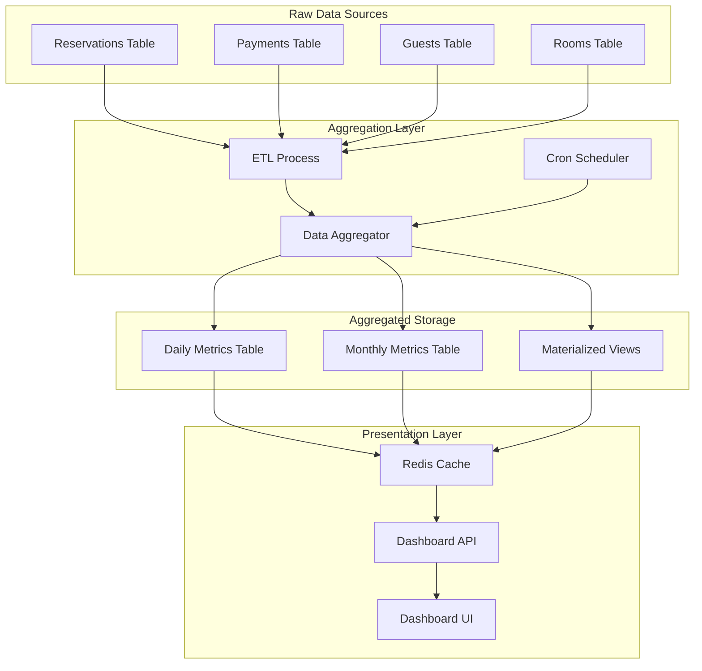
```mermaid
graph TB
    subgraph "Raw Data Sources"
        RESERVATIONS[Reservations Table]
        PAYMENTS[Payments Table]
        GUESTS[Guests Table]
        ROOMS[Rooms Table]
    end
    
    subgraph "Aggregation Layer"
        ETL[ETL Process]
        AGGREGATOR[Data Aggregator]
        SCHEDULER[Cron Scheduler]
    end
    
    subgraph "Aggregated Storage"
        DAILYMETRICS[Daily Metrics Table]
        MONTHLYMETRICS[Monthly Metrics Table]
        MATERIALIZEDVIEWS[Materialized Views]
    end
    
    subgraph "Presentation Layer"
        CACHE[Redis Cache]
        API[Dashboard API]
        FRONTEND[Dashboard UI]
    end
    
    RESERVATIONS --> ETL
    PAYMENTS --> ETL
    GUESTS --> ETL
    ROOMS --> ETL
    
    ETL --> AGGREGATOR
    SCHEDULER --> AGGREGATOR
    
    AGGREGATOR --> DAILYMETRICS
    AGGREGATOR --> MONTHLYMETRICS
    AGGREGATOR --> MATERIALIZEDVIEWS
    
    DAILYMETRICS --> CACHE
    MONTHLYMETRICS --> CACHE
    MATERIALIZEDVIEWS --> CACHE
    
    CACHE --> API
    API --> FRONTEND
```

## Error Handling and Recovery Flows

### Error Propagation Pattern

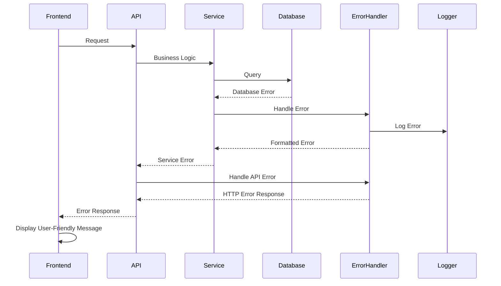
```mermaid
sequenceDiagram
    participant Frontend
    participant API
    participant Service
    participant Database
    participant ErrorHandler
    participant Logger
    
    Frontend->>API: Request
    API->>Service: Business Logic
    Service->>Database: Query
    Database-->>Service: Database Error
    Service->>ErrorHandler: Handle Error
    ErrorHandler->>Logger: Log Error
    ErrorHandler-->>Service: Formatted Error
    Service-->>API: Service Error
    API->>ErrorHandler: Handle API Error
    ErrorHandler-->>API: HTTP Error Response
    API-->>Frontend: Error Response
    Frontend->>Frontend: Display User-Friendly Message
```

### Retry and Circuit Breaker Pattern

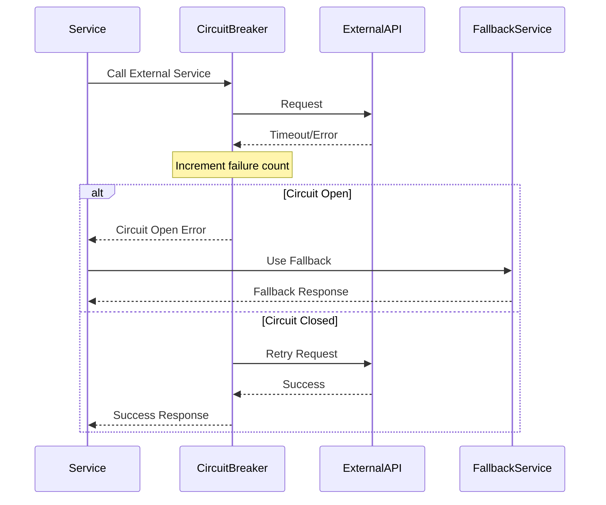
```mermaid
sequenceDiagram
    participant Service
    participant CircuitBreaker
    participant ExternalAPI
    participant FallbackService
    
    Service->>CircuitBreaker: Call External Service
    CircuitBreaker->>ExternalAPI: Request
    ExternalAPI-->>CircuitBreaker: Timeout/Error
    
    Note over CircuitBreaker: Increment failure count
    
    alt Circuit Open
        CircuitBreaker-->>Service: Circuit Open Error
        Service->>FallbackService: Use Fallback
        FallbackService-->>Service: Fallback Response
    else Circuit Closed
        CircuitBreaker->>ExternalAPI: Retry Request
        ExternalAPI-->>CircuitBreaker: Success
        CircuitBreaker-->>Service: Success Response
    end
```

## Data Security Flows

### Data Encryption Flow

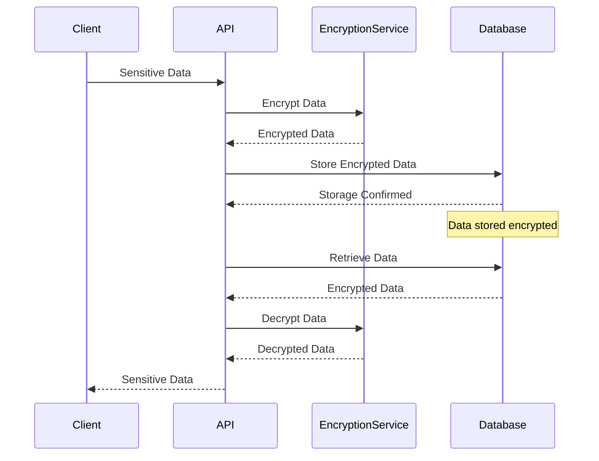
```mermaid
sequenceDiagram
    participant Client
    participant API
    participant EncryptionService
    participant Database
    
    Client->>API: Sensitive Data
    API->>EncryptionService: Encrypt Data
    EncryptionService-->>API: Encrypted Data
    API->>Database: Store Encrypted Data
    Database-->>API: Storage Confirmed
    
    Note over Database: Data stored encrypted
    
    API->>Database: Retrieve Data
    Database-->>API: Encrypted Data
    API->>EncryptionService: Decrypt Data
    EncryptionService-->>API: Decrypted Data
    API-->>Client: Sensitive Data
```

### Audit Trail Flow

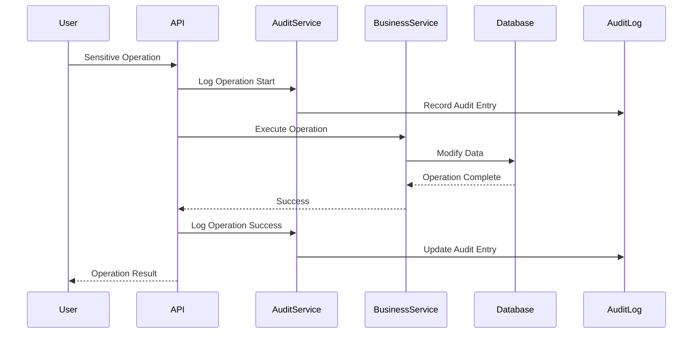
```mermaid
sequenceDiagram
    participant User
    participant API
    participant AuditService
    participant BusinessService
    participant Database
    participant AuditLog
    
    User->>API: Sensitive Operation
    API->>AuditService: Log Operation Start
    AuditService->>AuditLog: Record Audit Entry
    
    API->>BusinessService: Execute Operation
    BusinessService->>Database: Modify Data
    Database-->>BusinessService: Operation Complete
    BusinessService-->>API: Success
    
    API->>AuditService: Log Operation Success
    AuditService->>AuditLog: Update Audit Entry
    
    API-->>User: Operation Result
```

## See Also

### Related Architecture Documentation
- **[System Architecture](system-architecture.md)** - Overall system design and technology stack
- **[Component Architecture](component-diagrams.md)** - Component structure and relationships
- **[Data Models](data-models.md)** - Database schema and entity relationships
- **[API Design](api-design.md)** - API endpoint design and specifications

### Implementation Documentation
- **[Backend Development](../backend/README.md)** - Backend implementation guide
- **[Database Schema](../backend/database-schema.md)** - Detailed database design
- **[State Management](../frontend/state-management.md)** - Frontend state management

### Integration Documentation
- **[Integration Patterns](../architecture/integration-patterns.md)** - External system integration
- **[API Documentation](../api/README.md)** - API reference
- **[Integrations Overview](../integrations/README.md)** - External system connections

---

*This document is part of the [Architecture Documentation](../architecture/README.md)*
