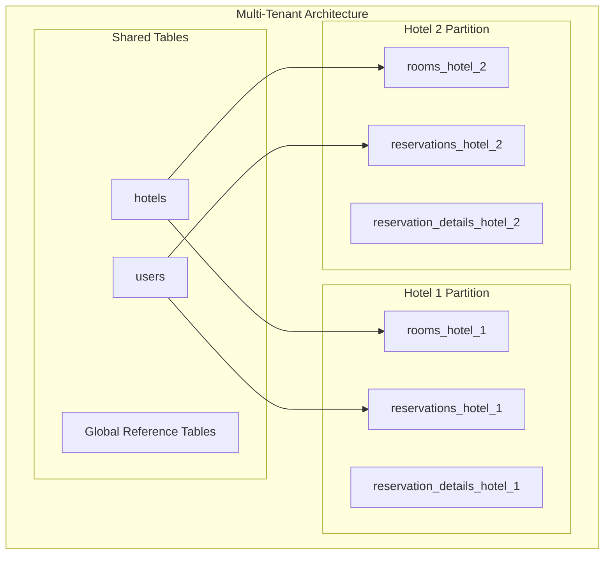
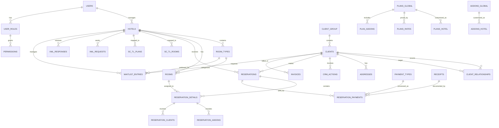
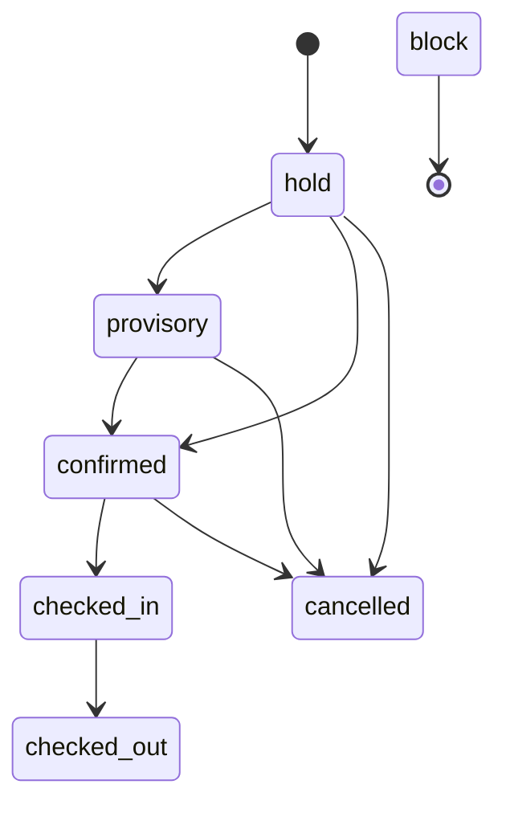

# Data Models and Database Design

## Overview

This document provides comprehensive documentation of the Hotel PMS database schema, including entity relationships, data models, constraints, indexes, and business rules. The database is built on PostgreSQL and uses advanced features like partitioning, materialized views, and custom functions.

## Database Architecture

### Multi-Tenant Design

The system uses a multi-tenant architecture with hotel-based partitioning for key tables:



### Database Schema Overview



## Core Entity Models

### User Management

#### Users Table
```sql
CREATE TABLE users (
    id SERIAL PRIMARY KEY,
    email VARCHAR(255) UNIQUE NOT NULL,
    name TEXT,
    password_hash TEXT NULL,
    status_id INT REFERENCES user_status(id) DEFAULT 1,
    role_id INT REFERENCES user_roles(id) DEFAULT 5,
    auth_provider VARCHAR(50) NOT NULL DEFAULT 'local',
    provider_user_id VARCHAR(255) NULL,
    google_calendar_id TEXT NULL,
    google_access_token TEXT NULL,
    google_refresh_token TEXT NULL,
    google_token_expiry_date TIMESTAMP WITH TIME ZONE NULL,
    last_successful_google_sync TIMESTAMP WITH TIME ZONE NULL,
    created_at TIMESTAMP DEFAULT CURRENT_TIMESTAMP,
    created_by INT REFERENCES users(id),
    updated_by INT DEFAULT NULL REFERENCES users(id)
);
```

**Business Rules:**
- Email must be unique across the system
- Password hash required for local authentication only
- Google tokens managed for calendar integration
- Role-based access control with default viewer role

#### User Roles and Permissions
```sql
CREATE TABLE user_roles (
    id SERIAL PRIMARY KEY,
    role_name VARCHAR(50) NOT NULL UNIQUE,
    permissions JSONB DEFAULT '{}',
    description TEXT
);
```

**Permission Structure:**
```json
{
  "manage_db": boolean,
  "manage_users": boolean,
  "manage_clients": boolean,
  "view_reports": boolean,
  "crud_ok": boolean
}
```

### Hotel Management

#### Hotels Table
```sql
CREATE TABLE hotels (
    id SERIAL PRIMARY KEY,
    formal_name VARCHAR(255),
    name VARCHAR(255) NOT NULL,
    facility_type VARCHAR(255),
    open_date DATE,
    total_rooms INT,
    postal_code VARCHAR(20),
    address TEXT,
    email TEXT,
    phone_number VARCHAR(20),
    latitude DECIMAL(9, 6),
    longitude DECIMAL(9, 6),
    bank_name TEXT,
    bank_branch_name TEXT,
    bank_account_type TEXT,
    bank_account_number TEXT,
    bank_account_name TEXT,
    created_at TIMESTAMP DEFAULT CURRENT_TIMESTAMP,
    created_by INT REFERENCES users(id),
    updated_by INT DEFAULT NULL REFERENCES users(id)
);
```

**Business Rules:**
- Hotel name is required
- Geographic coordinates for mapping integration
- Banking information for payment processing
- Audit trail with created_by/updated_by

#### Room Types and Rooms
```sql
CREATE TABLE room_types (
    id SERIAL,
    hotel_id INT REFERENCES hotels(id) ON DELETE CASCADE,
    name TEXT NOT NULL,
    description TEXT,
    created_at TIMESTAMP DEFAULT CURRENT_TIMESTAMP,
    created_by INT REFERENCES users(id),
    updated_by INT DEFAULT NULL REFERENCES users(id),
    PRIMARY KEY (hotel_id, id),
    UNIQUE (hotel_id, name)
) PARTITION BY LIST (hotel_id);

CREATE TABLE rooms (
    id SERIAL,
    hotel_id INT NOT NULL REFERENCES hotels(id) ON DELETE CASCADE,
    room_type_id INT NOT NULL,
    floor INT NOT NULL DEFAULT 1,
    room_number TEXT NOT NULL,
    capacity INT NOT NULL DEFAULT 1,
    smoking BOOLEAN NOT NULL DEFAULT FALSE,
    for_sale BOOLEAN NOT NULL DEFAULT TRUE,
    created_at TIMESTAMP DEFAULT CURRENT_TIMESTAMP,
    created_by INT REFERENCES users(id),
    updated_by INT DEFAULT NULL REFERENCES users(id),
    PRIMARY KEY (hotel_id, id),
    UNIQUE (hotel_id, room_type_id, room_number),
    FOREIGN KEY (room_type_id, hotel_id) REFERENCES room_types(id, hotel_id) ON DELETE CASCADE
) PARTITION BY LIST (hotel_id);
```

**Business Rules:**
- Partitioned by hotel_id for performance
- Room numbers must be unique within hotel and room type
- Capacity defines maximum occupancy
- for_sale flag controls availability for booking

### Client Management

#### Clients Table
```sql
CREATE TABLE clients (
    id UUID PRIMARY KEY DEFAULT gen_random_uuid(),
    customer_id INT NULL,
    name TEXT NOT NULL DEFAULT 'TBD',
    name_kana TEXT,
    name_kanji TEXT,
    date_of_birth DATE,
    legal_or_natural_person TEXT CHECK (legal_or_natural_person IN ('legal', 'natural')),
    gender TEXT DEFAULT 'other' CHECK (gender IN ('male', 'female', 'other')),
    email TEXT,
    phone TEXT,
    fax TEXT,
    loyalty_tier VARCHAR(50) DEFAULT 'prospect',
    client_group_id UUID DEFAULT NULL REFERENCES client_group(id),
    website TEXT NULL,
    billing_preference TEXT DEFAULT 'paper' CHECK (billing_preference IN ('paper', 'digital')),
    comment TEXT NULL,
    created_at TIMESTAMP DEFAULT CURRENT_TIMESTAMP,
    created_by INT REFERENCES users(id),
    updated_by INT DEFAULT NULL REFERENCES users(id)
);
```

**Business Rules:**
- UUID primary key for global uniqueness
- Supports both individual and corporate clients
- Multiple name formats for Japanese localization
- Loyalty tier system integration
- Flexible contact information

#### Client Relationships
```sql
CREATE TABLE client_relationships (
    id SERIAL PRIMARY KEY,
    source_client_id UUID NOT NULL,
    source_relationship_type VARCHAR(255) NOT NULL,
    target_client_id UUID NOT NULL,
    target_relationship_type VARCHAR(255) NOT NULL,
    comment TEXT,
    CONSTRAINT fk_source_client FOREIGN KEY(source_client_id) REFERENCES clients(id) ON DELETE CASCADE,
    CONSTRAINT fk_target_client FOREIGN KEY(target_client_id) REFERENCES clients(id) ON DELETE CASCADE
);
```

**Business Rules:**
- Bidirectional relationships between clients
- Flexible relationship types (parent/subsidiary, partner, etc.)
- Cascade deletion maintains referential integrity

### Reservation System

#### Reservations Table
```sql
CREATE TABLE reservations (
    id UUID DEFAULT gen_random_uuid(),
    hotel_id INT NOT NULL REFERENCES hotels(id) ON DELETE CASCADE,
    reservation_client_id UUID NOT NULL REFERENCES clients(id) ON DELETE CASCADE,
    check_in DATE NOT NULL,
    check_in_time TIME DEFAULT '16:00',
    check_out DATE NOT NULL,
    check_out_time TIME DEFAULT '10:00',
    number_of_people INT NOT NULL,
    status TEXT CHECK (status IN ('hold', 'provisory', 'confirmed', 'checked_in', 'checked_out', 'cancelled', 'block')) NOT NULL DEFAULT 'hold',
    type TEXT CHECK (type IN ('default', 'employee', 'ota', 'web')) NOT NULL DEFAULT 'default',
    agent TEXT NULL,
    ota_reservation_id TEXT NULL,
    comment TEXT NULL,
    created_at TIMESTAMP DEFAULT CURRENT_TIMESTAMP,
    created_by INT REFERENCES users(id),
    updated_by INT DEFAULT NULL REFERENCES users(id),
    PRIMARY KEY (hotel_id, id)
) PARTITION BY LIST (hotel_id);
```

**Status Flow:**


#### Reservation Details
```sql
CREATE TABLE reservation_details (
    id UUID DEFAULT gen_random_uuid(),
    hotel_id INT NOT NULL REFERENCES hotels(id) ON DELETE CASCADE,
    reservation_id UUID NOT NULL,
    date DATE NOT NULL,
    room_id INT,
    plans_global_id INT REFERENCES plans_global(id),
    plans_hotel_id INT,
    plan_name TEXT,
    plan_type TEXT CHECK (plan_type IN ('per_person', 'per_room')) NOT NULL DEFAULT 'per_room',
    number_of_people INT NOT NULL,
    price DECIMAL,
    cancelled UUID DEFAULT NULL,
    billable BOOLEAN DEFAULT FALSE,
    created_at TIMESTAMP DEFAULT CURRENT_TIMESTAMP,
    created_by INT REFERENCES users(id),
    updated_by INT DEFAULT NULL REFERENCES users(id),
    PRIMARY KEY (hotel_id, id),
    UNIQUE (hotel_id, reservation_id, room_id, date, cancelled),
    FOREIGN KEY (reservation_id, hotel_id) REFERENCES reservations(id, hotel_id) ON DELETE CASCADE,
    FOREIGN KEY (room_id, hotel_id) REFERENCES rooms(id, hotel_id),
    FOREIGN KEY (plans_hotel_id, hotel_id) REFERENCES plans_hotel(id, hotel_id)
) PARTITION BY LIST (hotel_id);
```

**Business Rules:**
- One detail record per room per night
- Supports both global and hotel-specific plans
- Cancellation tracking with UUID reference
- Billable flag for revenue recognition

### Pricing and Plans

#### Plans System
```sql
CREATE TABLE plans_global (
    id SERIAL PRIMARY KEY,
    name TEXT NOT NULL,
    description TEXT,
    plan_type TEXT CHECK (plan_type IN ('per_person', 'per_room')) NOT NULL DEFAULT 'per_room',
    color VARCHAR(7) CHECK (color ~ '^#[0-9A-Fa-f]{6}$') DEFAULT '#D3D3D3',
    created_at TIMESTAMP DEFAULT CURRENT_TIMESTAMP,
    created_by INT REFERENCES users(id),
    updated_by INT DEFAULT NULL REFERENCES users(id),
    UNIQUE (name)
);

CREATE TABLE plans_hotel (
    id SERIAL,
    hotel_id INT NOT NULL REFERENCES hotels(id) ON DELETE CASCADE,
    plans_global_id INT REFERENCES plans_global(id) ON DELETE SET NULL,
    name TEXT NOT NULL,
    description TEXT,
    plan_type TEXT CHECK (plan_type IN ('per_person', 'per_room')) NOT NULL DEFAULT 'per_room',
    color VARCHAR(7) CHECK (color ~ '^#[0-9A-Fa-f]{6}$') DEFAULT '#D3D3D3',
    created_at TIMESTAMP DEFAULT CURRENT_TIMESTAMP,
    created_by INT REFERENCES users(id),
    updated_by INT DEFAULT NULL REFERENCES users(id),
    PRIMARY KEY (hotel_id, id),
    UNIQUE (hotel_id, name)
) PARTITION BY LIST (hotel_id);
```

**Pricing Model:**
- Global plans can be customized per hotel
- Per-person vs per-room pricing models
- Color coding for UI visualization
- Hierarchical plan structure

#### Rate Management
```sql
CREATE TABLE plans_rates (
    id SERIAL PRIMARY KEY,
    hotel_id INT NULL REFERENCES hotels(id) ON DELETE CASCADE,
    plans_global_id INT REFERENCES plans_global(id) ON DELETE CASCADE,
    plans_hotel_id INT,
    adjustment_type TEXT CHECK (adjustment_type IN ('base_rate', 'percentage', 'flat_fee')) NOT NULL,
    adjustment_value DECIMAL(10, 2) NOT NULL,
    tax_type_id INT REFERENCES tax_info(id),
    tax_rate DECIMAL(12,4),
    net_price NUMERIC(12,0) GENERATED ALWAYS AS (
         CASE
            WHEN adjustment_type IN ('base_rate', 'flat_fee')
            THEN FLOOR(adjustment_value / (1 + tax_rate))
            ELSE NULL
         END
    ) STORED,
    condition_type TEXT CHECK (condition_type IN ('no_restriction', 'day_of_week', 'month')) NOT NULL,
    condition_value TEXT NULL,
    date_start DATE NOT NULL,
    date_end DATE DEFAULT NULL,
    created_at TIMESTAMP DEFAULT CURRENT_TIMESTAMP,
    created_by INT REFERENCES users(id),
    updated_by INT DEFAULT NULL REFERENCES users(id)
);
```

**Business Rules:**
- Flexible rate adjustment types
- Conditional pricing based on dates or days
- Automatic net price calculation
- Date range validity

### Billing System

#### Payment Processing
```sql
CREATE TABLE reservation_payments (
    id UUID DEFAULT gen_random_uuid(),
    hotel_id INT NOT NULL REFERENCES hotels(id),
    reservation_id UUID NOT NULL,
    date DATE NOT NULL,
    room_id INT,
    client_id UUID NOT NULL REFERENCES clients(id),
    payment_type_id INT NOT NULL REFERENCES payment_types(id),
    value DECIMAL,
    comment TEXT,
    invoice_id UUID DEFAULT NULL,
    receipt_id UUID DEFAULT NULL,
    created_at TIMESTAMP DEFAULT CURRENT_TIMESTAMP,
    created_by INT REFERENCES users(id),
    updated_by INT DEFAULT NULL REFERENCES users(id),
    PRIMARY KEY (hotel_id, id),
    FOREIGN KEY (reservation_id, hotel_id) REFERENCES reservations(id, hotel_id) ON DELETE CASCADE
) PARTITION BY LIST (hotel_id);
```

#### Invoice Management
```sql
CREATE TABLE invoices (
   id UUID,
   hotel_id INT NOT NULL REFERENCES hotels(id),
   date DATE NOT NULL,
   client_id UUID NOT NULL REFERENCES clients(id),
   invoice_number TEXT,
   status TEXT CHECK (status IN ('draft', 'sent', 'paid', 'cancelled')) NOT NULL DEFAULT 'draft',
   display_name TEXT NULL,
   due_date DATE NULL,
   total_stays INT NULL,
   comment TEXT NULL,
   created_at TIMESTAMP DEFAULT CURRENT_TIMESTAMP,
   created_by INT REFERENCES users(id),
   UNIQUE (id, hotel_id, date, client_id, invoice_number)
) PARTITION BY LIST (hotel_id);
```

### OTA Integration

#### Site Controller Integration
```sql
CREATE TABLE sc_tl_rooms (
   hotel_id INT NOT NULL REFERENCES hotels(id),
   room_type_id INT NULL,
   rmTypeCode TEXT NOT NULL,
   rmTypeName TEXT,
   netRmTypeGroupCode TEXT NOT NULL,
   netRmTypeGroupName TEXT,
   agtCode TEXT,
   netAgtRmTypeCode TEXT,
   netAgtRmTypeName TEXT,
   isStockAdjustable TEXT,
   lincolnUseFlag TEXT,
   FOREIGN KEY (room_type_id, hotel_id) REFERENCES room_types(id, hotel_id)
);

CREATE TABLE sc_tl_plans (
   hotel_id INT NOT NULL REFERENCES hotels(id),
   plans_global_id INT REFERENCES plans_global(id),
   plans_hotel_id INT,
   plan_key TEXT NOT NULL,
   planGroupCode TEXT NOT NULL,
   planGroupName TEXT NOT NULL,
   FOREIGN KEY (plans_hotel_id, hotel_id) REFERENCES plans_hotel(id, hotel_id)
);
```

**Integration Features:**
- Room type mapping to OTA systems
- Plan synchronization
- XML template management
- Request/response logging

### Waitlist System

#### Waitlist Entries
```sql
CREATE TABLE waitlist_entries (
    id UUID PRIMARY KEY DEFAULT gen_random_uuid(),
    client_id UUID NOT NULL REFERENCES clients(id) ON DELETE CASCADE,
    hotel_id INTEGER NOT NULL REFERENCES hotels(id) ON DELETE CASCADE,
    room_type_id INTEGER,
    requested_check_in_date DATE NOT NULL,
    requested_check_out_date DATE NOT NULL,
    number_of_guests INTEGER NOT NULL CHECK (number_of_guests > 0),
    number_of_rooms INTEGER NOT NULL DEFAULT 1 CHECK (number_of_rooms > 0),
    status TEXT NOT NULL DEFAULT 'waiting'
        CHECK (status IN ('waiting', 'notified', 'confirmed', 'expired', 'cancelled')),
    notes TEXT,
    confirmation_token TEXT UNIQUE,
    token_expires_at TIMESTAMPTZ,
    contact_email TEXT,
    contact_phone TEXT,
    communication_preference TEXT NOT NULL DEFAULT 'email' 
        CHECK (communication_preference IN ('email', 'phone')),
    preferred_smoking_status TEXT NOT NULL DEFAULT 'any' 
        CHECK (preferred_smoking_status IN ('any', 'smoking', 'non_smoking')),
    created_at TIMESTAMPTZ NOT NULL DEFAULT CURRENT_TIMESTAMP,
    updated_at TIMESTAMPTZ NOT NULL DEFAULT CURRENT_TIMESTAMP,
    created_by INTEGER REFERENCES users(id),
    updated_by INTEGER REFERENCES users(id),
    CONSTRAINT chk_dates CHECK (requested_check_out_date > requested_check_in_date),
    CONSTRAINT chk_token_expiry CHECK (
        (status = 'notified' AND confirmation_token IS NOT NULL AND token_expires_at IS NOT NULL)
        OR (status != 'notified')
    )
);
```

## Database Constraints and Business Rules

### Primary Key Strategies

1. **Serial IDs**: Used for system tables (users, hotels)
2. **UUIDs**: Used for business entities (clients, reservations)
3. **Composite Keys**: Used for partitioned tables

### Foreign Key Relationships

#### Cascade Rules
- **CASCADE**: Hotel deletion removes all related data
- **SET NULL**: Optional relationships maintained
- **RESTRICT**: Prevents deletion of referenced records

#### Partitioning Constraints
```sql
-- Example: Reservation details must reference same hotel
FOREIGN KEY (reservation_id, hotel_id) REFERENCES reservations(id, hotel_id)
```

### Check Constraints

#### Status Validation
```sql
-- Reservation status validation
CHECK (status IN ('hold', 'provisory', 'confirmed', 'checked_in', 'checked_out', 'cancelled', 'block'))

-- Payment transaction types
CHECK (transaction IN ('cash', 'wire', 'credit', 'bill', 'point', 'discount'))
```

#### Business Logic Constraints
```sql
-- Date validation
CONSTRAINT chk_dates CHECK (requested_check_out_date > requested_check_in_date)

-- Capacity validation
CHECK (number_of_guests > 0)
CHECK (number_of_rooms > 0)
```

### Generated Columns

#### Tax Calculations
```sql
net_price NUMERIC(12,0) GENERATED ALWAYS AS (
    CASE
        WHEN adjustment_type IN ('base_rate', 'flat_fee')
        THEN FLOOR(adjustment_value / (1 + tax_rate))
        ELSE NULL
    END
) STORED
```

## Indexes and Performance

### Primary Indexes

#### Partitioned Table Indexes
```sql
-- Hotel-based partitioning
CREATE INDEX idx_reservations_hotel_status ON reservations(hotel_id, status);
CREATE INDEX idx_reservation_details_date ON reservation_details(hotel_id, date);
```

#### Search Optimization
```sql
-- Client search
CREATE INDEX idx_clients_name ON clients(name);
CREATE INDEX idx_clients_email ON clients(email);

-- Reservation lookup
CREATE INDEX idx_reservations_check_in ON reservations(check_in);
CREATE INDEX idx_reservations_client ON reservations(reservation_client_id);
```

### Composite Indexes

#### Multi-column Searches
```sql
-- Room availability
CREATE INDEX idx_rooms_hotel_type_sale ON rooms(hotel_id, room_type_id, for_sale);

-- Waitlist processing
CREATE INDEX idx_waitlist_hotel_status ON waitlist_entries(hotel_id, status);
CREATE INDEX idx_waitlist_dates ON waitlist_entries(requested_check_in_date, requested_check_out_date);
```

### JSONB Indexes

#### Permission Queries
```sql
-- User role permissions
CREATE INDEX idx_user_roles_permissions ON user_roles USING GIN (permissions);

-- Project client relationships
CREATE INDEX idx_projects_related_clients ON projects USING GIN (related_clients);
```

## Views and Materialized Views

### Operational Views

#### Room Inventory View
```sql
CREATE OR REPLACE VIEW vw_room_inventory AS
WITH roomTotal AS (
    SELECT
        hotel_id,
        room_type_id,
        COUNT(*) as total_rooms
    FROM rooms
    WHERE for_sale = true
    GROUP BY hotel_id, room_type_id
)
SELECT
    rd.hotel_id,
    rd.date,
    r.room_type_id,
    sc.netrmtypegroupcode,
    rt.name as room_type_name,
    roomTotal.total_rooms,
    COUNT(rd.date) as room_count
FROM reservation_details rd
    JOIN rooms r ON r.hotel_id = rd.hotel_id AND r.id = rd.room_id
    JOIN room_types rt ON rt.hotel_id = r.hotel_id AND rt.id = r.room_type_id
    LEFT JOIN (SELECT DISTINCT hotel_id, room_type_id, netrmtypegroupcode FROM sc_tl_rooms) sc 
        ON sc.hotel_id = rt.hotel_id AND sc.room_type_id = rt.id
    JOIN roomTotal ON roomTotal.hotel_id = rd.hotel_id AND roomTotal.room_type_id = r.room_type_id
WHERE rd.cancelled IS NULL
GROUP BY rd.hotel_id, rd.date, r.room_type_id, sc.netrmtypegroupcode, rt.name, roomTotal.total_rooms;
```

#### Booking Integration View
```sql
CREATE OR REPLACE VIEW vw_booking_for_google AS
SELECT
    h.id AS hotel_id,
    h.formal_name AS hotel_name,
    rd.id AS reservation_detail_id,
    rd.date,
    rt.name AS room_type_name,
    rd.room_id,
    rooms.room_number,
    COALESCE(c.name_kanji, c.name_kana, c.name) AS client_name,
    rd.plan_name,
    r.status,
    r.type,
    r.agent
FROM hotels h
    JOIN reservations r ON h.id = r.hotel_id
    JOIN clients c ON c.id = r.reservation_client_id
    JOIN reservation_details rd ON r.hotel_id = rd.hotel_id AND r.id = rd.reservation_id
    JOIN rooms ON rooms.hotel_id = rd.hotel_id AND rooms.id = rd.room_id
    JOIN room_types rt ON rooms.room_type_id = rt.id AND rt.hotel_id = rooms.hotel_id
WHERE rd.cancelled IS NULL
ORDER BY h.id, rd.date, rooms.room_number;
```

## Custom Functions and Triggers

### Waitlist Availability Function
```sql
CREATE OR REPLACE FUNCTION is_waitlist_vacancy_available(
    p_hotel_id INT,
    p_room_type_id INT,
    p_check_in DATE,
    p_check_out DATE,
    p_number_of_rooms INT,
    p_number_of_guests INT,
    p_smoking_preference BOOLEAN
) RETURNS BOOLEAN AS $
DECLARE
    available_room_count INT;
    total_capacity INT;
    current_date DATE := CURRENT_DATE;
BEGIN
    -- Check if dates are in the past
    IF p_check_in < current_date THEN
        RETURN FALSE;
    END IF;
    
    -- Count available rooms for the specified criteria
    SELECT COUNT(*)
    INTO available_room_count
    FROM rooms r
    WHERE r.hotel_id = p_hotel_id
      AND r.for_sale = true
      AND (p_room_type_id IS NULL OR r.room_type_id = p_room_type_id)
      AND (p_smoking_preference IS NULL OR r.smoking = p_smoking_preference)
      AND r.id NOT IN (
          SELECT DISTINCT rd.room_id
          FROM reservation_details rd
          WHERE rd.date >= p_check_in 
            AND rd.date < p_check_out
            AND rd.cancelled IS NULL
      );
    
    -- Check if we have enough rooms and capacity
    IF available_room_count >= p_number_of_rooms THEN
        SELECT COALESCE(SUM(selected_rooms.capacity), 0)
        INTO total_capacity
        FROM (
            SELECT r.capacity
            FROM rooms r
            WHERE r.hotel_id = p_hotel_id
              AND r.for_sale = true
              AND (p_room_type_id IS NULL OR r.room_type_id = p_room_type_id)
              AND (p_smoking_preference IS NULL OR r.smoking = p_smoking_preference)
              AND r.id NOT IN (
                  SELECT DISTINCT rd.room_id
                  FROM reservation_details rd
                  WHERE rd.date >= p_check_in 
                    AND rd.date < p_check_out
                    AND rd.cancelled IS NULL
              )
            ORDER BY r.capacity DESC
            LIMIT p_number_of_rooms
        ) AS selected_rooms;
        
        RETURN total_capacity >= p_number_of_guests;
    END IF;
    
    RETURN FALSE;
END;
$ LANGUAGE plpgsql;
```

### Audit Triggers
```sql
CREATE OR REPLACE FUNCTION update_waitlist_entries_updated_at()
RETURNS TRIGGER AS $
BEGIN
    NEW.updated_at = CURRENT_TIMESTAMP;
    RETURN NEW;
END;
$ LANGUAGE plpgsql;

CREATE TRIGGER trg_waitlist_entries_updated_at
    BEFORE UPDATE ON waitlist_entries
    FOR EACH ROW
    EXECUTE FUNCTION update_waitlist_entries_updated_at();
```

## Data Integrity and Validation

### Referential Integrity

#### Multi-Table Constraints
```sql
-- Ensure plan references are consistent
CHECK (
    (plans_global_id IS NOT NULL AND plans_hotel_id IS NULL) OR
    (plans_global_id IS NULL AND plans_hotel_id IS NOT NULL)
)

-- Ensure addon references are consistent
CHECK (
    (addons_global_id IS NOT NULL AND addons_hotel_id IS NULL) OR
    (addons_global_id IS NULL AND addons_hotel_id IS NOT NULL)
)
```

#### Authentication Consistency
```sql
-- Password required for local auth only
CHECK (
    (auth_provider = 'local' AND password_hash IS NOT NULL)
    OR
    (auth_provider != 'local' AND password_hash IS NULL)
)

-- Provider ID required for external auth
CHECK (
    (auth_provider = 'local' AND provider_user_id IS NULL)
    OR
    (auth_provider != 'local' AND provider_user_id IS NOT NULL)
)
```

### Data Validation Rules

#### Format Validation
```sql
-- Color hex code validation
CHECK (color ~ '^#[0-9A-Fa-f]{6}$')

-- Email format validation (application level)
-- Phone number format validation (application level)
```

#### Business Logic Validation
```sql
-- Reservation date logic
CHECK (check_out_date > check_in_date)

-- Capacity constraints
CHECK (number_of_people > 0)
CHECK (capacity > 0)

-- Status transitions (enforced at application level)
```

## Performance Optimization

### Partitioning Strategy

#### Hotel-Based Partitioning
```sql
-- Tables partitioned by hotel_id
- room_types
- rooms  
- reservations
- reservation_details
- reservation_addons
- reservation_clients
- reservation_payments
- reservation_rates
- plans_hotel
- addons_hotel
- invoices
- receipts
- xml_requests
- xml_responses
```

#### Benefits
- Improved query performance for hotel-specific operations
- Parallel processing capabilities
- Easier maintenance and backup strategies
- Better resource utilization

### Query Optimization

#### Index Usage Patterns
```sql
-- Hotel-specific queries
WHERE hotel_id = ? AND status = ?

-- Date range queries  
WHERE date BETWEEN ? AND ?

-- Client lookup
WHERE client_id = ?

-- Room availability
WHERE hotel_id = ? AND for_sale = true AND room_type_id = ?
```

#### Materialized View Candidates
- Daily hotel metrics aggregation
- Monthly revenue summaries
- Occupancy rate calculations
- Client loyalty tier calculations

## Security Considerations

### Row Level Security

#### Multi-Tenant Isolation
```sql
-- Example RLS policy for hotel data isolation
CREATE POLICY hotel_isolation ON reservations
    FOR ALL TO rhtsys_user
    USING (hotel_id IN (SELECT hotel_id FROM user_hotel_access WHERE user_id = current_user_id()));
```

### Data Encryption

#### Sensitive Data Protection
- Payment information encryption at rest
- Personal data anonymization capabilities
- Audit logging for sensitive operations
- Secure token generation for waitlist confirmations

### Access Control

#### Database User Permissions
```sql
-- Application user permissions
GRANT SELECT, INSERT, UPDATE, DELETE ON ALL TABLES IN SCHEMA public TO rhtsys_user;
GRANT USAGE, SELECT ON ALL SEQUENCES IN SCHEMA public TO rhtsys_user;

-- Read-only reporting user
GRANT SELECT ON ALL TABLES IN SCHEMA public TO rhtsys_readonly;
```

## Backup and Recovery

### Backup Strategy

#### Full Database Backup
- Daily full backups with point-in-time recovery
- Partition-level backup for large hotels
- Cross-region backup replication

#### Incremental Backups
- Transaction log shipping
- Continuous archiving
- Automated backup verification

### Disaster Recovery

#### Recovery Procedures
- Database restoration procedures
- Data consistency verification
- Application-level recovery testing
- Business continuity planning

## Migration and Versioning

### Schema Evolution

#### Migration Scripts
- Numbered migration files (001_initial_schema.sql, etc.)
- Rollback procedures for each migration
- Data migration validation
- Performance impact assessment

#### Version Control
- Schema versioning in database
- Migration history tracking
- Environment-specific configurations
- Automated deployment procedures