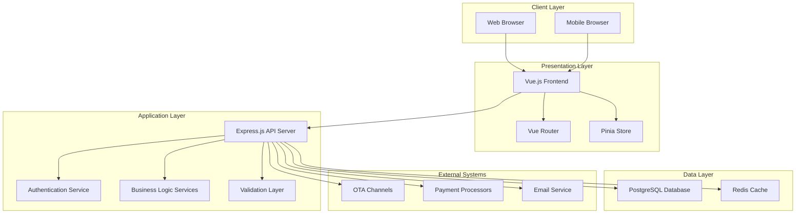
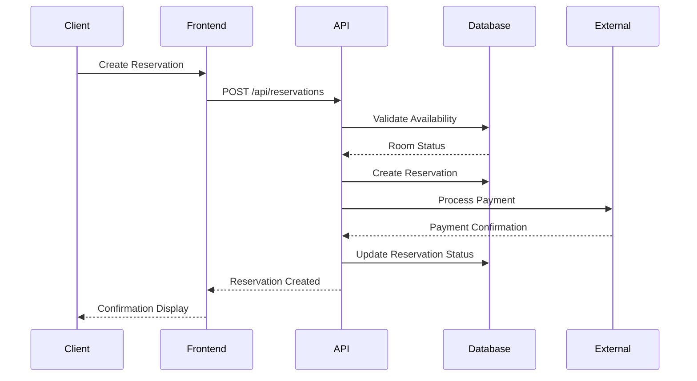
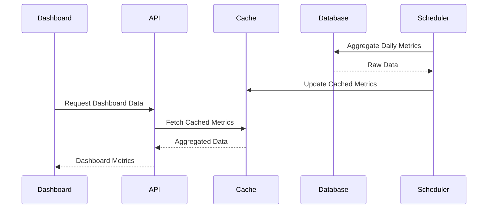

# System Architecture

## Overview

The Hotel Property Management System (PMS) is a comprehensive web-based application designed to manage hotel operations including reservations, guest management, billing, and reporting. The system follows a modern three-tier architecture with a Vue.js frontend, Node.js/Express backend API, and PostgreSQL database.

## High-Level Architecture



## System Components

### Frontend Layer (Vue.js)

The frontend is built using Vue.js 3 with the Composition API and provides a responsive, single-page application interface.

**Key Components:**
- **Main Dashboard**: Real-time operational overview with key metrics
- **Reservation Management**: Booking creation, modification, and tracking
- **Guest Management**: Customer information and history
- **Reporting Module**: Analytics and business intelligence
- **Admin Panel**: System configuration and user management

**Technology Stack:**
- Vue.js 3 with Composition API
- Vue Router for navigation
- Pinia for state management
- Tailwind CSS for styling
- Chart.js for data visualization

### Backend API Layer (Node.js/Express)

The backend provides RESTful APIs and handles business logic, authentication, and data processing.

**Core Services:**
- **Reservation Service**: Booking lifecycle management
- **Guest Service**: Customer data management
- **Billing Service**: Payment processing and invoicing
- **Reporting Service**: Data aggregation and analytics
- **Authentication Service**: User management and security
- **Integration Service**: External system connectivity

**Technology Stack:**
- Node.js runtime
- Express.js web framework
- JWT for authentication
- Bcrypt for password hashing
- Node-cron for scheduled tasks

### Database Layer (PostgreSQL)

PostgreSQL serves as the primary data store with optimized schemas for hotel operations.

**Key Database Features:**
- ACID compliance for transaction integrity
- Advanced indexing for query performance
- Materialized views for reporting optimization
- Row-level security for multi-tenant data isolation
- Backup and replication for high availability

## Data Flow Architecture

### Reservation Booking Flow



### Real-time Dashboard Updates



## Integration Architecture

### External System Integrations

**OTA (Online Travel Agency) Integration:**
- Bidirectional synchronization of rates and availability
- Real-time booking notifications
- Inventory management across channels

**Payment Processing:**
- Multiple payment gateway support
- PCI DSS compliance
- Automated reconciliation

**Email Services:**
- Transactional email delivery
- Booking confirmations and notifications
- Marketing campaign support

### API Design Patterns

**RESTful API Structure:**
```
/api/v1/
├── /auth/          # Authentication endpoints
├── /reservations/  # Reservation management
├── /guests/        # Guest information
├── /rooms/         # Room inventory
├── /billing/       # Payment and invoicing
├── /reports/       # Analytics and reporting
└── /admin/         # Administrative functions
```

**Authentication Flow:**
- JWT-based stateless authentication
- Role-based access control (RBAC)
- Multi-hotel permission management

## Performance Architecture

### Caching Strategy

**Application-Level Caching:**
- Redis for session storage
- API response caching for frequently accessed data
- Real-time metrics caching

**Database Optimization:**
- Materialized views for complex reporting queries
- Strategic indexing on high-traffic columns
- Query optimization for dashboard metrics

### Scalability Considerations

**Horizontal Scaling:**
- Stateless API design for load balancing
- Database connection pooling
- CDN integration for static assets

**Performance Monitoring:**
- Application performance monitoring (APM)
- Database query performance tracking
- Real-time error logging and alerting

## Security Architecture

### Authentication & Authorization

**Multi-layered Security:**
- JWT token-based authentication
- Role-based access control (RBAC)
- Multi-hotel data isolation
- Session management and timeout

**Data Protection:**
- Encrypted data transmission (HTTPS/TLS)
- Password hashing with bcrypt
- Input validation and sanitization
- SQL injection prevention

### Compliance & Privacy

**Data Privacy:**
- GDPR compliance for guest data
- PCI DSS compliance for payment data
- Data retention policies
- Audit logging for sensitive operations

## Deployment Architecture

### Environment Structure

**Development Environment:**
- Local development setup
- Hot reloading for rapid development
- Mock external services

**Production Environment:**
- Load-balanced application servers
- Database clustering for high availability
- Automated backup and disaster recovery
- SSL/TLS termination at load balancer

### Infrastructure Components

**Server Infrastructure:**
- Web application servers
- Database servers with replication
- Redis cache servers
- File storage for documents and images

**Monitoring & Logging:**
- Application performance monitoring
- Error tracking and alerting
- Security event logging
- Business metrics tracking

## Technology Decisions

### Frontend Technology Choice

**Vue.js Selection Rationale:**
- Component-based architecture for maintainability
- Excellent performance with virtual DOM
- Strong ecosystem and community support
- Progressive adoption capability

### Database Technology Choice

**PostgreSQL Selection Rationale:**
- ACID compliance for financial transactions
- Advanced querying capabilities for reporting
- Excellent performance with proper indexing
- Strong JSON support for flexible data structures

### API Architecture Choice

**RESTful API Design:**
- Industry standard approach
- Clear resource-based URL structure
- Stateless design for scalability
- Easy integration with frontend frameworks

## Future Architecture Considerations

### Microservices Migration

**Potential Service Boundaries:**
- Reservation Service
- Guest Management Service
- Billing Service
- Reporting Service
- Notification Service

### Cloud Migration Strategy

**Cloud-Native Features:**
- Container orchestration with Kubernetes
- Managed database services
- Auto-scaling capabilities
- Global content delivery network

### Event-Driven Architecture

**Event Streaming:**
- Real-time event processing
- Asynchronous communication between services
- Event sourcing for audit trails
- CQRS pattern for read/write optimization