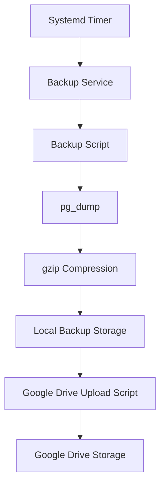

# PostgreSQL Configuration

This document provides detailed information about the PostgreSQL database configuration used in the hotel management system.

## Installation and Version

### Current PostgreSQL Version

The Sakura VPS is running PostgreSQL 16.9 on Ubuntu 24.04:

```
psql (PostgreSQL) 16.9 (Ubuntu 16.9-0ubuntu0.24.04.1)
```

### Installed PostgreSQL Packages

The following PostgreSQL packages are installed on the system:

| Package | Version | Description |
|---------|---------|-------------|
| postgresql | 16+257build1.1 | Object-relational SQL database (supported version) |
| postgresql-16 | 16.9-0ubuntu0.24.04.1 | The World's Most Advanced Open Source Relational Database |
| postgresql-client-16 | 16.9-0ubuntu0.24.04.1 | Front-end programs for PostgreSQL 16 |
| postgresql-client-common | 257build1.1 | Manager for multiple PostgreSQL client versions |
| postgresql-common | 257build1.1 | PostgreSQL database-cluster manager |
| postgresql-contrib | 16+257build1.1 | Additional facilities for PostgreSQL (supported version) |

### Service Configuration

PostgreSQL is configured as a systemd service and is set to start automatically at boot:

```
● postgresql.service - PostgreSQL RDBMS
   Loaded: loaded (/usr/lib/systemd/system/postgresql.service; enabled; preset: enabled)
   Active: active (exited) since Thu 2025-07-17 09:34:03 JST; 46min ago
```

The PostgreSQL service is a meta-service that manages the actual PostgreSQL cluster service, which is typically named `postgresql@16-main.service` for PostgreSQL 16 with the default cluster named "main".

### Installation Method

PostgreSQL was installed using the official Ubuntu repositories, which ensures compatibility with the operating system and regular security updates.

### Installation Directory Structure

The PostgreSQL installation follows the standard Debian/Ubuntu directory structure:

| Directory | Purpose |
|-----------|---------|
| `/etc/postgresql/16/main/` | Configuration files for the main cluster |
| `/var/lib/postgresql/16/main/` | Data directory for the main cluster |
| `/var/log/postgresql/` | Log files |
| `/usr/lib/postgresql/16/` | Binaries and libraries |
| `/usr/share/postgresql/16/` | Shared files |

### Upgrade Procedures

#### Minor Version Upgrades

Minor version upgrades (e.g., 16.8 to 16.9) can be performed using the standard Ubuntu package management system:

```bash
# Update package lists
sudo apt update

# Upgrade PostgreSQL packages
sudo apt upgrade postgresql postgresql-16 postgresql-client-16 postgresql-contrib

# Restart PostgreSQL to apply changes
sudo systemctl restart postgresql@16-main
```

#### Major Version Upgrades

Major version upgrades (e.g., PostgreSQL 15 to 16) require more careful planning and execution:

1. **Pre-upgrade Tasks**:
   ```bash
   # Install the new PostgreSQL version alongside the existing one
   sudo apt install postgresql-16 postgresql-client-16 postgresql-contrib-16
   ```

2. **Backup the Current Database**:
   ```bash
   # Create a full backup
   sudo -u postgres pg_dumpall > /path/to/backup/pg_dumpall_$(date +%Y%m%d).sql
   ```

3. **Use pg_upgradecluster Tool**:
   ```bash
   # Upgrade the cluster
   sudo pg_upgradecluster 15 main
   ```

4. **Post-upgrade Tasks**:
   ```bash
   # Verify the new cluster is working
   sudo -u postgres psql -c "SELECT version();"
   
   # Drop the old cluster when everything is confirmed working
   sudo pg_dropcluster 15 main
   ```

5. **Update Application Configurations**:
   - Update connection strings if necessary
   - Test application functionality thoroughly

### Version Verification

To verify the current PostgreSQL version and connection information:

```bash
# Check PostgreSQL version
psql --version

# Connect to PostgreSQL and check version from SQL
sudo -u postgres psql -c "SELECT version();"
```

## Configuration Parameters

### Key PostgreSQL Configuration Parameters

Based on the information available, the PostgreSQL server is configured with the following key parameters:

| Parameter | Value | Description | Context |
|-----------|-------|-------------|---------|
| DateStyle | ISO, MDY | Date format | user |
| IntervalStyle | postgres | Interval format | user |
| TimeZone | Asia/Tokyo | Server timezone | user |
| allow_system_table_mods | off | Prevents modifications to system tables | superuser |
| archive_mode | off | WAL archiving is disabled | postmaster |
| autovacuum | on | Automatic vacuuming is enabled | sighup |
| autovacuum_max_workers | 3 | Maximum number of autovacuum worker processes | postmaster |

### PostgreSQL Configuration File

The main PostgreSQL configuration file is located at `/etc/postgresql/16/main/postgresql.conf`. The most important non-default settings include:

```
# Memory Configuration
shared_buffers = 1GB                  # 25% of system memory for dedicated PostgreSQL memory
work_mem = 32MB                       # Memory for query operations
maintenance_work_mem = 256MB          # Memory for maintenance operations
effective_cache_size = 3GB            # Estimate of system memory available for disk caching

# Connection Settings
max_connections = 100                 # Maximum number of concurrent connections
listen_addresses = '*'                # Listen on all available network interfaces

# Write-Ahead Log (WAL) Settings
wal_level = replica                   # Minimum level for replication
max_wal_size = 1GB                    # Maximum WAL size before checkpoint
min_wal_size = 80MB                   # Minimum WAL size to maintain

# Query Tuning
random_page_cost = 1.1                # Cost estimate for random page access (lower for SSD)
effective_io_concurrency = 200        # Number of concurrent disk I/O operations (higher for SSD)

# Autovacuum Settings
autovacuum = on                       # Enable autovacuum
autovacuum_vacuum_scale_factor = 0.1  # Fraction of table size before vacuum
autovacuum_analyze_scale_factor = 0.05 # Fraction of table size before analyze

# Logging
log_destination = 'stderr'            # Log output destination
logging_collector = on                # Enable capturing of stderr into log files
log_directory = 'log'                 # Directory for log files
log_filename = 'postgresql-%Y-%m-%d_%H%M%S.log' # Log file name pattern
log_min_duration_statement = 1000     # Log statements running longer than this (ms)
log_connections = on                  # Log all connections
log_disconnections = on               # Log all disconnections
log_line_prefix = '%m [%p] %q%u@%d '  # Prefix format for log lines
```

### Client Authentication Configuration

The client authentication configuration is defined in `/etc/postgresql/16/main/pg_hba.conf`. The current configuration includes:

```
# TYPE  DATABASE        USER            ADDRESS                 METHOD
local   all             postgres                                peer
local   all             all                                     peer
host    all             all             127.0.0.1/32            scram-sha-256
host    all             all             ::1/128                 scram-sha-256
host    all             all             153.246.150.162/32      scram-sha-256
host    all             all             153.127.41.18/32        scram-sha-256
host    all             all             133.32.134.250/32       scram-sha-256
```

This configuration:
- Allows local connections using peer authentication
- Allows connections from localhost (127.0.0.1/32 and ::1/128) using SCRAM-SHA-256 password authentication
- Allows connections from specific IP addresses (153.246.150.162/32, 153.127.41.18/32, 133.32.134.250/32) using SCRAM-SHA-256 password authentication

### Connection Pooling

The system uses PgBouncer for connection pooling, which helps manage database connections efficiently, especially during high traffic periods or DoS attacks. The PgBouncer configuration is located at `/etc/pgbouncer/pgbouncer.ini` with the following key settings:

```
[databases]
* = host=localhost port=5432

[pgbouncer]
listen_addr = *
listen_port = 6432
auth_type = md5
auth_file = /etc/pgbouncer/userlist.txt
pool_mode = transaction
max_client_conn = 1000
default_pool_size = 20
reserve_pool_size = 10
reserve_pool_timeout = 5.0
max_db_connections = 50
max_user_connections = 50
```

### Performance Optimization Recommendations

Based on the current configuration and system specifications (4 cores, 4GB RAM), the following optimizations are recommended:

1. **Memory Settings**:
   - `shared_buffers`: Increase to 1GB (25% of system memory)
   - `work_mem`: Set to 32MB for complex queries
   - `maintenance_work_mem`: Set to 256MB for faster maintenance operations
   - `effective_cache_size`: Set to 3GB (75% of system memory)

2. **Connection Settings**:
   - Use connection pooling with PgBouncer to manage connection load
   - Set `max_connections` to 100 to prevent resource exhaustion

3. **Disk I/O Settings**:
   - `random_page_cost`: Set to 1.1 for SSD storage
   - `effective_io_concurrency`: Set to 200 for SSD storage

4. **Autovacuum Settings**:
   - Ensure autovacuum is enabled
   - Adjust `autovacuum_vacuum_scale_factor` to 0.1 for more frequent vacuuming
   - Adjust `autovacuum_analyze_scale_factor` to 0.05 for more frequent statistics updates

5. **WAL Settings**:
   - `wal_level`: Set to 'replica' for enhanced data protection
   - `checkpoint_timeout`: Set to 15min to reduce checkpoint frequency
   - `max_wal_size`: Set to 1GB to reduce checkpoint frequency

### Configuration Management

PostgreSQL configuration changes should be made following these best practices:

1. **Always backup configuration files before making changes**:
   ```bash
   sudo cp /etc/postgresql/16/main/postgresql.conf /etc/postgresql/16/main/postgresql.conf.bak
   ```

2. **Test configuration changes before applying**:
   ```bash
   sudo -u postgres pg_ctl -D /var/lib/postgresql/16/main -o "-c config_file=/path/to/test/postgresql.conf" start
   ```

3. **Apply changes with minimal downtime**:
   - For parameters with context 'user': No restart required
   - For parameters with context 'sighup': Use `pg_ctl reload` or `SELECT pg_reload_conf()`
   - For parameters with context 'postmaster': Full restart required

4. **Monitor system after changes**:
   ```bash
   sudo -u postgres psql -c "SELECT pg_stat_reset();"
   # Wait for representative workload
   sudo -u postgres psql -c "SELECT * FROM pg_stat_database WHERE datname = 'your_database';"
   ```

5. **Document all changes in a change log**

## Backup Strategies

The PostgreSQL database is backed up using a comprehensive strategy that includes automated daily backups with offsite storage to Google Drive for disaster recovery.

### Backup Architecture

The backup system consists of the following components:

1. **Backup Script**: `/usr/local/bin/backup_postgresql.sh`
2. **Systemd Service**: `postgresql-backup.service`
3. **Systemd Timer**: `postgresql-backup.timer`
4. **Google Drive Upload Script**: `/usr/local/bin/upload_to_google_drive.js`



### Backup Schedule

Backups are performed automatically according to the following schedule:

- **Daily Full Backup**: Runs at 2:00 AM every day via systemd timer
- **On-Boot Backup**: Runs 15 minutes after system boot if the scheduled backup was missed

The systemd timer configuration (`postgresql-backup.timer`):

```ini
[Unit]
Description=Run PostgreSQL Daily Backup Service

[Timer]
# Run daily at 2:00 AM
OnCalendar=*-*-* 02:00:00
# Or run 15 minutes after boot if missed the scheduled time
OnBootSec=15min
# Ensure the timer persists across reboots
Persistent=true

[Install]
WantedBy=timers.target
```

### Backup Process

The backup process follows these steps:

1. **Database Dump**: The `pg_dump` utility creates a custom-format dump of the database
2. **Compression**: The dump is compressed using `gzip` to reduce storage requirements
3. **Local Storage**: The compressed backup is stored in `/var/backups/postgresql/`
4. **Cloud Upload**: The backup is uploaded to Google Drive for offsite storage

The backup script (`backup_postgresql.sh`):

```bash
#!/bin/bash

# --- Configuration ---
# Database name is passed as argument
DB_NAME="$1"
BACKUP_DIR="/var/backups/postgresql"
DATE_FORMAT=$(date +"%Y-%m-%d_%H-%M-%S")
BACKUP_FILE="$BACKUP_DIR/${DB_NAME}-${DATE_FORMAT}.dump"
PG_USER="rhtsys_user"
GDRIVE_FOLDER_ID="$2"

# Path to the upload script
UPLOAD_SCRIPT="/usr/local/bin/upload_to_google_drive.js"

# --- Perform Backup ---
# Exit immediately if any command fails
set -e 
set -o pipefail

# --- Validate Input ---
if [ -z "$DB_NAME" ]; then
  echo "Error: No database name provided."
  echo "Usage: $0 <database_name>"
  exit 1
fi
# Add validation for folder ID too
if [ -z "$GDRIVE_FOLDER_ID" ]; then
  echo "Error: No Google Drive folder ID provided."
  echo "Usage: $0 <database_name> <google_drive_folder_id>"
  exit 1
fi

echo "Starting PostgreSQL backup for database: $DB_NAME at $DATE_FORMAT"

# Note: Password should be handled via .pgpass or environment variable.
pg_dump -h localhost -U "$PG_USER" -Fc "$DB_NAME" | gzip > "$BACKUP_FILE.gz"

echo "Backup completed successfully: $BACKUP_FILE.gz"

# --- Upload to Google Drive ---
echo "Uploading $BACKUP_FILE.gz to Google Drive folder $GDRIVE_FOLDER_ID..."

# Get the global npm modules path for the current user
NPM_GLOBAL_MODULES_PATH=$(npm root -g 2>/dev/null)

if [ -n "$NPM_GLOBAL_MODULES_PATH" ] && [ -d "$NPM_GLOBAL_MODULES_PATH" ]; then
  echo "Attempting to use NODE_PATH: $NPM_GLOBAL_MODULES_PATH"
  NODE_PATH="$NPM_GLOBAL_MODULES_PATH" "$UPLOAD_SCRIPT" "$BACKUP_FILE.gz" "$GDRIVE_FOLDER_ID"
else
  echo "Warning: Could not determine npm global modules path via 'npm root -g'."
  echo "Attempting to run upload script without explicit NODE_PATH."
  "$UPLOAD_SCRIPT" "$BACKUP_FILE.gz" "$GDRIVE_FOLDER_ID"
fi

echo "Upload to Google Drive finished."
```

### Backup Retention Policy

The backup retention policy is as follows:

1. **Local Storage**: 
   - Last 7 daily backups are retained locally
   - Older backups are automatically removed by a log rotation policy

2. **Google Drive Storage**:
   - All backups are retained in Google Drive
   - The Google Drive folder ID used for storage is `1Yf-69S4xFV7wRavBnybcef8Q539uidc0`

### Backup Verification

To ensure backup integrity, the following verification procedures should be performed regularly:

1. **Manual Verification** (Monthly):
   - Download a backup from Google Drive
   - Restore to a test database
   - Verify data integrity with sample queries

2. **Automated Log Verification** (Daily):
   - Check systemd journal logs for backup service success/failure
   - Command: `journalctl -u postgresql-backup.service --since "24 hours ago"`

### Backup Restoration Procedure

In case of database corruption or data loss, follow these steps to restore from backup:

1. **Identify the Backup File**:
   - Locate the appropriate backup file in `/var/backups/postgresql/` or Google Drive
   - Choose the most recent backup before the data loss occurred

2. **Stop PostgreSQL Service**:
   ```bash
   sudo systemctl stop postgresql
   ```

3. **Restore the Database**:
   ```bash
   # For a complete restore (replacing the current database)
   gunzip -c /var/backups/postgresql/rhthotels-YYYY-MM-DD_HH-MM-SS.dump.gz | \
   sudo -u postgres pg_restore -C -d postgres
   
   # For restoring to a different database for verification
   gunzip -c /var/backups/postgresql/rhthotels-YYYY-MM-DD_HH-MM-SS.dump.gz | \
   sudo -u postgres pg_restore -C -d rhthotels_test
   ```

4. **Start PostgreSQL Service**:
   ```bash
   sudo systemctl start postgresql
   ```

5. **Verify Restoration**:
   ```bash
   sudo -u postgres psql -d rhthotels -c "SELECT count(*) FROM reservations;"
   ```

### Disaster Recovery Scenario

In case of complete server failure, follow these steps to recover the database on a new server:

1. **Install PostgreSQL**:
   ```bash
   sudo apt update
   sudo apt install postgresql postgresql-contrib
   ```

2. **Download Backup from Google Drive**:
   - Access the Google Drive folder using the credentials stored in `/etc/app_config/google/`
   - Download the most recent backup file

3. **Restore the Database**:
   ```bash
   gunzip -c downloaded-backup-file.dump.gz | sudo -u postgres pg_restore -C -d postgres
   ```

4. **Configure PostgreSQL**:
   - Apply the same configuration parameters as documented in this guide
   - Restore user permissions and roles

5. **Verify Restoration**:
   - Connect to the database and verify data integrity
   - Test application connectivity

### Backup Monitoring

The backup process is monitored through the following methods:

1. **Systemd Service Status**:
   ```bash
   systemctl status postgresql-backup.service
   ```

2. **Backup Log Monitoring**:
   ```bash
   journalctl -u postgresql-backup.service -n 50
   ```

3. **Disk Space Monitoring**:
   ```bash
   df -h /var/backups/postgresql/
   ```

4. **Google Drive Upload Verification**:
   - Check the Google Drive folder for new backup files
   - Verify the timestamp of the most recent backup

## Performance Tuning

This section provides guidance on optimizing PostgreSQL performance for the hotel management system, with specific recommendations based on the current configuration and system resources.

### Current Performance Configuration

The PostgreSQL server is currently configured with the following key performance-related parameters:

| Parameter | Current Value | Recommended Value | Description |
|-----------|---------------|------------------|-------------|
| shared_buffers | 128MB | 1GB | Memory used for shared data buffers |
| work_mem | 4MB | 32MB | Memory used for query operations |
| maintenance_work_mem | 64MB | 256MB | Memory used for maintenance operations |
| effective_cache_size | 4GB | 3GB | Estimate of available system memory |
| max_connections | 100 | 100 | Maximum number of concurrent connections |
| random_page_cost | 4.0 | 1.1 | Cost estimate for random page access |
| effective_io_concurrency | 1 | 200 | Number of concurrent disk I/O operations |
| checkpoint_timeout | 5min | 15min | Time between automatic WAL checkpoints |
| max_wal_size | 1GB | 1GB | Maximum WAL size before checkpoint |
| min_wal_size | 80MB | 80MB | Minimum WAL size to maintain |

### Performance Optimization Recommendations

Based on the current system specifications (4 cores, 4GB RAM) and the PostgreSQL configuration, the following optimizations are recommended:

#### Memory Configuration

1. **Shared Buffers**:
   ```
   shared_buffers = 1GB  # 25% of system memory
   ```
   - Rationale: Increasing shared_buffers from 128MB to 1GB will allow PostgreSQL to cache more data in memory, reducing disk I/O.
   - Impact: Improved query performance for frequently accessed data.

2. **Work Memory**:
   ```
   work_mem = 32MB
   ```
   - Rationale: Increasing work_mem from 4MB to 32MB will allow more complex sorts and hash operations to be performed in memory.
   - Impact: Faster execution of complex queries involving sorts and joins.
   - Caution: Setting this too high can lead to memory exhaustion if many concurrent queries are running.

3. **Maintenance Work Memory**:
   ```
   maintenance_work_mem = 256MB
   ```
   - Rationale: Increasing maintenance_work_mem from 64MB to 256MB will speed up maintenance operations like VACUUM and CREATE INDEX.
   - Impact: Faster index creation and vacuum operations.

4. **Effective Cache Size**:
   ```
   effective_cache_size = 3GB  # 75% of system memory
   ```
   - Rationale: This parameter helps the query planner estimate the amount of memory available for caching.
   - Impact: Better query plans that take advantage of system memory for caching.

#### I/O Configuration

1. **Random Page Cost**:
   ```
   random_page_cost = 1.1
   ```
   - Rationale: The default value of 4.0 is too high for SSD storage. A value of 1.1 better reflects the performance of SSDs.
   - Impact: Query planner will be more likely to use index scans, which are efficient on SSDs.

2. **Effective I/O Concurrency**:
   ```
   effective_io_concurrency = 200
   ```
   - Rationale: Increasing from 1 to 200 allows more concurrent I/O operations, which is beneficial for SSDs.
   - Impact: Better utilization of SSD's parallel I/O capabilities.

#### Write-Ahead Log (WAL) Configuration

1. **Checkpoint Timeout**:
   ```
   checkpoint_timeout = 15min
   ```
   - Rationale: Increasing from 5min to 15min reduces the frequency of checkpoints, which can be I/O intensive.
   - Impact: Reduced I/O spikes during checkpoints, more consistent performance.

2. **WAL Level**:
   ```
   wal_level = replica
   ```
   - Rationale: This setting enables WAL archiving and replication, which is useful for backup and recovery.
   - Impact: Enables point-in-time recovery and replication features.

#### Connection Management

1. **Connection Pooling**:
   - Implement PgBouncer for connection pooling to efficiently manage database connections.
   - Configuration:
     ```
     [pgbouncer]
     listen_port = 6432
     max_client_conn = 1000
     default_pool_size = 20
     pool_mode = transaction
     ```
   - Rationale: Reduces the overhead of establishing new connections and manages connection limits effectively.
   - Impact: Improved scalability and performance under high connection loads.

### Query Optimization Techniques

1. **Index Optimization**:
   - Regularly analyze tables to update statistics:
     ```sql
     ANALYZE;
     ```
   - Create indexes on frequently queried columns:
     ```sql
     CREATE INDEX idx_reservation_date ON reservations(check_in_date, check_out_date);
     ```
   - Consider partial indexes for filtered queries:
     ```sql
     CREATE INDEX idx_active_reservations ON reservations(id) WHERE status = 'active';
     ```

2. **Query Rewriting**:
   - Use EXPLAIN ANALYZE to identify slow queries:
     ```sql
     EXPLAIN ANALYZE SELECT * FROM reservations WHERE check_in_date BETWEEN '2025-01-01' AND '2025-01-31';
     ```
   - Rewrite queries to use indexes effectively:
     ```sql
     -- Instead of:
     SELECT * FROM clients WHERE LOWER(email) = 'example@example.com';
     
     -- Use:
     SELECT * FROM clients WHERE email = 'example@example.com';
     ```

3. **Table Partitioning**:
   - Consider partitioning large tables by date range:
     ```sql
     CREATE TABLE reservations (
         id SERIAL,
         check_in_date DATE,
         check_out_date DATE,
         -- other columns
     ) PARTITION BY RANGE (check_in_date);
     
     CREATE TABLE reservations_2025_q1 PARTITION OF reservations
         FOR VALUES FROM ('2025-01-01') TO ('2025-04-01');
     ```
   - Rationale: Improves query performance for date-range queries and simplifies data archiving.

### Monitoring Performance

#### Performance Monitoring Queries

The following queries help identify performance bottlenecks and optimization opportunities:

1. **Slow Query Analysis**:
   ```sql
   -- Top 10 slowest queries by total execution time
   SELECT 
       query,
       calls,
       total_time,
       mean_time,
       (total_time/sum(total_time) OVER()) * 100 AS percentage_of_total
   FROM pg_stat_statements
   ORDER BY total_time DESC
   LIMIT 10;
   
   -- Queries with highest average execution time
   SELECT 
       query,
       calls,
       mean_time,
       total_time
   FROM pg_stat_statements
   WHERE calls > 10  -- Only queries called more than 10 times
   ORDER BY mean_time DESC
   LIMIT 10;
   ```

2. **Table and Index Usage Analysis**:
   ```sql
   -- Table bloat analysis
   SELECT 
       schemaname,
       relname,
       n_dead_tup,
       n_live_tup,
       CASE 
           WHEN n_live_tup > 0 
           THEN (n_dead_tup::float / (n_live_tup + n_dead_tup) * 100)::int 
           ELSE 0 
       END AS dead_percentage,
       last_vacuum,
       last_autovacuum
   FROM pg_stat_user_tables
   WHERE n_live_tup > 0
   ORDER BY dead_percentage DESC;
   
   -- Index usage statistics
   SELECT 
       schemaname,
       relname,
       indexrelname,
       idx_tup_read,
       idx_tup_fetch,
       idx_scan,
       CASE 
           WHEN idx_scan = 0 THEN 'UNUSED INDEX'
           WHEN idx_scan < 10 THEN 'LOW USAGE'
           ELSE 'ACTIVE'
       END AS usage_status
   FROM pg_stat_user_indexes
   ORDER BY idx_scan ASC;
   
   -- Tables with sequential scans (potential missing indexes)
   SELECT 
       schemaname,
       relname,
       seq_scan,
       seq_tup_read,
       idx_scan,
       idx_tup_fetch,
       CASE 
           WHEN seq_scan > idx_scan AND seq_scan > 100 
           THEN 'HIGH SEQ SCAN - CONSIDER INDEX'
           ELSE 'OK'
       END AS recommendation
   FROM pg_stat_user_tables
   WHERE seq_scan > 0
   ORDER BY seq_scan DESC;
   ```

3. **Connection and Lock Analysis**:
   ```sql
   -- Current active connections
   SELECT 
       datname,
       usename,
       application_name,
       client_addr,
       state,
       query_start,
       state_change,
       query
   FROM pg_stat_activity
   WHERE state != 'idle'
   ORDER BY query_start;
   
   -- Lock analysis
   SELECT 
       blocked_locks.pid AS blocked_pid,
       blocked_activity.usename AS blocked_user,
       blocking_locks.pid AS blocking_pid,
       blocking_activity.usename AS blocking_user,
       blocked_activity.query AS blocked_statement,
       blocking_activity.query AS blocking_statement
   FROM pg_catalog.pg_locks blocked_locks
   JOIN pg_catalog.pg_stat_activity blocked_activity ON blocked_activity.pid = blocked_locks.pid
   JOIN pg_catalog.pg_locks blocking_locks ON blocking_locks.locktype = blocked_locks.locktype
       AND blocking_locks.DATABASE IS NOT DISTINCT FROM blocked_locks.DATABASE
       AND blocking_locks.relation IS NOT DISTINCT FROM blocked_locks.relation
       AND blocking_locks.page IS NOT DISTINCT FROM blocked_locks.page
       AND blocking_locks.tuple IS NOT DISTINCT FROM blocked_locks.tuple
       AND blocking_locks.virtualxid IS NOT DISTINCT FROM blocked_locks.virtualxid
       AND blocking_locks.transactionid IS NOT DISTINCT FROM blocked_locks.transactionid
       AND blocking_locks.classid IS NOT DISTINCT FROM blocked_locks.classid
       AND blocking_locks.objid IS NOT DISTINCT FROM blocked_locks.objid
       AND blocking_locks.objsubid IS NOT DISTINCT FROM blocked_locks.objsubid
       AND blocking_locks.pid != blocked_locks.pid
   JOIN pg_catalog.pg_stat_activity blocking_activity ON blocking_activity.pid = blocking_locks.pid
   WHERE NOT blocked_locks.GRANTED;
   ```

4. **Database Size and Growth Analysis**:
   ```sql
   -- Database size analysis
   SELECT 
       datname,
       pg_size_pretty(pg_database_size(datname)) AS size
   FROM pg_database
   WHERE datname NOT IN ('template0', 'template1', 'postgres')
   ORDER BY pg_database_size(datname) DESC;
   
   -- Table size analysis
   SELECT 
       schemaname,
       relname,
       pg_size_pretty(pg_total_relation_size(schemaname||'.'||relname)) AS total_size,
       pg_size_pretty(pg_relation_size(schemaname||'.'||relname)) AS table_size,
       pg_size_pretty(pg_total_relation_size(schemaname||'.'||relname) - pg_relation_size(schemaname||'.'||relname)) AS index_size
   FROM pg_stat_user_tables
   ORDER BY pg_total_relation_size(schemaname||'.'||relname) DESC;
   ```

5. **Cache Hit Ratio Analysis**:
   ```sql
   -- Buffer cache hit ratio (should be > 95%)
   SELECT 
       datname,
       blks_read,
       blks_hit,
       CASE 
           WHEN (blks_hit + blks_read) = 0 THEN 0
           ELSE round((blks_hit::float / (blks_hit + blks_read)) * 100, 2)
       END AS cache_hit_ratio
   FROM pg_stat_database
   WHERE datname NOT IN ('template0', 'template1')
   ORDER BY cache_hit_ratio DESC;
   
   -- Index cache hit ratio
   SELECT 
       schemaname,
       relname,
       indexrelname,
       idx_blks_read,
       idx_blks_hit,
       CASE 
           WHEN (idx_blks_hit + idx_blks_read) = 0 THEN 0
           ELSE round((idx_blks_hit::float / (idx_blks_hit + idx_blks_read)) * 100, 2)
       END AS index_cache_hit_ratio
   FROM pg_stat_user_indexes
   WHERE idx_blks_read > 0
   ORDER BY index_cache_hit_ratio ASC;
   ```

6. **Checkpoint and WAL Analysis**:
   ```sql
   -- Checkpoint statistics
   SELECT 
       checkpoints_timed,
       checkpoints_req,
       checkpoint_write_time,
       checkpoint_sync_time,
       buffers_checkpoint,
       buffers_clean,
       maxwritten_clean,
       buffers_backend,
       buffers_backend_fsync,
       buffers_alloc,
       stats_reset
   FROM pg_stat_bgwriter;
   
   -- WAL statistics
   SELECT 
       pg_current_wal_lsn(),
       pg_wal_lsn_diff(pg_current_wal_lsn(), '0/0') AS wal_bytes_generated;
   ```

#### Performance Monitoring Tools

1. **Essential Extensions**:
   ```sql
   -- Install pg_stat_statements for query performance tracking
   CREATE EXTENSION IF NOT EXISTS pg_stat_statements;
   
   -- Install pg_buffercache for buffer cache analysis
   CREATE EXTENSION IF NOT EXISTS pg_buffercache;
   
   -- Install pg_stat_kcache for system-level statistics (if available)
   CREATE EXTENSION IF NOT EXISTS pg_stat_kcache;
   ```

2. **Log Analysis Tools**:
   - **pgBadger**: Comprehensive PostgreSQL log analyzer
     ```bash
     # Install pgBadger
     sudo apt install pgbadger
     
     # Analyze logs
     pgbadger /var/log/postgresql/postgresql-*.log -o /tmp/pgbadger_report.html
     ```
   
   - **pg_stat_statements Reset**: Reset statistics for fresh analysis
     ```sql
     SELECT pg_stat_statements_reset();
     ```

3. **Real-time Monitoring Setup**:
   - **Prometheus + Grafana**: For comprehensive monitoring dashboard
   - **postgres_exporter**: Prometheus exporter for PostgreSQL metrics
   - **Custom monitoring scripts**: Automated performance checks

#### Performance Monitoring Schedule

Implement a regular monitoring schedule to proactively identify performance issues:

1. **Daily Checks**:
   - Review slow query log
   - Check cache hit ratios
   - Monitor connection counts
   - Verify autovacuum activity

2. **Weekly Checks**:
   - Analyze table bloat
   - Review index usage statistics
   - Check database growth trends
   - Validate backup performance

3. **Monthly Checks**:
   - Comprehensive performance review
   - Index optimization analysis
   - Query plan analysis for critical queries
   - Capacity planning review

#### Performance Alerting Thresholds

Set up alerts for the following performance indicators:

| Metric | Warning Threshold | Critical Threshold |
|--------|------------------|-------------------|
| Cache Hit Ratio | < 95% | < 90% |
| Average Query Time | > 100ms | > 500ms |
| Active Connections | > 80 | > 95 |
| Table Bloat | > 20% | > 40% |
| Checkpoint Frequency | > 1/min | > 2/min |
| Lock Wait Time | > 1s | > 5s |

#### Performance Troubleshooting Workflow

When performance issues are detected:

1. **Immediate Assessment**:
   - Check current active queries
   - Identify blocking locks
   - Review recent configuration changes

2. **Root Cause Analysis**:
   - Analyze slow query patterns
   - Check for missing indexes
   - Review table bloat levels
   - Examine system resource usage

3. **Resolution Steps**:
   - Optimize problematic queries
   - Add missing indexes
   - Adjust configuration parameters
   - Schedule maintenance operations

4. **Verification**:
   - Monitor performance improvements
   - Validate that changes don't cause regressions
   - Document lessons learned

### Autovacuum Configuration

1. **Optimize Autovacuum Settings**:
   ```
   autovacuum_vacuum_scale_factor = 0.1
   autovacuum_analyze_scale_factor = 0.05
   autovacuum_vacuum_cost_delay = 2ms
   ```
   - Rationale: More frequent vacuuming prevents table bloat and keeps statistics up-to-date.
   - Impact: Improved query performance and reduced table bloat.

2. **Monitor Autovacuum Activity**:
   ```sql
   SELECT relname, last_vacuum, last_autovacuum, 
          last_analyze, last_autoanalyze
   FROM pg_stat_user_tables;
   ```

### Performance Scaling Recommendations

As the system grows from a single hotel to 25 hotels with up to 40 concurrent users, consider the following scaling strategies:

1. **Short-term (1-5 hotels)**:
   - Implement the memory and I/O optimizations described above
   - Set up connection pooling with PgBouncer
   - Optimize indexes and queries

2. **Medium-term (5-15 hotels)**:
   - Increase server RAM to 8GB
   - Adjust shared_buffers to 2GB
   - Implement table partitioning for large tables
   - Consider read replicas for reporting workloads

3. **Long-term (15-25+ hotels)**:
   - Upgrade to 16GB RAM and 6-8 cores
   - Adjust shared_buffers to 4GB
   - Implement application-level sharding if necessary
   - Consider distributed database architecture

### Performance Testing

Before applying any configuration changes to the production environment, test them in a staging environment using the following methodology:

1. **Baseline Performance**:
   - Capture current performance metrics
   - Document query execution times for common operations

2. **Apply Changes Incrementally**:
   - Make one change at a time
   - Measure impact after each change

3. **Load Testing**:
   - Simulate production workload with tools like pgbench
   - Test with projected future workload (e.g., 40 concurrent users)

4. **Verify Improvements**:
   - Compare performance metrics before and after changes
   - Ensure no regressions in any critical operations