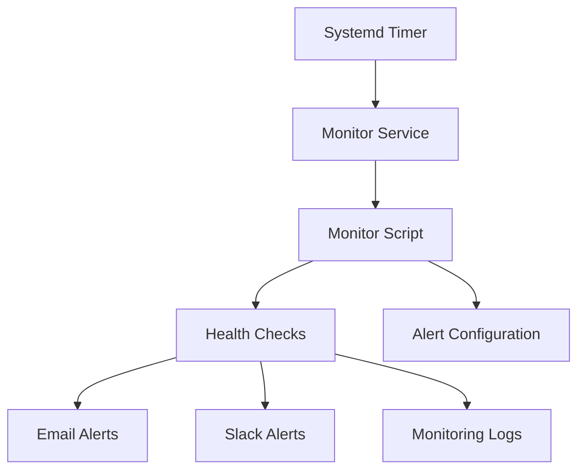
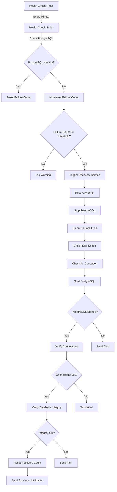

# Automatic Recovery Mechanisms

This document provides detailed information about the automatic recovery mechanisms implemented for PostgreSQL on the Sakura VPS, specifically designed to handle DoS attacks from scraper bots.

## Health Check Implementation

The PostgreSQL health check system is designed to monitor the database's availability and performance, automatically triggering recovery mechanisms when issues are detected. This section documents the implementation of the health check script and its configuration.

### Health Check Script Overview

The health check script (`pg-health-check.sh`) performs multiple checks to verify PostgreSQL's health:

1. **Service Status Check**: Verifies that the PostgreSQL service is running
2. **Connection Check**: Ensures PostgreSQL is accepting connections
3. **Authentication Check**: Verifies that the application user can authenticate
4. **Performance Check**: Measures query response time
5. **Write Check**: Confirms the database can write data
6. **Disk Space Check**: Monitors available disk space

The script implements a failure counting mechanism that triggers recovery actions after a specified number of consecutive failures, providing resilience against transient issues while ensuring prompt recovery from persistent problems.

### Health Check Script Implementation

The health check script is located at `/usr/local/bin/pg-health-check.sh` and is implemented as follows:

```bash
#!/bin/bash

# PostgreSQL health check script
# This script checks if PostgreSQL is running and responding to queries
# It is designed to be run by a systemd timer to monitor PostgreSQL health

# Configuration
LOG_FILE="/var/log/postgresql/health-check.log"
MAX_FAILURES=3
FAILURE_COUNT_FILE="/var/run/postgresql/failure_count"
PG_USER="rhtsys_user"
PG_DATABASE="rhthotels"
RECOVERY_SERVICE="postgresql-recovery.service"

# Create log directory if it doesn't exist
LOG_DIR=$(dirname "$LOG_FILE")
if [ ! -d "$LOG_DIR" ]; then
    mkdir -p "$LOG_DIR"
    chown postgres:postgres "$LOG_DIR"
fi

# Create failure count directory if it doesn't exist
FAILURE_DIR=$(dirname "$FAILURE_COUNT_FILE")
if [ ! -d "$FAILURE_DIR" ]; then
    mkdir -p "$FAILURE_DIR"
    chown postgres:postgres "$FAILURE_DIR"
fi

# Initialize failure count if file doesn't exist
if [ ! -f "$FAILURE_COUNT_FILE" ]; then
    echo "0" > "$FAILURE_COUNT_FILE"
    chown postgres:postgres "$FAILURE_COUNT_FILE"
fi

# Function to log messages
log_message() {
    echo "$(date '+%Y-%m-%d %H:%M:%S') - $1" >> "$LOG_FILE"
}

# Function to increment failure count
increment_failure() {
    FAILURES=$(cat "$FAILURE_COUNT_FILE")
    FAILURES=$((FAILURES + 1))
    echo "$FAILURES" > "$FAILURE_COUNT_FILE"
    
    log_message "WARNING: Failure count: $FAILURES/$MAX_FAILURES"
    
    if [ "$FAILURES" -ge "$MAX_FAILURES" ]; then
        log_message "CRITICAL: Maximum failures reached, attempting recovery"
        systemctl start "$RECOVERY_SERVICE"
        echo "0" > "$FAILURE_COUNT_FILE"
    fi
}

# Function to reset failure count
reset_failure() {
    echo "0" > "$FAILURE_COUNT_FILE"
}

# Start health check
log_message "INFO: Starting PostgreSQL health check"

# Check 1: Is PostgreSQL service running?
if ! systemctl is-active --quiet postgresql; then
    log_message "ERROR: PostgreSQL service is not running"
    increment_failure
    exit 1
fi

# Check 2: Is PostgreSQL accepting connections?
if ! sudo -u postgres psql -c "SELECT 1" >/dev/null 2>&1; then
    log_message "ERROR: PostgreSQL is not accepting connections"
    increment_failure
    exit 1
fi

# Check 3: Can we connect with application user?
if ! PGPASSWORD="${PG_PASSWORD}" psql -h localhost -U "$PG_USER" -d "$PG_DATABASE" -c "SELECT 1" >/dev/null 2>&1; then
    log_message "ERROR: Cannot connect to PostgreSQL with application user"
    increment_failure
    exit 1
fi

# Check 4: Is the database responding to queries in a timely manner?
QUERY_START_TIME=$(date +%s%N)
PGPASSWORD="${PG_PASSWORD}" psql -h localhost -U "$PG_USER" -d "$PG_DATABASE" -c "SELECT 1" >/dev/null 2>&1
QUERY_END_TIME=$(date +%s%N)
QUERY_DURATION=$(( (QUERY_END_TIME - QUERY_START_TIME) / 1000000 )) # Convert to milliseconds

if [ "$QUERY_DURATION" -gt 5000 ]; then # 5 seconds threshold
    log_message "ERROR: PostgreSQL query response time is too slow: ${QUERY_DURATION}ms"
    increment_failure
    exit 1
fi

# Check 5: Is the database able to write data?
TEST_TABLE="health_check_test"
if ! PGPASSWORD="${PG_PASSWORD}" psql -h localhost -U "$PG_USER" -d "$PG_DATABASE" -c "CREATE TABLE IF NOT EXISTS $TEST_TABLE (id SERIAL PRIMARY KEY, check_time TIMESTAMP DEFAULT NOW());" >/dev/null 2>&1; then
    log_message "ERROR: Cannot create test table in PostgreSQL"
    increment_failure
    exit 1
fi

if ! PGPASSWORD="${PG_PASSWORD}" psql -h localhost -U "$PG_USER" -d "$PG_DATABASE" -c "INSERT INTO $TEST_TABLE (check_time) VALUES (NOW());" >/dev/null 2>&1; then
    log_message "ERROR: Cannot insert data into test table in PostgreSQL"
    increment_failure
    exit 1
fi

# Clean up old test data (keep only the last 100 entries)
PGPASSWORD="${PG_PASSWORD}" psql -h localhost -U "$PG_USER" -d "$PG_DATABASE" -c "DELETE FROM $TEST_TABLE WHERE id NOT IN (SELECT id FROM $TEST_TABLE ORDER BY check_time DESC LIMIT 100);" >/dev/null 2>&1

# Check 6: Is the database running out of disk space?
DB_DISK=$(df -h /var/lib/postgresql | tail -n 1 | awk '{print $5}' | sed 's/%//')
if [ "$DB_DISK" -gt 90 ]; then
    log_message "WARNING: PostgreSQL data directory is running out of disk space: ${DB_DISK}%"
    # Don't increment failure count for disk space warning, just log it
fi

# All checks passed
log_message "INFO: PostgreSQL is healthy"
reset_failure
exit 0
```

### Health Check Components

#### Configuration Variables

| Variable | Description |
|----------|-------------|
| LOG_FILE | Path to the health check log file |
| MAX_FAILURES | Number of consecutive failures before triggering recovery |
| FAILURE_COUNT_FILE | File to store the current failure count |
| PG_USER | PostgreSQL user for application connection test |
| PG_DATABASE | PostgreSQL database for application connection test |
| RECOVERY_SERVICE | Systemd service to trigger for recovery |

#### Health Check Functions

1. **log_message()**: Writes timestamped messages to the log file
2. **increment_failure()**: Increments the failure count and triggers recovery if threshold is reached
3. **reset_failure()**: Resets the failure count after a successful health check

#### Health Check Tests

1. **Service Status Check**:
   ```bash
   systemctl is-active --quiet postgresql
   ```
   Verifies that the PostgreSQL service is running according to systemd.

2. **Connection Check**:
   ```bash
   sudo -u postgres psql -c "SELECT 1"
   ```
   Ensures PostgreSQL is accepting connections from the postgres superuser.

3. **Authentication Check**:
   ```bash
   PGPASSWORD="${PG_PASSWORD}" psql -h localhost -U "$PG_USER" -d "$PG_DATABASE" -c "SELECT 1"
   ```
   Verifies that the application user can authenticate and connect to the database.

4. **Performance Check**:
   ```bash
   QUERY_START_TIME=$(date +%s%N)
   PGPASSWORD="${PG_PASSWORD}" psql -h localhost -U "$PG_USER" -d "$PG_DATABASE" -c "SELECT 1"
   QUERY_END_TIME=$(date +%s%N)
   QUERY_DURATION=$(( (QUERY_END_TIME - QUERY_START_TIME) / 1000000 ))
   ```
   Measures query response time to detect performance degradation.

5. **Write Check**:
   ```bash
   PGPASSWORD="${PG_PASSWORD}" psql -h localhost -U "$PG_USER" -d "$PG_DATABASE" -c "INSERT INTO $TEST_TABLE (check_time) VALUES (NOW());"
   ```
   Confirms the database can write data by inserting a record into a test table.

6. **Disk Space Check**:
   ```bash
   DB_DISK=$(df -h /var/lib/postgresql | tail -n 1 | awk '{print $5}' | sed 's/%//')
   ```
   Monitors available disk space to prevent disk-full situations.

### Failure Counting Mechanism

The script implements a failure counting mechanism that:

1. Increments a counter for each failed health check
2. Resets the counter after a successful health check
3. Triggers recovery actions after reaching the MAX_FAILURES threshold

This approach provides resilience against transient issues while ensuring prompt recovery from persistent problems.

### Installation and Configuration

To install and configure the health check script:

1. **Create the Script**:
   ```bash
   sudo mkdir -p /usr/local/bin
   sudo nano /usr/local/bin/pg-health-check.sh
   # Paste the script content
   sudo chmod +x /usr/local/bin/pg-health-check.sh
   ```

2. **Set Up Environment Variables**:
   ```bash
   sudo nano /etc/default/postgresql-health-check
   ```
   Add the following content:
   ```
   PG_PASSWORD="your_application_user_password"
   ```

3. **Create Log Directory**:
   ```bash
   sudo mkdir -p /var/log/postgresql
   sudo chown postgres:postgres /var/log/postgresql
   ```

4. **Create Failure Count Directory**:
   ```bash
   sudo mkdir -p /var/run/postgresql
   sudo chown postgres:postgres /var/run/postgresql
   ```

### Security Considerations

The health check script includes several security measures:

1. **Password Handling**:
   - The database password is stored in a separate environment file
   - The password is passed via the PGPASSWORD environment variable, not command line arguments

2. **File Permissions**:
   - Log files and failure count files are owned by the postgres user
   - The script ensures proper directory permissions

3. **Error Handling**:
   - All commands use proper error checking
   - Failures are logged with detailed error messages

4. **Resource Usage**:
   - The script performs minimal operations to avoid resource contention
   - Old test data is automatically cleaned up to prevent database bloat

### Customization Options

The health check script can be customized by modifying the following parameters:

1. **MAX_FAILURES**: Adjust the number of consecutive failures before triggering recovery
2. **Test Thresholds**: Modify the performance thresholds (e.g., query response time)
3. **Additional Checks**: Add custom checks specific to your application
4. **Recovery Actions**: Customize the recovery actions triggered on failure

### Logging and Monitoring

The health check script logs all activities to `/var/log/postgresql/health-check.log` with the following log levels:

- **INFO**: Normal operation messages
- **WARNING**: Potential issues that don't require immediate action
- **ERROR**: Failed checks that increment the failure counter
- **CRITICAL**: Severe issues that trigger recovery actions

To monitor the health check logs:

```bash
sudo tail -f /var/log/postgresql/health-check.log
```

Example log output:
```
2025-07-17 10:00:00 - INFO: Starting PostgreSQL health check
2025-07-17 10:00:00 - INFO: PostgreSQL is healthy
2025-07-17 10:01:00 - INFO: Starting PostgreSQL health check
2025-07-17 10:01:00 - ERROR: PostgreSQL is not accepting connections
2025-07-17 10:01:00 - WARNING: Failure count: 1/3
2025-07-17 10:02:00 - INFO: Starting PostgreSQL health check
2025-07-17 10:02:00 - ERROR: PostgreSQL is not accepting connections
2025-07-17 10:02:00 - WARNING: Failure count: 2/3
2025-07-17 10:03:00 - INFO: Starting PostgreSQL health check
2025-07-17 10:03:00 - ERROR: PostgreSQL is not accepting connections
2025-07-17 10:03:00 - WARNING: Failure count: 3/3
2025-07-17 10:03:00 - CRITICAL: Maximum failures reached, attempting recovery
```

## Recovery Service Configuration

### PostgreSQL Recovery Script

The PostgreSQL recovery script (`pg-recovery.sh`) is designed to automatically recover the PostgreSQL database from various failure scenarios, including crashes, corruption, and resource exhaustion. This section documents the implementation of the recovery script and its configuration.

#### Recovery Script Overview

The recovery script performs a series of steps to restore PostgreSQL to a healthy state:

1. **Service Management**: Stops and restarts the PostgreSQL service
2. **Lock File Cleanup**: Removes stale PID files and locks
3. **Disk Space Management**: Cleans up old logs and WAL files if disk space is low
4. **Corruption Detection**: Checks for and attempts to handle database corruption
5. **Service Verification**: Confirms that PostgreSQL is running and accepting connections
6. **Integrity Verification**: Validates database integrity after recovery

The script implements a recovery attempt counting mechanism that limits the number of automatic recovery attempts before requiring manual intervention, preventing endless recovery loops for severe issues.

#### Recovery Script Implementation

The recovery script is located at `/usr/local/bin/pg-recovery.sh` and is implemented as follows:

```bash
#!/bin/bash

# PostgreSQL Recovery Script
# This script performs recovery actions for PostgreSQL database failures
# It is triggered by the health check script when multiple failures are detected

# Configuration
LOG_FILE="/var/log/postgresql/recovery.log"
PG_VERSION="16"
PG_CLUSTER="main"
PG_DATA_DIR="/var/lib/postgresql/${PG_VERSION}/${PG_CLUSTER}"
PG_CONFIG_DIR="/etc/postgresql/${PG_VERSION}/${PG_CLUSTER}"
MAX_RECOVERY_ATTEMPTS=3
RECOVERY_COUNT_FILE="/var/run/postgresql/recovery_count"
ALERT_EMAIL="admin@example.com"
BACKUP_DIR="/var/backups/postgresql"

# Create log directory if it doesn't exist
LOG_DIR=$(dirname "$LOG_FILE")
if [ ! -d "$LOG_DIR" ]; then
    mkdir -p "$LOG_DIR"
    chown postgres:postgres "$LOG_DIR"
fi

# Create recovery count directory if it doesn't exist
RECOVERY_DIR=$(dirname "$RECOVERY_COUNT_FILE")
if [ ! -d "$RECOVERY_DIR" ]; then
    mkdir -p "$RECOVERY_DIR"
    chown postgres:postgres "$RECOVERY_DIR"
fi

# Initialize recovery count if file doesn't exist
if [ ! -f "$RECOVERY_COUNT_FILE" ]; then
    echo "0" > "$RECOVERY_COUNT_FILE"
    chown postgres:postgres "$RECOVERY_COUNT_FILE"
fi

# Function to log messages
log_message() {
    echo "$(date '+%Y-%m-%d %H:%M:%S') - $1" >> "$LOG_FILE"
    echo "$(date '+%Y-%m-%d %H:%M:%S') - $1"
}

# Function to send alert email
send_alert() {
    local subject="$1"
    local message="$2"
    
    if command -v mail >/dev/null 2>&1; then
        echo "$message" | mail -s "$subject" "$ALERT_EMAIL"
        log_message "INFO: Alert email sent to $ALERT_EMAIL"
    else
        log_message "WARNING: mail command not available, could not send alert"
    fi
}

# Function to increment recovery count
increment_recovery_count() {
    RECOVERY_COUNT=$(cat "$RECOVERY_COUNT_FILE")
    RECOVERY_COUNT=$((RECOVERY_COUNT + 1))
    echo "$RECOVERY_COUNT" > "$RECOVERY_COUNT_FILE"
    
    log_message "WARNING: Recovery attempt count: $RECOVERY_COUNT/$MAX_RECOVERY_ATTEMPTS"
    
    if [ "$RECOVERY_COUNT" -ge "$MAX_RECOVERY_ATTEMPTS" ]; then
        log_message "CRITICAL: Maximum recovery attempts reached, manual intervention required"
        send_alert "CRITICAL: PostgreSQL Recovery Failed" "Maximum recovery attempts reached for PostgreSQL. Manual intervention required."
        exit 1
    fi
}

# Function to reset recovery count
reset_recovery_count() {
    echo "0" > "$RECOVERY_COUNT_FILE"
}

# Start recovery process
log_message "INFO: Starting PostgreSQL recovery process"
increment_recovery_count

# Step 1: Check if PostgreSQL service is running and try to stop it gracefully
log_message "INFO: Attempting to stop PostgreSQL service gracefully"
if systemctl is-active --quiet postgresql; then
    systemctl stop postgresql
    sleep 5
    
    # If service is still running, try to stop it forcefully
    if systemctl is-active --quiet postgresql; then
        log_message "WARNING: PostgreSQL service did not stop gracefully, attempting force stop"
        systemctl kill postgresql
        sleep 5
    fi
else
    log_message "INFO: PostgreSQL service is already stopped"
fi

# Step 2: Check for and clean up any lock files or stale PID files
log_message "INFO: Checking for lock files and stale PID files"
PG_PID_FILE="${PG_DATA_DIR}/postmaster.pid"
if [ -f "$PG_PID_FILE" ]; then
    log_message "INFO: Removing stale PID file: $PG_PID_FILE"
    rm -f "$PG_PID_FILE"
fi

# Step 3: Check disk space
log_message "INFO: Checking disk space"
DB_DISK=$(df -h /var/lib/postgresql | tail -n 1 | awk '{print $5}' | sed 's/%//')
if [ "$DB_DISK" -gt 90 ]; then
    log_message "WARNING: Low disk space: ${DB_DISK}%, attempting cleanup"
    
    # Clean up old WAL files if archive_mode is off
    if sudo -u postgres grep -q "archive_mode = off" "${PG_CONFIG_DIR}/postgresql.conf"; then
        log_message "INFO: Cleaning up old WAL files"
        find "${PG_DATA_DIR}/pg_wal" -type f -name "*.backup" -mtime +7 -delete
    fi
    
    # Clean up old log files
    log_message "INFO: Cleaning up old log files"
    find /var/log/postgresql -type f -name "postgresql-*.log" -mtime +7 -delete
fi

# Step 4: Check for database corruption
log_message "INFO: Checking for database corruption"
if [ -x "$(command -v pg_checksums)" ]; then
    if ! sudo -u postgres pg_checksums --check --pgdata="$PG_DATA_DIR" >/dev/null 2>&1; then
        log_message "WARNING: Database corruption detected, attempting repair"
        # We can't repair corruption automatically, but we can try to start PostgreSQL with zero_damaged_pages=on
        echo "zero_damaged_pages = on" >> "${PG_CONFIG_DIR}/conf.d/recovery.conf"
        log_message "INFO: Enabled zero_damaged_pages to skip corrupted pages"
    fi
fi

# Step 5: Start PostgreSQL service
log_message "INFO: Starting PostgreSQL service"
systemctl start postgresql
sleep 10

# Step 6: Verify PostgreSQL is running
if systemctl is-active --quiet postgresql; then
    log_message "INFO: PostgreSQL service started successfully"
else
    log_message "ERROR: Failed to start PostgreSQL service"
    send_alert "ERROR: PostgreSQL Recovery Failed" "Failed to start PostgreSQL service after recovery attempt."
    exit 1
fi

# Step 7: Verify PostgreSQL is accepting connections
log_message "INFO: Verifying PostgreSQL connections"
if sudo -u postgres psql -c "SELECT 1" >/dev/null 2>&1; then
    log_message "INFO: PostgreSQL is accepting connections"
else
    log_message "ERROR: PostgreSQL is not accepting connections after recovery"
    send_alert "ERROR: PostgreSQL Recovery Failed" "PostgreSQL is not accepting connections after recovery attempt."
    exit 1
fi

# Step 8: Check for any emergency recovery configurations and remove them
if [ -f "${PG_CONFIG_DIR}/conf.d/recovery.conf" ]; then
    log_message "INFO: Removing emergency recovery configurations"
    rm -f "${PG_CONFIG_DIR}/conf.d/recovery.conf"
    systemctl restart postgresql
    sleep 5
fi

# Step 9: Verify database integrity
log_message "INFO: Verifying database integrity"
if ! sudo -u postgres psql -c "SELECT count(*) FROM pg_stat_user_tables;" >/dev/null 2>&1; then
    log_message "ERROR: Database integrity check failed"
    send_alert "WARNING: PostgreSQL Recovery Partial Success" "PostgreSQL service is running but database integrity check failed."
    exit 1
fi

# Recovery successful
log_message "INFO: PostgreSQL recovery completed successfully"
reset_recovery_count
send_alert "INFO: PostgreSQL Recovery Successful" "PostgreSQL has been successfully recovered and is now operational."
exit 0
```

#### Recovery Script Components

##### Configuration Variables

| Variable | Description |
|----------|-------------|
| LOG_FILE | Path to the recovery log file |
| PG_VERSION | PostgreSQL version number |
| PG_CLUSTER | PostgreSQL cluster name |
| PG_DATA_DIR | Path to PostgreSQL data directory |
| PG_CONFIG_DIR | Path to PostgreSQL configuration directory |
| MAX_RECOVERY_ATTEMPTS | Maximum number of consecutive recovery attempts |
| RECOVERY_COUNT_FILE | File to store the current recovery attempt count |
| ALERT_EMAIL | Email address for recovery notifications |
| BACKUP_DIR | Directory containing PostgreSQL backups |

##### Recovery Functions

1. **log_message()**: Writes timestamped messages to the log file
2. **send_alert()**: Sends email notifications about recovery status
3. **increment_recovery_count()**: Increments the recovery attempt count and checks against the maximum
4. **reset_recovery_count()**: Resets the recovery attempt count after successful recovery

##### Recovery Steps

1. **Service Management**:
   ```bash
   systemctl stop postgresql
   # ...
   systemctl start postgresql
   ```
   Stops and restarts the PostgreSQL service to clear any hung processes or memory issues.

2. **Lock File Cleanup**:
   ```bash
   PG_PID_FILE="${PG_DATA_DIR}/postmaster.pid"
   if [ -f "$PG_PID_FILE" ]; then
       rm -f "$PG_PID_FILE"
   fi
   ```
   Removes stale PID files that might prevent PostgreSQL from starting.

3. **Disk Space Management**:
   ```bash
   if [ "$DB_DISK" -gt 90 ]; then
       # Clean up old WAL files and logs
   fi
   ```
   Frees up disk space by removing old logs and WAL files if disk usage is high.

4. **Corruption Detection**:
   ```bash
   if ! sudo -u postgres pg_checksums --check --pgdata="$PG_DATA_DIR" >/dev/null 2>&1; then
       echo "zero_damaged_pages = on" >> "${PG_CONFIG_DIR}/conf.d/recovery.conf"
   fi
   ```
   Checks for database corruption and enables zero_damaged_pages to skip corrupted pages.

5. **Service Verification**:
   ```bash
   if systemctl is-active --quiet postgresql; then
       log_message "INFO: PostgreSQL service started successfully"
   else
       log_message "ERROR: Failed to start PostgreSQL service"
   fi
   ```
   Confirms that PostgreSQL is running after recovery attempts.

6. **Integrity Verification**:
   ```bash
   if ! sudo -u postgres psql -c "SELECT count(*) FROM pg_stat_user_tables;" >/dev/null 2>&1; then
       log_message "ERROR: Database integrity check failed"
   fi
   ```
   Validates database integrity by executing a simple query.

#### Recovery Attempt Counting Mechanism

The script implements a recovery attempt counting mechanism that:

1. Increments a counter for each recovery attempt
2. Resets the counter after a successful recovery
3. Limits the number of automatic recovery attempts before requiring manual intervention

This approach prevents endless recovery loops for severe issues while allowing automatic recovery for transient problems.

#### Installation and Configuration

To install and configure the recovery script:

1. **Create the Script**:
   ```bash
   sudo mkdir -p /usr/local/bin
   sudo nano /usr/local/bin/pg-recovery.sh
   # Paste the script content
   sudo chmod +x /usr/local/bin/pg-recovery.sh
   ```

2. **Configure Email Notifications**:
   ```bash
   sudo apt install mailutils
   sudo nano /usr/local/bin/pg-recovery.sh
   # Update ALERT_EMAIL variable with your email address
   ```

3. **Create Log Directory**:
   ```bash
   sudo mkdir -p /var/log/postgresql
   sudo chown postgres:postgres /var/log/postgresql
   ```

4. **Create Recovery Count Directory**:
   ```bash
   sudo mkdir -p /var/run/postgresql
   sudo chown postgres:postgres /var/run/postgresql
   ```

5. **Create Configuration Directory**:
   ```bash
   sudo mkdir -p /etc/postgresql/16/main/conf.d
   sudo chown postgres:postgres /etc/postgresql/16/main/conf.d
   ```

#### Security Considerations

The recovery script includes several security measures:

1. **File Permissions**:
   - Log files and recovery count files are owned by the postgres user
   - The script ensures proper directory permissions

2. **Error Handling**:
   - All commands use proper error checking
   - Failures are logged with detailed error messages

3. **Service Management**:
   - The script uses systemctl for service management
   - Force stop is only used as a last resort

4. **Database Integrity**:
   - The script verifies database integrity after recovery
   - Corruption is handled with appropriate PostgreSQL parameters

#### Customization Options

The recovery script can be customized by modifying the following parameters:

1. **MAX_RECOVERY_ATTEMPTS**: Adjust the number of consecutive recovery attempts before requiring manual intervention
2. **Recovery Steps**: Add or modify recovery steps based on specific requirements
3. **Alert Notifications**: Configure different notification methods (e.g., Slack, SMS)
4. **Integrity Checks**: Add more comprehensive database integrity checks

#### Logging and Monitoring

The recovery script logs all activities to `/var/log/postgresql/recovery.log` with the following log levels:

- **INFO**: Normal operation messages
- **WARNING**: Potential issues that might require attention
- **ERROR**: Failed recovery steps
- **CRITICAL**: Severe issues that require manual intervention

To monitor the recovery logs:

```bash
sudo tail -f /var/log/postgresql/recovery.log
```

Example log output:
```
2025-07-17 10:05:00 - INFO: Starting PostgreSQL recovery process
2025-07-17 10:05:00 - WARNING: Recovery attempt count: 1/3
2025-07-17 10:05:00 - INFO: Attempting to stop PostgreSQL service gracefully
2025-07-17 10:05:05 - INFO: Checking for lock files and stale PID files
2025-07-17 10:05:05 - INFO: Removing stale PID file: /var/lib/postgresql/16/main/postmaster.pid
2025-07-17 10:05:05 - INFO: Checking disk space
2025-07-17 10:05:05 - INFO: Starting PostgreSQL service
2025-07-17 10:05:15 - INFO: PostgreSQL service started successfully
2025-07-17 10:05:15 - INFO: Verifying PostgreSQL connections
2025-07-17 10:05:15 - INFO: PostgreSQL is accepting connections
2025-07-17 10:05:15 - INFO: Verifying database integrity
2025-07-17 10:05:16 - INFO: PostgreSQL recovery completed successfully
```

### Systemd Service for Health Checks

The PostgreSQL health check system is configured as a systemd service and timer to run at regular intervals. This section documents the systemd configuration for the health check system.

#### Health Check Systemd Components

The health check system consists of the following systemd components:

1. **postgresql-health-check.service**: Defines the health check service
2. **postgresql-health-check.timer**: Schedules regular execution of the health check
3. **postgresql-recovery.service**: Defines the recovery service triggered by the health check

#### Health Check Service Configuration

The health check service is defined in `/etc/systemd/system/postgresql-health-check.service`:

```ini
[Unit]
Description=PostgreSQL Health Check Service
After=network.target postgresql.service
Wants=postgresql.service

[Service]
Type=oneshot
User=root
Group=root
EnvironmentFile=-/etc/default/postgresql-health-check
ExecStart=/usr/local/bin/pg-health-check.sh
StandardOutput=journal
StandardError=journal
SyslogIdentifier=postgresql-health-check

[Install]
WantedBy=multi-user.target
```

This service configuration:
- Runs after the network and PostgreSQL services are available
- Executes the health check script as a one-shot service
- Loads environment variables from `/etc/default/postgresql-health-check`
- Logs output to the systemd journal with a distinct identifier

#### Health Check Timer Configuration

The health check timer is defined in `/etc/systemd/system/postgresql-health-check.timer`:

```ini
[Unit]
Description=Run PostgreSQL Health Check Every Minute
Requires=postgresql-health-check.service

[Timer]
OnBootSec=1min
OnUnitActiveSec=1min
AccuracySec=1s

[Install]
WantedBy=timers.target
```

This timer configuration:
- Runs the health check service 1 minute after system boot
- Repeats the health check every minute thereafter
- Ensures accurate timing with a 1-second precision
- Automatically starts with the system via the timers.target

#### Recovery Service Configuration

The recovery service is defined in `/etc/systemd/system/postgresql-recovery.service`:

```ini
[Unit]
Description=PostgreSQL Recovery Service
After=network.target
Conflicts=postgresql.service

[Service]
Type=oneshot
User=root
Group=root
ExecStart=/usr/local/bin/pg-recovery.sh
StandardOutput=journal
StandardError=journal
SyslogIdentifier=postgresql-recovery

[Install]
WantedBy=multi-user.target
```

This service configuration:
- Runs after the network service is available
- Conflicts with the PostgreSQL service (to prevent simultaneous operation)
- Executes the recovery script as a one-shot service
- Logs output to the systemd journal with a distinct identifier

#### Installation and Activation

To install and activate the systemd services:

1. **Copy Service Files**:
   ```bash
   sudo cp postgresql-health-check.service /etc/systemd/system/
   sudo cp postgresql-health-check.timer /etc/systemd/system/
   sudo cp postgresql-recovery.service /etc/systemd/system/
   ```

2. **Reload Systemd**:
   ```bash
   sudo systemctl daemon-reload
   ```

3. **Enable and Start the Timer**:
   ```bash
   sudo systemctl enable postgresql-health-check.timer
   sudo systemctl start postgresql-health-check.timer
   ```

4. **Enable the Recovery Service**:
   ```bash
   sudo systemctl enable postgresql-recovery.service
   ```

#### Environment Configuration

Create the environment file for the health check service:

```bash
sudo nano /etc/default/postgresql-health-check
```

Add the following content:
```
PG_PASSWORD="your_application_user_password"
```

Set appropriate permissions:
```bash
sudo chmod 600 /etc/default/postgresql-health-check

## Monitoring and Alerting for Database Failures

The PostgreSQL monitoring and alerting system provides comprehensive monitoring of database health, performance, and availability. This system automatically detects issues and sends notifications through multiple channels including email and Slack.

### Monitoring Architecture

The monitoring system consists of the following components:

1. **Monitoring Script**: `/usr/local/bin/pg-monitor.sh`
2. **Configuration File**: `/etc/postgresql-monitor/postgresql-alerts.conf`
3. **Systemd Service**: `postgresql-monitor.service`
4. **Systemd Timer**: `postgresql-monitor.timer`
5. **Log Rotation**: Automated cleanup of monitoring logs



### Monitoring Components

#### System Resource Monitoring

The monitoring system tracks the following system resources:

1. **CPU Usage**: Monitors PostgreSQL server CPU utilization
2. **Memory Usage**: Tracks system memory consumption
3. **Disk Usage**: Monitors PostgreSQL data directory disk space
4. **Network Connections**: Tracks active database connections

#### Database Health Monitoring

The system performs comprehensive database health checks:

1. **Service Status**: Verifies PostgreSQL service is running
2. **Connection Availability**: Tests database connectivity
3. **Query Performance**: Monitors query execution times
4. **Lock Detection**: Identifies blocking queries and deadlocks
5. **Transaction Monitoring**: Tracks long-running and idle transactions

#### Database Maintenance Monitoring

The system monitors database maintenance needs:

1. **Table Bloat**: Detects tables with excessive bloat
2. **Dead Tuples**: Monitors tables needing vacuum operations
3. **Index Usage**: Identifies unused or inefficient indexes
4. **Autovacuum Activity**: Tracks vacuum and analyze operations

#### Backup and Recovery Monitoring

The system monitors backup and recovery operations:

1. **Backup Status**: Verifies recent backup completion
2. **Backup Integrity**: Checks for backup errors
3. **Recovery Readiness**: Validates recovery mechanisms
4. **Replication Status**: Monitors replication lag (if configured)

### Alert Configuration

#### Alert Thresholds

The monitoring system uses configurable thresholds for alerting:

| Metric | Warning Threshold | Critical Threshold |
|--------|------------------|-------------------|
| CPU Usage | 80% | 90% |
| Memory Usage | 80% | 90% |
| Disk Usage | 80% | 85% |
| Connection Usage | 70% | 80% |
| Query Duration | 5 minutes | 10 minutes |
| Idle Transaction | 30 minutes | 1 hour |
| Dead Tuples | 15% | 20% |
| Table Bloat | 20% | 30% |

#### Notification Channels

The system supports multiple notification channels:

1. **Email Notifications**:
   - SMTP server configuration
   - Multiple recipient support
   - HTML formatted alerts
   - Severity-based routing

2. **Slack Notifications**:
   - Webhook integration
   - Channel-specific routing
   - Rich message formatting
   - Emoji indicators

3. **Log-based Alerts**:
   - Structured logging
   - Syslog integration
   - Log aggregation support
   - Searchable alert history

### Monitoring Configuration

#### Configuration File Structure

The monitoring configuration is stored in `/etc/postgresql-monitor/postgresql-alerts.conf`:

```bash
# Email notification settings
ALERT_EMAIL="admin@example.com"
ALERT_FROM="postgres-monitor@example.com"
SMTP_SERVER="smtp.example.com"
SMTP_PORT="587"
SMTP_USER="alerts@example.com"
SMTP_PASSWORD="your_smtp_password"

# Slack webhook notification settings
SLACK_WEBHOOK_URL="https://hooks.slack.com/services/YOUR/WEBHOOK/URL"
SLACK_CHANNEL="#database-alerts"

# Monitoring thresholds
MAX_CPU_USAGE=90
MAX_MEMORY_USAGE=90
MAX_DISK_USAGE=85
MAX_CONNECTION_PERCENTAGE=80
MAX_IDLE_TRANSACTION_TIME=3600
MAX_QUERY_TIME=300
MAX_DEAD_TUPLES_PERCENTAGE=20
MAX_INDEX_BLOAT_PERCENTAGE=30

# Database connection settings
DB_HOST="localhost"
DB_PORT="5432"
DB_NAME="rhthotels"
DB_USER="rhtsys_user"
```

#### Environment Configuration

Create the environment file for the monitoring service:

```bash
sudo mkdir -p /etc/postgresql-monitor
sudo cp /path/to/postgresql-alerts.conf /etc/postgresql-monitor/
sudo chmod 600 /etc/postgresql-monitor/postgresql-alerts.conf
```

Create the environment file for systemd:

```bash
sudo nano /etc/default/postgresql-monitor
```

Add the following content:
```bash
DB_PASSWORD="your_database_password"
```

Set appropriate permissions:
```bash
sudo chmod 600 /etc/default/postgresql-monitor
```

### Monitoring Service Configuration

#### Systemd Service Configuration

The monitoring service is defined in `/etc/systemd/system/postgresql-monitor.service`:

```ini
[Unit]
Description=PostgreSQL Monitoring Service
After=network.target postgresql.service
Wants=postgresql.service

[Service]
Type=oneshot
User=root
Group=root
EnvironmentFile=-/etc/default/postgresql-monitor
ExecStart=/usr/local/bin/pg-monitor.sh
StandardOutput=journal
StandardError=journal
SyslogIdentifier=postgresql-monitor

[Install]
WantedBy=multi-user.target
```

#### Systemd Timer Configuration

The monitoring timer is defined in `/etc/systemd/system/postgresql-monitor.timer`:

```ini
[Unit]
Description=Run PostgreSQL Monitoring Every 5 Minutes
Requires=postgresql-monitor.service

[Timer]
OnBootSec=5min
OnUnitActiveSec=5min
AccuracySec=1s

[Install]
WantedBy=timers.target
```

This timer configuration:
- Runs the monitoring service 5 minutes after system boot
- Repeats the monitoring every 5 minutes thereafter
- Ensures accurate timing with a 1-second precision
- Automatically starts with the system via the timers.target

### Installation and Setup

#### Step 1: Install Monitoring Components

1. **Copy the monitoring script**:
   ```bash
   sudo cp /path/to/pg-monitor.sh /usr/local/bin/
   sudo chmod +x /usr/local/bin/pg-monitor.sh
   ```

2. **Copy the configuration file**:
   ```bash
   sudo mkdir -p /etc/postgresql-monitor
   sudo cp /path/to/postgresql-alerts.conf /etc/postgresql-monitor/
   sudo chmod 600 /etc/postgresql-monitor/postgresql-alerts.conf
   ```

3. **Copy the systemd service files**:
   ```bash
   sudo cp postgresql-monitor.service /etc/systemd/system/
   sudo cp postgresql-monitor.timer /etc/systemd/system/
   ```

#### Step 2: Configure Email Notifications

1. **Install mail utilities**:
   ```bash
   sudo apt update
   sudo apt install mailutils postfix
   ```

2. **Configure Postfix** (if using local SMTP):
   ```bash
   sudo dpkg-reconfigure postfix
   ```

3. **Test email functionality**:
   ```bash
   echo "Test message" | mail -s "Test Subject" admin@example.com
   ```

#### Step 3: Configure Slack Notifications (Optional)

1. **Create a Slack webhook**:
   - Go to your Slack workspace settings
   - Create a new incoming webhook
   - Copy the webhook URL

2. **Update the configuration**:
   ```bash
   sudo nano /etc/postgresql-monitor/postgresql-alerts.conf
   # Update SLACK_WEBHOOK_URL with your webhook URL
   ```

#### Step 4: Enable and Start Services

1. **Reload systemd**:
   ```bash
   sudo systemctl daemon-reload
   ```

2. **Enable and start the timer**:
   ```bash
   sudo systemctl enable postgresql-monitor.timer
   sudo systemctl start postgresql-monitor.timer
   ```

3. **Verify the timer is active**:
   ```bash
   sudo systemctl status postgresql-monitor.timer
   sudo systemctl list-timers postgresql-monitor.timer
   ```

### Log Management

#### Log File Locations

The monitoring system creates logs in the following locations:

| Log File | Purpose |
|----------|---------|
| `/var/log/postgresql/monitoring.log` | Main monitoring log |
| `/var/log/postgresql/health-check.log` | Health check results |
| `/var/log/postgresql/recovery.log` | Recovery operations |
| `/var/log/syslog` | Systemd service logs |

#### Log Rotation Configuration

Create a log rotation configuration for monitoring logs:

```bash
sudo nano /etc/logrotate.d/postgresql-monitoring
```

Add the following content:
```
/var/log/postgresql/monitoring.log {
    daily
    rotate 30
    compress
    delaycompress
    missingok
    notifempty
    create 644 postgres postgres
    postrotate
        systemctl reload rsyslog > /dev/null 2>&1 || true
    endscript
}

/var/log/postgresql/health-check.log {
    daily
    rotate 30
    compress
    delaycompress
    missingok
    notifempty
    create 644 postgres postgres
}

/var/log/postgresql/recovery.log {
    daily
    rotate 30
    compress
    delaycompress
    missingok
    notifempty
    create 644 postgres postgres
}
```

#### Log Monitoring Commands

Monitor the logs using the following commands:

```bash
# Monitor real-time monitoring logs
sudo tail -f /var/log/postgresql/monitoring.log

# Check recent monitoring activity
sudo journalctl -u postgresql-monitor.service -n 50

# View timer status and next run time
sudo systemctl list-timers postgresql-monitor.timer

# Check for recent alerts
sudo grep -i "alert\|error\|critical" /var/log/postgresql/monitoring.log | tail -20
```

### Alert Types and Responses

#### Critical Alerts

Critical alerts require immediate attention and trigger multiple notification channels:

1. **Service Down**: PostgreSQL service is not running
   - **Response**: Automatic recovery attempt via recovery service
   - **Notification**: Email + Slack + SMS (if configured)

2. **Connection Failure**: Database not accepting connections
   - **Response**: Health check escalation and recovery
   - **Notification**: Email + Slack

3. **Disk Space Critical**: Less than 15% disk space remaining
   - **Response**: Automatic log cleanup and backup rotation
   - **Notification**: Email + Slack + Phone call (if configured)

4. **Memory Exhaustion**: System memory usage above 90%
   - **Response**: Process monitoring and potential restart
   - **Notification**: Email + Slack

#### Warning Alerts

Warning alerts indicate potential issues that should be monitored:

1. **High Resource Usage**: CPU, memory, or disk usage above warning thresholds
2. **Long-Running Queries**: Queries running longer than expected
3. **Table Bloat**: Tables requiring maintenance
4. **Backup Delays**: Backups not completed within expected timeframe

#### Informational Alerts

Informational alerts provide status updates and confirmations:

1. **Recovery Success**: Successful completion of recovery operations
2. **Backup Completion**: Successful backup operations
3. **Maintenance Completion**: Successful vacuum or reindex operations
4. **Service Restart**: Planned service restarts

### Troubleshooting Monitoring Issues

#### Common Issues and Solutions

1. **Email Alerts Not Sending**:
   ```bash
   # Check mail service status
   sudo systemctl status postfix
   
   # Test mail configuration
   echo "Test" | mail -s "Test" admin@example.com
   
   # Check mail logs
   sudo tail -f /var/log/mail.log
   ```

2. **Slack Alerts Not Working**:
   ```bash
   # Test webhook URL
   curl -X POST -H 'Content-type: application/json' \
        --data '{"text":"Test message"}' \
        YOUR_WEBHOOK_URL
   
   # Check network connectivity
   ping hooks.slack.com
   ```

3. **Monitoring Service Not Running**:
   ```bash
   # Check service status
   sudo systemctl status postgresql-monitor.timer
   
   # Check service logs
   sudo journalctl -u postgresql-monitor.service -n 50
   
   # Restart the timer
   sudo systemctl restart postgresql-monitor.timer
   ```

4. **Database Connection Issues**:
   ```bash
   # Test database connection
   PGPASSWORD="password" psql -h localhost -U rhtsys_user -d rhthotels -c "SELECT 1"
   
   # Check PostgreSQL logs
   sudo tail -f /var/log/postgresql/postgresql-*.log
   
   # Verify pg_hba.conf configuration
   sudo cat /etc/postgresql/16/main/pg_hba.conf
   ```

### Performance Impact

The monitoring system is designed to have minimal performance impact:

1. **Resource Usage**:
   - CPU: Less than 1% during monitoring runs
   - Memory: Approximately 10-20MB per monitoring cycle
   - Disk I/O: Minimal, primarily log writes

2. **Database Impact**:
   - Connection overhead: 1-2 connections during monitoring
   - Query load: Lightweight monitoring queries only
   - Lock contention: Minimal, read-only operations

3. **Network Impact**:
   - Email alerts: Minimal bandwidth usage
   - Slack alerts: Small JSON payloads
   - Log shipping: Configurable based on setup

### Monitoring Best Practices

1. **Regular Review**:
   - Review alert thresholds monthly
   - Analyze false positive rates
   - Update notification preferences

2. **Documentation**:
   - Document all configuration changes
   - Maintain runbook for common alerts
   - Keep contact information updated

3. **Testing**:
   - Test alert mechanisms monthly
   - Verify backup and recovery procedures
   - Validate monitoring coverage

4. **Optimization**:
   - Tune alert thresholds based on historical data
   - Optimize monitoring queries for performance
   - Implement alert suppression for maintenance windows

### Integration with External Systems

The monitoring system can be integrated with external monitoring and alerting platforms:

1. **Prometheus Integration**:
   - Export metrics via custom exporter
   - Create Grafana dashboards
   - Set up Prometheus alerting rules

2. **Nagios Integration**:
   - Create Nagios check commands
   - Configure service definitions
   - Set up notification escalations

3. **Zabbix Integration**:
   - Create custom monitoring items
   - Configure trigger expressions
   - Set up action scenarios

4. **PagerDuty Integration**:
   - Configure webhook notifications
   - Set up escalation policies
   - Implement incident management workflows
```

#### Logging Configuration

The health check and recovery services log to the systemd journal with distinct identifiers. To view the logs:

```bash
# View health check logs
sudo journalctl -u postgresql-health-check.service

# View recovery logs
sudo journalctl -u postgresql-recovery.service

# Follow logs in real-time
sudo journalctl -f -u postgresql-health-check.service -u postgresql-recovery.service
```

#### Service Management

To manage the health check and recovery services:

```bash
# Check timer status
sudo systemctl status postgresql-health-check.timer

# Run health check manually
sudo systemctl start postgresql-health-check.service

# Run recovery manually
sudo systemctl start postgresql-recovery.service

# Temporarily disable health checks
sudo systemctl stop postgresql-health-check.timer

# Re-enable health checks
sudo systemctl start postgresql-health-check.timer
```

#### Customizing the Schedule

To modify the health check frequency:

1. **Edit the Timer Configuration**:
   ```bash
   sudo nano /etc/systemd/system/postgresql-health-check.timer
   ```

2. **Update the OnUnitActiveSec Value**:
   ```ini
   # Check every 5 minutes instead of every minute
   OnUnitActiveSec=5min
   ```

3. **Reload and Restart**:
   ```bash
   sudo systemctl daemon-reload
   sudo systemctl restart postgresql-health-check.timer
   ```

#### Security Considerations

The systemd services include several security measures:

1. **File Permissions**:
   - Environment file with database password has restricted permissions (600)
   - Service files have standard systemd permissions

2. **Service Dependencies**:
   - Health check service depends on PostgreSQL service
   - Recovery service conflicts with PostgreSQL service to prevent simultaneous operation

3. **Logging**:
   - All service output is logged to the systemd journal
   - Distinct identifiers make it easy to filter logs

### Automatic Recovery Service Configuration

The automatic recovery system is designed to restore PostgreSQL functionality after failures detected by the health check system. This section documents the configuration and workflow of the automatic recovery service.

#### Recovery Workflow

The automatic recovery process follows this workflow:

1. **Health Check Detection**: The health check script detects a PostgreSQL failure
2. **Failure Counting**: The health check increments a failure counter
3. **Recovery Triggering**: After reaching the failure threshold, the recovery service is triggered
4. **Recovery Execution**: The recovery script performs recovery actions
5. **Service Restoration**: PostgreSQL service is restored to normal operation
6. **Notification**: Administrators are notified of the recovery status



#### Recovery Service Integration

The recovery service is integrated with the health check system through the following components:

1. **Failure Counting Mechanism**:
   ```bash
   # In pg-health-check.sh
   if [ "$FAILURES" -ge "$MAX_FAILURES" ]; then
       log_message "CRITICAL: Maximum failures reached, attempting recovery"
       systemctl start "$RECOVERY_SERVICE"
       echo "0" > "$FAILURE_COUNT_FILE"
   fi
   ```

2. **Recovery Service Definition**:
   ```ini
   # In postgresql-recovery.service
   [Unit]
   Description=PostgreSQL Recovery Service
   After=network.target
   Conflicts=postgresql.service

   [Service]
   Type=oneshot
   User=root
   Group=root
   ExecStart=/usr/local/bin/pg-recovery.sh
   StandardOutput=journal
   StandardError=journal
   SyslogIdentifier=postgresql-recovery

   [Install]
   WantedBy=multi-user.target
   ```

3. **Recovery Attempt Limiting**:
   ```bash
   # In pg-recovery.sh
   if [ "$RECOVERY_COUNT" -ge "$MAX_RECOVERY_ATTEMPTS" ]; then
       log_message "CRITICAL: Maximum recovery attempts reached, manual intervention required"
       send_alert "CRITICAL: PostgreSQL Recovery Failed" "Maximum recovery attempts reached for PostgreSQL. Manual intervention required."
       exit 1
   fi
   ```

#### Installation and Configuration

To install and configure the automatic recovery service:

1. **Copy Service File**:
   ```bash
   sudo cp postgresql-recovery.service /etc/systemd/system/
   ```

2. **Reload Systemd**:
   ```bash
   sudo systemctl daemon-reload
   ```

3. **Enable the Recovery Service**:
   ```bash
   sudo systemctl enable postgresql-recovery.service
   ```

4. **Configure Recovery Script**:
   ```bash
   sudo nano /usr/local/bin/pg-recovery.sh
   # Update ALERT_EMAIL and other variables as needed
   ```

5. **Set Appropriate Permissions**:
   ```bash
   sudo chmod +x /usr/local/bin/pg-recovery.sh
   ```

#### Recovery Escalation Procedures

The automatic recovery system includes escalation procedures for persistent issues:

1. **Automatic Recovery Attempts**:
   - The system attempts recovery automatically when failures are detected
   - Recovery attempts are limited to prevent endless recovery loops

2. **Administrator Notification**:
   - Email alerts are sent when recovery is triggered
   - Success or failure status is included in notifications

3. **Manual Intervention**:
   - After MAX_RECOVERY_ATTEMPTS (default: 3), manual intervention is required
   - Detailed logs help administrators diagnose and resolve persistent issues

#### Testing the Recovery Service

To test the automatic recovery service:

1. **Simulate a PostgreSQL Failure**:
   ```bash
   sudo systemctl stop postgresql
   ```

2. **Wait for Health Check Detection**:
   - The health check runs every minute
   - After MAX_FAILURES (default: 3) consecutive failures, recovery will be triggered

3. **Monitor Recovery Process**:
   ```bash
   sudo journalctl -f -u postgresql-health-check.service -u postgresql-recovery.service
   ```

4. **Verify Recovery Success**:
   ```bash
   sudo systemctl status postgresql
   sudo -u postgres psql -c "SELECT 1"
   ```

#### Customizing Recovery Behavior

To customize the recovery behavior:

1. **Adjust Failure Threshold**:
   ```bash
   sudo nano /usr/local/bin/pg-health-check.sh
   # Update MAX_FAILURES variable
   ```

2. **Adjust Recovery Attempt Limit**:
   ```bash
   sudo nano /usr/local/bin/pg-recovery.sh
   # Update MAX_RECOVERY_ATTEMPTS variable
   ```

3. **Customize Recovery Actions**:
   ```bash
   sudo nano /usr/local/bin/pg-recovery.sh
   # Modify recovery steps as needed
   ```

4. **Configure Notification Recipients**:
   ```bash
   sudo nano /usr/local/bin/pg-recovery.sh
   # Update ALERT_EMAIL variable
   ```

#### Monitoring Recovery Events

To monitor recovery events:

1. **View Recovery Logs**:
   ```bash
   sudo journalctl -u postgresql-recovery.service
   ```

2. **Check Recovery Count**:
   ```bash
   cat /var/run/postgresql/recovery_count
   ```

3. **View Email Notifications**:
   - Check the email account specified in ALERT_EMAIL
   - Notifications include recovery status and timestamp

4. **Monitor PostgreSQL Status**:
   ```bash
   sudo systemctl status postgresql
   ```

#### Troubleshooting Recovery Issues

If the automatic recovery system is not working as expected:

1. **Check Service Status**:
   ```bash
   sudo systemctl status postgresql-health-check.timer
   sudo systemctl status postgresql-health-check.service
   sudo systemctl status postgresql-recovery.service
   ```

2. **Verify Script Permissions**:
   ```bash
   ls -l /usr/local/bin/pg-health-check.sh
   ls -l /usr/local/bin/pg-recovery.sh
   ```

3. **Check Log Files**:
   ```bash
   sudo cat /var/log/postgresql/health-check.log
   sudo cat /var/log/postgresql/recovery.log
   ```

4. **Test Scripts Manually**:
   ```bash
   sudo /usr/local/bin/pg-health-check.sh
   sudo /usr/local/bin/pg-recovery.sh
   ```

5. **Verify Environment Configuration**:
   ```bash
   sudo cat /etc/default/postgresql-health-check
   ```

## Monitoring and Alerting

*Content will be added in task 5.5*

## Testing Procedures for Recovery Mechanisms

This section provides comprehensive testing procedures to validate the automatic recovery mechanisms for PostgreSQL. These tests should be performed regularly to ensure the recovery system functions correctly when needed.

### Testing Overview

The testing procedures are designed to:

1. **Validate Recovery Scripts**: Ensure health check and recovery scripts function correctly
2. **Test Failure Scenarios**: Simulate various failure conditions safely
3. **Verify Alert Systems**: Confirm notifications are sent properly
4. **Validate Recovery Effectiveness**: Ensure PostgreSQL is restored to a healthy state
5. **Test Edge Cases**: Handle unusual failure scenarios

### Pre-Testing Checklist

Before conducting recovery tests, ensure the following prerequisites are met:

1. **Backup Current State**:
   ```bash
   # Create a database backup before testing
   sudo -u postgres pg_dump -Fc rhthotels > /tmp/pre_test_backup.dump
   
   # Backup configuration files
   sudo cp -r /etc/postgresql/16/main /tmp/postgresql_config_backup
   ```

2. **Verify System Status**:
   ```bash
   # Ensure PostgreSQL is running normally
   sudo systemctl status postgresql
   
   # Check current connections
   sudo -u postgres psql -c "SELECT count(*) FROM pg_stat_activity;"
   
   # Verify disk space
   df -h /var/lib/postgresql
   ```

3. **Prepare Test Environment**:
   ```bash
   # Create test database for non-destructive testing
   sudo -u postgres createdb test_recovery
   
   # Set up test data
   sudo -u postgres psql -d test_recovery -c "
   CREATE TABLE test_table (id SERIAL PRIMARY KEY, data TEXT, created_at TIMESTAMP DEFAULT NOW());
   INSERT INTO test_table (data) SELECT 'Test data ' || generate_series(1, 1000);
   "
   ```

4. **Notify Stakeholders**:
   - Inform team members about planned testing
   - Schedule testing during low-usage periods
   - Prepare rollback procedures

### Test Categories

#### Category 1: Health Check Script Testing

These tests validate the health check script functionality without causing service disruption.

##### Test 1.1: Normal Health Check Execution

**Objective**: Verify health check script runs successfully under normal conditions.

**Procedure**:
```bash
# Run health check manually
sudo /usr/local/bin/pg-health-check.sh

# Check exit code
echo "Exit code: $?"

# Verify log output
sudo tail -10 /var/log/postgresql/health-check.log
```

**Expected Results**:
- Exit code: 0
- Log shows "INFO: PostgreSQL is healthy"
- No failure count increment
- No recovery service triggered

**Verification Steps**:
```bash
# Check failure count (should be 0)
cat /var/run/postgresql/failure_count

# Verify no recovery service runs
sudo journalctl -u postgresql-recovery.service --since "5 minutes ago"
```

##### Test 1.2: Health Check Performance Measurement

**Objective**: Measure health check execution time and resource usage.

**Procedure**:
```bash
# Time the health check execution
time sudo /usr/local/bin/pg-health-check.sh

# Monitor resource usage during health check
top -p $(pgrep -f pg-health-check.sh) -n 1
```

**Expected Results**:
- Execution time: < 10 seconds
- CPU usage: < 5%
- Memory usage: < 50MB

##### Test 1.3: Health Check Under Load

**Objective**: Verify health check functions correctly under database load.

**Procedure**:
```bash
# Generate database load
sudo -u postgres pgbench -i -s 10 test_recovery
sudo -u postgres pgbench -c 10 -j 2 -T 60 test_recovery &

# Run health check during load
sudo /usr/local/bin/pg-health-check.sh

# Stop load generation
pkill pgbench
```

**Expected Results**:
- Health check completes successfully
- No false positives due to load
- Performance thresholds not exceeded

#### Category 2: Simulated Failure Testing

These tests simulate various failure scenarios to validate recovery mechanisms.

##### Test 2.1: PostgreSQL Service Stop Simulation

**Objective**: Test recovery when PostgreSQL service is stopped.

**Procedure**:
```bash
# Stop PostgreSQL service
sudo systemctl stop postgresql

# Wait for health check to detect failure
sleep 180  # Wait for 3 health check cycles

# Monitor recovery process
sudo journalctl -u postgresql-recovery.service -f &

# Wait for recovery completion
sleep 300
```

**Expected Results**:
- Health check detects service failure
- After 3 failures, recovery service is triggered
- PostgreSQL service is restarted successfully
- Database accepts connections after recovery

**Verification Steps**:
```bash
# Verify PostgreSQL is running
sudo systemctl status postgresql

# Test database connectivity
sudo -u postgres psql -c "SELECT 1;"

# Check recovery logs
sudo cat /var/log/postgresql/recovery.log | tail -20

# Verify failure count reset
cat /var/run/postgresql/failure_count
```

##### Test 2.2: Database Connection Failure Simulation

**Objective**: Test recovery when database accepts connections but queries fail.

**Procedure**:
```bash
# Simulate connection issues by temporarily blocking connections
sudo -u postgres psql -c "ALTER SYSTEM SET max_connections = 1;"
sudo systemctl reload postgresql

# Generate connection load to exhaust connections
for i in {1..5}; do
    sudo -u postgres psql -c "SELECT pg_sleep(60);" &
done

# Wait for health check to detect connection issues
sleep 180

# Clean up
pkill -f "pg_sleep"
sudo -u postgres psql -c "ALTER SYSTEM RESET max_connections;"
sudo systemctl reload postgresql
```

**Expected Results**:
- Health check detects connection failures
- Recovery process is triggered
- Database connectivity is restored

##### Test 2.3: Disk Space Exhaustion Simulation

**Objective**: Test recovery behavior when disk space is low.

**Procedure**:
```bash
# Create large file to simulate disk space issue (be careful with size)
sudo fallocate -l 1G /var/lib/postgresql/test_large_file

# Check disk usage
df -h /var/lib/postgresql

# Run health check
sudo /usr/local/bin/pg-health-check.sh

# Clean up
sudo rm /var/lib/postgresql/test_large_file
```

**Expected Results**:
- Health check detects disk space warning
- Warning logged but no recovery triggered (unless critical threshold reached)
- System continues to function

##### Test 2.4: Corrupted PID File Simulation

**Objective**: Test recovery when PostgreSQL PID file is corrupted.

**Procedure**:
```bash
# Stop PostgreSQL cleanly
sudo systemctl stop postgresql

# Create corrupted PID file
echo "invalid_pid" | sudo tee /var/lib/postgresql/16/main/postmaster.pid

# Try to start PostgreSQL (should fail)
sudo systemctl start postgresql

# Check if recovery handles the situation
sudo /usr/local/bin/pg-recovery.sh
```

**Expected Results**:
- Recovery script detects and removes corrupted PID file
- PostgreSQL starts successfully after cleanup
- No data corruption occurs

#### Category 3: Recovery Script Testing

These tests validate the recovery script functionality.

##### Test 3.1: Manual Recovery Script Execution

**Objective**: Test recovery script execution without triggering conditions.

**Procedure**:
```bash
# Ensure PostgreSQL is running normally
sudo systemctl status postgresql

# Run recovery script manually
sudo /usr/local/bin/pg-recovery.sh

# Monitor the process
sudo journalctl -u postgresql-recovery.service -f
```

**Expected Results**:
- Recovery script executes without errors
- PostgreSQL remains stable
- Recovery count is incremented
- Appropriate logs are generated

##### Test 3.2: Recovery Script Under Multiple Failure Conditions

**Objective**: Test recovery script when multiple issues exist simultaneously.

**Procedure**:
```bash
# Stop PostgreSQL
sudo systemctl stop postgresql

# Create stale PID file
echo "12345" | sudo tee /var/lib/postgresql/16/main/postmaster.pid

# Create some old log files
sudo touch /var/log/postgresql/old_test_log_$(date -d '10 days ago' +%Y%m%d).log

# Run recovery script
sudo /usr/local/bin/pg-recovery.sh
```

**Expected Results**:
- Recovery script handles multiple issues
- PID file is cleaned up
- Old logs are removed (if disk space is low)
- PostgreSQL starts successfully

##### Test 3.3: Recovery Script Maximum Attempts

**Objective**: Test recovery script behavior when maximum attempts are reached.

**Procedure**:
```bash
# Temporarily lower max attempts for testing
sudo sed -i 's/MAX_RECOVERY_ATTEMPTS=3/MAX_RECOVERY_ATTEMPTS=1/' /usr/local/bin/pg-recovery.sh

# Create a condition that prevents PostgreSQL from starting
sudo chmod 000 /var/lib/postgresql/16/main

# Run recovery script
sudo /usr/local/bin/pg-recovery.sh

# Restore permissions and reset script
sudo chmod 700 /var/lib/postgresql/16/main
sudo sed -i 's/MAX_RECOVERY_ATTEMPTS=1/MAX_RECOVERY_ATTEMPTS=3/' /usr/local/bin/pg-recovery.sh
```

**Expected Results**:
- Recovery script reaches maximum attempts
- Critical alert is sent
- Manual intervention message is logged
- Script exits with error code

#### Category 4: Alert and Notification Testing

These tests validate the alerting and notification systems.

##### Test 4.1: Email Alert Testing

**Objective**: Verify email alerts are sent correctly for different scenarios.

**Procedure**:
```bash
# Test email configuration
echo "Test email from PostgreSQL monitoring" | mail -s "Test Alert" admin@example.com

# Trigger a recovery scenario to test automatic emails
sudo systemctl stop postgresql
sleep 180  # Wait for recovery to trigger

# Check mail logs
sudo tail -f /var/log/mail.log
```

**Expected Results**:
- Test email is delivered successfully
- Recovery alerts are sent automatically
- Email contains relevant information (timestamp, server, issue description)

##### Test 4.2: Alert Priority Testing

**Objective**: Verify different alert priorities are handled correctly.

**Procedure**:
```bash
# Test critical alert (service down)
sudo systemctl stop postgresql
sleep 180

# Test warning alert (disk space)
# (Use the disk space simulation from Test 2.3)

# Check email headers for priority settings
# Review received emails for priority indicators
```

**Expected Results**:
- Critical alerts have high priority headers
- Warning alerts have normal priority
- Email formatting reflects alert severity

#### Category 5: Integration Testing

These tests validate the complete recovery system integration.

##### Test 5.1: End-to-End Recovery Testing

**Objective**: Test complete failure-to-recovery cycle.

**Procedure**:
```bash
# Record initial state
sudo -u postgres psql -c "SELECT count(*) FROM pg_stat_activity;" > /tmp/initial_state.txt

# Simulate failure
sudo systemctl stop postgresql

# Monitor complete recovery cycle
timeout 600 bash -c 'while ! sudo -u postgres psql -c "SELECT 1;" 2>/dev/null; do sleep 10; done'

# Verify recovery
sudo -u postgres psql -c "SELECT count(*) FROM pg_stat_activity;" > /tmp/recovered_state.txt

# Compare states
diff /tmp/initial_state.txt /tmp/recovered_state.txt
```

**Expected Results**:
- Complete recovery within 10 minutes
- Database functionality fully restored
- No data loss or corruption
- All services operational

##### Test 5.2: Recovery During High Load

**Objective**: Test recovery effectiveness during high database load.

**Procedure**:
```bash
# Generate sustained load
sudo -u postgres pgbench -i -s 50 test_recovery
sudo -u postgres pgbench -c 20 -j 4 -T 3600 test_recovery &

# Wait for load to stabilize
sleep 60

# Simulate failure during load
sudo systemctl kill postgresql

# Monitor recovery
sudo journalctl -u postgresql-recovery.service -f &

# Wait for recovery and verify load can resume
wait  # Wait for pgbench to complete or fail
```

**Expected Results**:
- Recovery completes successfully despite load
- Database performance returns to normal
- No transaction corruption
- Load can resume after recovery

### Test Execution Schedule

#### Regular Testing Schedule

1. **Daily Automated Tests**:
   - Health check script execution (Test 1.1)
   - Basic connectivity verification

2. **Weekly Tests**:
   - Performance measurement (Test 1.2)
   - Email alert testing (Test 4.1)

3. **Monthly Tests**:
   - Simulated service stop (Test 2.1)
   - Manual recovery script execution (Test 3.1)
   - End-to-end recovery testing (Test 5.1)

4. **Quarterly Tests**:
   - All failure simulation tests (Category 2)
   - Complete integration testing (Category 5)
   - Recovery script stress testing

#### Pre-Production Testing

Before deploying changes to the recovery system:

1. Run all tests in Category 1 (Health Check Testing)
2. Execute at least one test from each failure category
3. Verify alert systems with Test 4.1
4. Perform end-to-end testing (Test 5.1)

### Test Documentation and Reporting

#### Test Execution Log Template

```
Test Execution Report
Date: [DATE]
Tester: [NAME]
Environment: [PRODUCTION/STAGING]

Test Results:
- Test 1.1: [PASS/FAIL] - [NOTES]
- Test 1.2: [PASS/FAIL] - [NOTES]
- Test 2.1: [PASS/FAIL] - [NOTES]
[Continue for all executed tests]

Issues Identified:
- [Issue 1]: [Description and resolution]
- [Issue 2]: [Description and resolution]

Recommendations:
- [Recommendation 1]
- [Recommendation 2]

Next Test Date: [DATE]
```

#### Test Result Storage

Store test results in:
```bash
# Create test results directory
sudo mkdir -p /var/log/postgresql/test-results

# Store test logs with timestamps
sudo tee /var/log/postgresql/test-results/test-$(date +%Y%m%d-%H%M%S).log
```

### Troubleshooting Test Failures

#### Common Test Issues and Solutions

1. **Health Check Script Fails**:
   ```bash
   # Check script permissions
   ls -l /usr/local/bin/pg-health-check.sh
   
   # Verify environment variables
   sudo cat /etc/default/postgresql-health-check
   
   # Test database connectivity manually
   sudo -u postgres psql -c "SELECT 1;"
   ```

2. **Recovery Script Doesn't Trigger**:
   ```bash
   # Check timer status
   sudo systemctl status postgresql-health-check.timer
   
   # Verify failure count
   cat /var/run/postgresql/failure_count
   
   # Check systemd logs
   sudo journalctl -u postgresql-health-check.service
   ```

3. **Email Alerts Not Received**:
   ```bash
   # Test mail system
   echo "Test" | mail -s "Test" admin@example.com
   
   # Check mail logs
   sudo tail -f /var/log/mail.log
   
   # Verify SMTP configuration
   sudo postconf | grep relayhost
   ```

4. **Recovery Takes Too Long**:
   ```bash
   # Check system resources
   top
   iostat 1 5
   
   # Review recovery logs for bottlenecks
   sudo cat /var/log/postgresql/recovery.log
   
   # Verify PostgreSQL configuration
   sudo -u postgres psql -c "SHOW ALL;"
   ```

### Test Safety Measures

#### Safety Precautions

1. **Always Backup Before Testing**:
   ```bash
   sudo -u postgres pg_dumpall > /tmp/full_backup_$(date +%Y%m%d).sql
   ```

2. **Test in Staging First**:
   - Never run destructive tests directly in production
   - Use staging environment that mirrors production

3. **Monitor System Resources**:
   ```bash
   # Monitor during tests
   watch -n 1 'df -h; free -h; uptime'
   ```

4. **Have Rollback Plan**:
   ```bash
   # Quick rollback procedure
   sudo systemctl stop postgresql
   sudo -u postgres pg_ctl -D /var/lib/postgresql/16/main start
   ```

#### Emergency Procedures

If testing causes system instability:

1. **Immediate Actions**:
   ```bash
   # Stop all test processes
   sudo pkill -f test
   sudo pkill -f pgbench
   
   # Restart PostgreSQL cleanly
   sudo systemctl restart postgresql
   
   # Verify system status
   sudo systemctl status postgresql
   ```

2. **Recovery Actions**:
   ```bash
   # Restore from backup if needed
   sudo systemctl stop postgresql
   sudo -u postgres pg_restore -C -d postgres /tmp/pre_test_backup.dump
   sudo systemctl start postgresql
   ```

3. **Post-Incident Review**:
   - Document what went wrong
   - Update test procedures
   - Implement additional safety measures

### Continuous Improvement

#### Test Enhancement

1. **Regular Review**:
   - Monthly review of test procedures
   - Update tests based on system changes
   - Add new tests for identified scenarios

2. **Automation Enhancement**:
   ```bash
   # Create automated test runner
   #!/bin/bash
   # automated-recovery-tests.sh
   
   # Run daily tests
   /usr/local/bin/pg-health-check.sh
   
   # Log results
   echo "$(date): Daily test completed" >> /var/log/postgresql/test-results/daily.log
   ```

3. **Metrics Collection**:
   - Track test execution times
   - Monitor recovery success rates
   - Measure system performance impact

#### Integration with CI/CD

For development environments:

```bash
# Add to deployment pipeline
- name: Test Recovery Mechanisms
  run: |
    ./scripts/test-recovery-basic.sh
    ./scripts/verify-health-checks.sh
```

This comprehensive testing framework ensures the PostgreSQL recovery mechanisms are thoroughly validated and will function correctly when needed in production scenarios.