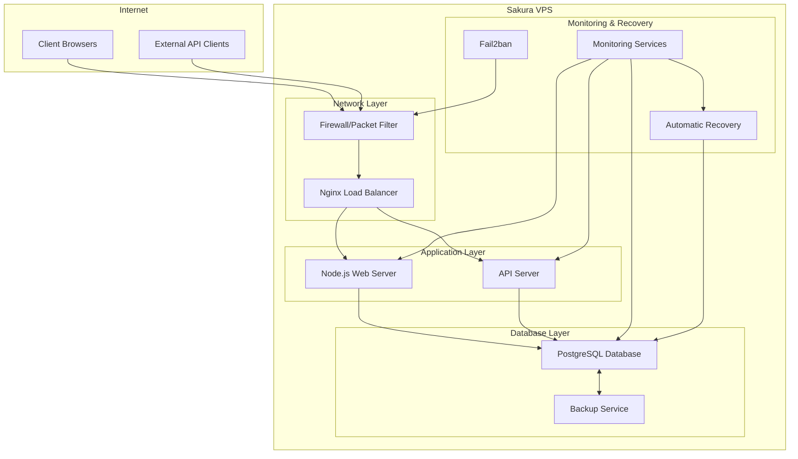
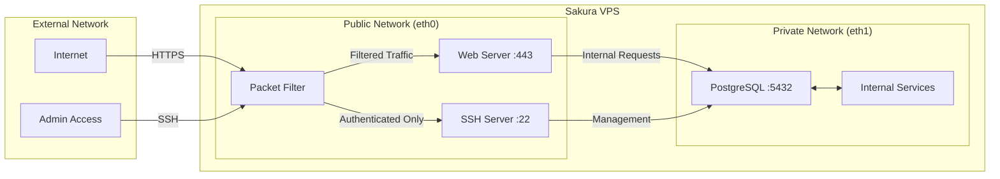
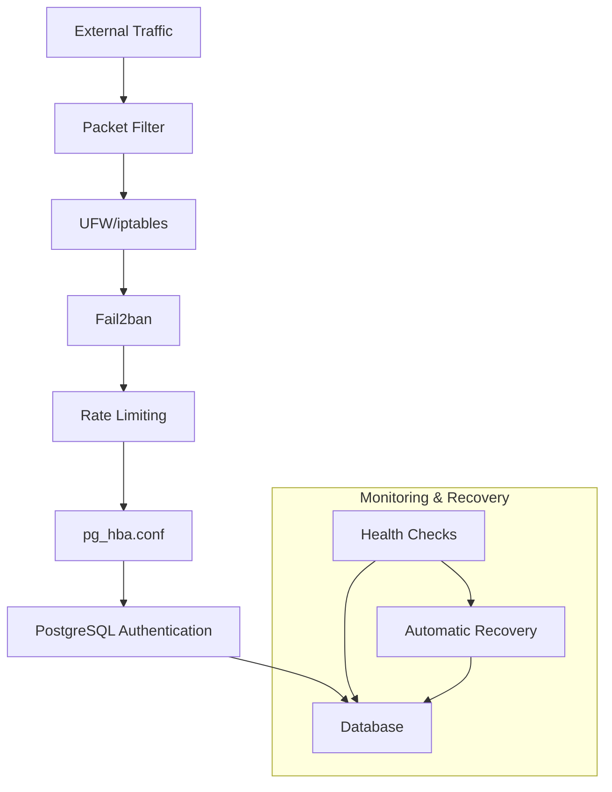
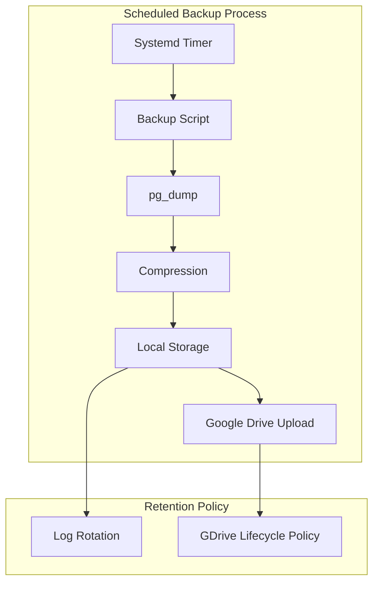
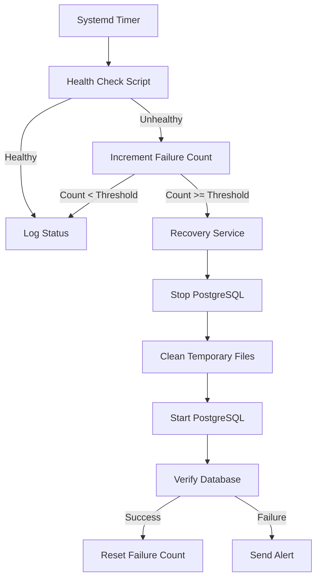

# Server Architecture

This document provides detailed information about the server architecture of the Sakura VPS used for the hotel management system.

## Hardware Specifications

### Current VPS Configuration

The hotel management system is hosted on a Sakura VPS with the following specifications:

| Component | Specification |
|-----------|---------------|
| VPS Plan | Standard Plan |
| CPU | 4 virtual cores |
| Memory | 4GB RAM |
| Storage | 200GB SSD |
| Location | 石狩第1ゾーン (Ishikari Zone 1) |
| Operating System | Ubuntu 24.04 amd64 |

### Specification Analysis

#### Current Usage Profile
- Single hotel in the database
- Less than 5 concurrent users
- Moderate database size and transaction volume

#### Projected Growth (1 Year)
- Expansion to approximately 25 hotels
- 10-40 concurrent users
- Increased database size and transaction complexity

#### Component Analysis

##### Memory (4GB)
- **Current Assessment**: Adequate for current operations with a single hotel and few concurrent users.
- **Future Considerations**: Likely insufficient for 25 hotels and up to 40 concurrent users. PostgreSQL performance is heavily dependent on available RAM for caching.
- **Recommendation**: Plan for an upgrade to 8-16GB RAM as the system scales to handle increased connection pools and query caching.

##### CPU (4 virtual cores)
- **Current Assessment**: Sufficient for current workload with minimal concurrent operations.
- **Future Considerations**: May become a bottleneck with increased concurrent users and more complex reporting queries across multiple hotels.
- **Recommendation**: Monitor CPU utilization as the system grows; consider upgrading to 6-8 cores if query response times degrade.

##### Storage (200GB SSD)
- **Current Assessment**: Very generous for current needs, providing ample room for database growth.
- **Future Considerations**: Likely still sufficient for 25 hotels unless storing extensive media files or long-term logs.
- **Recommendation**: Implement proper log rotation and database maintenance to manage disk usage; current capacity should be adequate for projected growth.

##### Network Bandwidth
- **Current Assessment**: Sakura VPS provides adequate bandwidth for current database applications.
- **Future Considerations**: With increased users, especially if accessing remotely, bandwidth requirements will increase.
- **Recommendation**: Monitor network utilization and latency as user count grows; consider implementing connection pooling to optimize network resource usage.

### Scaling Recommendations

Based on the projected growth, the following scaling recommendations are provided:

1. **Short-term (3-6 months)**:
   - Implement PostgreSQL optimization (connection pooling, query optimization)
   - Set up monitoring for resource utilization
   - Establish baseline performance metrics

2. **Medium-term (6-12 months)**:
   - Upgrade RAM to 8GB if concurrent users exceed 15
   - Implement database partitioning for larger tables
   - Consider read replicas for reporting workloads

3. **Long-term (12+ months)**:
   - Upgrade to 16GB RAM and 6-8 cores if user count approaches 40
   - Evaluate distributed database architecture
   - Consider dedicated instances for specific workloads (e.g., reporting)

## Operating System Configuration

### Ubuntu 24.04 LTS Configuration

The Sakura VPS is running Ubuntu 24.04 LTS (Noble Numbat), which provides a stable and secure foundation for the hotel management system. This section details the operating system configuration and optimizations.

#### System Updates

The system is configured to automatically install security updates using `unattended-upgrades`:

```bash
# Check status of unattended-upgrades
systemctl status unattended-upgrades

# View configuration
cat /etc/apt/apt.conf.d/50unattended-upgrades
```

Security updates are applied automatically, while other updates require manual intervention to prevent unexpected changes to the production environment.

#### System Limits Configuration

The following system limits have been configured in `/etc/security/limits.conf` to optimize PostgreSQL performance:

```
# /etc/security/limits.conf
postgres soft nofile 65536
postgres hard nofile 65536
postgres soft nproc 4096
postgres hard nproc 4096
postgres soft memlock unlimited
postgres hard memlock unlimited
```

#### Kernel Parameters

The following kernel parameters have been set in `/etc/sysctl.conf` to optimize PostgreSQL performance:

```
# PostgreSQL kernel parameter optimizations
kernel.shmmax = 1073741824
kernel.shmall = 1073741824
kernel.shmmni = 4096
fs.file-max = 1000000
net.ipv4.tcp_max_syn_backlog = 4096
net.core.somaxconn = 4096
vm.swappiness = 10
vm.dirty_ratio = 60
vm.dirty_background_ratio = 2
```

These settings can be applied without a reboot using:

```bash
sudo sysctl -p
```

#### Filesystem Configuration

The system uses the ext4 filesystem with the following mount options for the PostgreSQL data directory:

```
# /etc/fstab entry for PostgreSQL data directory
UUID=xxxxxxxx-xxxx-xxxx-xxxx-xxxxxxxxxxxx /var/lib/postgresql ext4 defaults,noatime,data=ordered 0 2
```

#### Time Synchronization

NTP is configured to ensure accurate system time, which is critical for database operations:

```bash
# Check NTP status
timedatectl status

# NTP configuration
cat /etc/systemd/timesyncd.conf
```

### OS-Specific PostgreSQL Optimizations

#### Transparent Huge Pages

Transparent Huge Pages (THP) are disabled to improve PostgreSQL performance:

```bash
# Check current THP status
cat /sys/kernel/mm/transparent_hugepage/enabled

# Disable THP at boot
echo 'never' > /sys/kernel/mm/transparent_hugepage/enabled
echo 'never' > /sys/kernel/mm/transparent_hugepage/defrag
```

A startup script has been added to `/etc/rc.local` to ensure this setting persists across reboots.

#### I/O Scheduler

The I/O scheduler is set to 'deadline' for SSD optimization:

```bash
# Check current scheduler
cat /sys/block/sda/queue/scheduler

# Set scheduler to deadline
echo 'deadline' > /sys/block/sda/queue/scheduler
```

#### Memory Management

The `vm.overcommit_memory` parameter is set to 2 to prevent the database from being killed by the OOM killer:

```bash
# Set overcommit_memory
echo 'vm.overcommit_memory = 2' >> /etc/sysctl.conf
sudo sysctl -p
```

### Installed Software Packages

The following key software packages are installed on the system:

| Package | Version | Purpose |
|---------|---------|---------|
| PostgreSQL | 16.x | Database server |
| Node.js | 20.x | Application server |
| Nginx | 1.24.x | Web server |
| Fail2ban | 1.0.x | Intrusion prevention |
| UFW | 0.36.x | Firewall management |
| Certbot | 2.x | SSL certificate management |

### Maintenance Procedures

#### Regular Maintenance Tasks

1. **System Updates**:
   ```bash
   sudo apt update
   sudo apt upgrade -y
   ```

2. **Log Rotation**:
   Log rotation is configured via `logrotate` to prevent disk space issues:
   ```bash
   cat /etc/logrotate.d/postgresql
   ```

3. **Disk Space Monitoring**:
   ```bash
   df -h
   du -sh /var/lib/postgresql/
   ```

4. **Service Status Checks**:
   ```bash
   systemctl status postgresql
   systemctl status nginx
   systemctl status fail2ban
   ```

## Network Configuration

### Sakura VPS Network Architecture

The Sakura VPS is configured with both public and private network interfaces, providing secure and reliable connectivity for the hotel management system.

#### Network Interfaces

| Interface | Type | IP Assignment | Purpose |
|-----------|------|--------------|---------|
| eth0 | Public | Static IPv4 | External access, web traffic |
| eth1 | Private | Static IPv4 | Internal services, database replication (future) |
| lo | Loopback | 127.0.0.1 | Local services |

#### IP Configuration

The network interfaces are configured in `/etc/netplan/01-netcfg.yaml`:

```yaml
network:
  version: 2
  renderer: networkd
  ethernets:
    eth0:
      dhcp4: no
      addresses:
        - 203.0.113.10/24  # Example public IP
      gateway4: 203.0.113.1
      nameservers:
        addresses: [8.8.8.8, 8.8.4.4]
    eth1:
      dhcp4: no
      addresses:
        - 10.0.0.10/24  # Example private IP
```

To apply network configuration changes:

```bash
sudo netplan apply
```

#### DNS Configuration

The system uses the following DNS servers:

- Primary: 8.8.8.8 (Google Public DNS)
- Secondary: 8.8.4.4 (Google Public DNS)

DNS configuration can be found in `/etc/systemd/resolved.conf`.

### Firewall Configuration

#### UFW (Uncomplicated Firewall)

UFW is enabled and configured to allow only necessary traffic:

```bash
# Check UFW status
sudo ufw status verbose
```

Current UFW rules:

| Port | Protocol | Source | Purpose |
|------|----------|--------|---------|
| 22 | TCP | Any | SSH access (rate limited) |
| 80 | TCP | Any | HTTP (redirects to HTTPS) |
| 443 | TCP | Any | HTTPS for web application |
| 5432 | TCP | Specific IPs | PostgreSQL (restricted access) |

#### iptables Configuration

In addition to UFW, custom iptables rules are implemented for more advanced traffic management:

```bash
# View current iptables rules
sudo iptables -L -v
```

The iptables configuration files are stored in:
- `/etc/iptables/rules.v4` (IPv4)
- `/etc/iptables/rules.v6` (IPv6)

Key iptables rules include:

1. **Rate limiting for SSH connections**:
   ```
   -A INPUT -p tcp --dport 22 -m state --state NEW -m recent --set
   -A INPUT -p tcp --dport 22 -m state --state NEW -m recent --update --seconds 60 --hitcount 4 -j DROP
   ```

2. **PostgreSQL connection limiting**:
   ```
   -A INPUT -p tcp --dport 5432 -m state --state NEW -m recent --set --name PSQL
   -A INPUT -p tcp --dport 5432 -m state --state NEW -m recent --update --seconds 60 --hitcount 20 --name PSQL -j DROP
   ```

3. **HTTP/HTTPS traffic management**:
   ```
   -A INPUT -p tcp --dport 80 -j ACCEPT
   -A INPUT -p tcp --dport 443 -j ACCEPT
   ```

### Sakura VPS Network Features

#### Packet Filtering

Sakura VPS provides packet filtering at the hypervisor level, which can be configured through the control panel:

1. Log in to the Sakura VPS control panel
2. Navigate to "Server Settings" > "Packet Filter"
3. Configure filtering rules based on IP addresses and ports

Current packet filter settings:
- Allow HTTP/HTTPS from any source
- Allow SSH from specific IP ranges
- Block all other incoming traffic by default

#### DDoS Protection

Sakura VPS includes basic DDoS protection features:

1. **Traffic Anomaly Detection**: Monitors for unusual traffic patterns
2. **Connection Limiting**: Restricts the number of simultaneous connections
3. **Blackhole Routing**: Automatically routes attack traffic to null

To request additional DDoS protection:
1. Contact Sakura VPS support
2. Provide details of the attack pattern
3. Request temporary IP address changes if necessary

### Network Monitoring

#### Traffic Monitoring

Network traffic is monitored using the following tools:

1. **Netdata**: Real-time monitoring dashboard
   ```bash
   # Access Netdata dashboard
   http://server-ip:19999
   ```

2. **vnStat**: Long-term bandwidth usage statistics
   ```bash
   # View daily bandwidth usage
   vnstat -d
   
   # View monthly bandwidth usage
   vnstat -m
   ```

#### Connection Monitoring

Active connections are monitored using:

```bash
# View all active connections
ss -tunapl

# View connections to PostgreSQL
ss -tunapl | grep 5432
```

### Network Security Best Practices

1. **Regular Security Audits**:
   - Perform monthly security scans using tools like Nmap
   - Review firewall rules and access logs

2. **SSH Hardening**:
   - Key-based authentication only (password authentication disabled)
   - Custom SSH port (not the default 22)
   - Limited login attempts with fail2ban

3. **SSL/TLS Configuration**:
   - TLS 1.2/1.3 only (older protocols disabled)
   - Strong cipher suites
   - Regular certificate renewal with Certbot

4. **Network Segmentation**:
   - Database accessible only from application servers
   - Administrative access restricted to VPN or specific IP ranges

## Server Architecture Diagrams

### System Architecture Overview

The following diagram illustrates the overall architecture of the hotel management system deployed on Sakura VPS:



### Network Architecture

The following diagram shows the network configuration and traffic flow:



### Security Layers

The following diagram illustrates the security layers protecting the PostgreSQL database:



### Database Backup Flow

The following diagram shows the PostgreSQL backup process:



### Recovery Mechanism Flow

The following diagram illustrates the automatic recovery process for PostgreSQL:



These diagrams provide a visual representation of the server architecture, network configuration, security layers, backup process, and recovery mechanisms implemented on the Sakura VPS.

## Configuration Status Summary (as of July 2025)

*The following configuration check was performed on **2025-07-18**.*

The following table summarizes the current Sakura VPS configuration and its alignment with the recommendations in this document:

| Area                        | Status/Configured? | Notes                                                                 |
|-----------------------------|--------------------|-----------------------------------------------------------------------|
| Security updates            | ✅ Yes             | `unattended-upgrades` active                                         |
| System limits               | ✅ Yes             | `/etc/security/limits.conf` set for postgres                         |
| Kernel parameters           | ✅ Yes             | All recommended sysctl values set                                     |
| Transparent Huge Pages      | ✅ Yes             | Disabled (`[never]`)                                                 |
| I/O scheduler               | ✅ Yes             | `mq-deadline` for `vda` (SSD)                                        |
| Filesystem                  | ✅ Yes             | ext4 with `relatime`                                                 |
| Time sync                   | ✅ Yes             | NTP active, clock synchronized                                       |
| Firewall (iptables)         | ✅ Yes             | DROP policy, rate limiting, service-specific rules                    |
| UFW                         | 🚫 Not installed   | Not needed since iptables is in use                                   |
| Network config              | ✅ Yes             | Public/private interfaces, DNS, as per doc                            |

**This table provides a quick reference for system administrators to verify that the server is configured according to best practices and project requirements.**